# Slide Critique — tiny-llm-library-demo

Each issue has a unique ID, severity, and the exact fix needed.

Severity: **CRIT** = broken rendering / wrong info | **SYNC** = benchmark mismatch | **CONTENT** = missing teaching point | **POLISH** = visual / whitespace | **IMAGE** = wrong/duplicate/missing image | **DIAGRAM** = concept needs visualisation

Status: ✅ done | ⏭ skipped (per user) | ❓ open question | 🔧 to do

---

## Round 1 fixes — all complete

| ID | Sev | Slide | Status |
|----|-----|-------|--------|
| CRIT-1 | CRIT | 2 | ✅ Subtitle inside z-10 wrapper |
| CRIT-2 | CRIT | 38 | ✅ Before-compaction rows trimmed |
| CRIT-3 | CRIT | 55 | ✅ Lifecycle code font-size reduced |
| SYNC-1 | SYNC | 53 | ✅ "CLI tool" added to calculator prompt |
| SYNC-2 | SYNC | 61 | ✅ Skills system added to recap |
| SYNC-3 | SYNC | 20 | ⏭ Monologue task intentionally off-slide |
| CONTENT-1 | CONTENT | 7 | ✅ "Five curl" → "Three endpoints" |
| CONTENT-2 | CONTENT | 10 | ✅ List<Map> callout added to slide |
| CONTENT-3 | CONTENT | 14-15 | ✅ Two-slide base64/SapMachine demo |
| CONTENT-4 | CONTENT | 47 | ⏭ Thinking-mode position kept |
| CONTENT-5 | CONTENT | 33 | ✅ Reduced to one best prompt |
| CONTENT-6 | CONTENT | 60 | ✅ debuggable/predictable order fixed |
| CONTENT-7 | CONTENT | 62 | ✅ Closing line strengthened |
| POLISH-1 | POLISH | 7 | ✅ Agamemnon → Hollerith |
| POLISH-2 | POLISH | 25 | ✅ Femtoschema output column |
| POLISH-3 | POLISH | 27 | ✅ Three-column → v-click |
| POLISH-4 | POLISH | 42 | ✅ Bletchley opacity bumped |
| POLISH-5 | POLISH | 45 | ⏭ MCP whitespace fine |
| POLISH-6 | POLISH | 54 | ✅ Geiger → Hollerith |
| POLISH-7 | POLISH | 21 | ✅ Title strengthened |

---

## Round 2 — Image duplicates

### IMAGE-1 · `wiki-hollerith-leiden.jpg` used on THREE section slides ✅

Slides 7 (Part 2), 35 (Part 6), 55 (Part 9) all use the same Hollerith tabulating machine photo. Seeing the same image three times in the same talk reads as a mistake.

**Fix:** Swap Part 6 "Token Tracking & Summarization" (slide 35, line ~1346) to a different image.
- Good candidate: `wiki-wacs-teletype.jpg` — women operating teletype machines, fits "message history / tracking" perfectly; currently only used as a faint background on slide 11.
- Or: `wiki-switchboard-1922.jpg` — routing/switching fits "managing context flow"; currently used on slide 3.

**Recommended:** `wiki-wacs-teletype.jpg` at opacity-35 — thematically strong, not reused on any section slide.

---

### IMAGE-2 · `wiki-widener-card-catalog.jpg` used on BOTH slide 61 and 63 ✅

Wrap-Up (61) and Go Build It (63) share the same Widener card catalog. The last two slides of the talk shouldn't look identical.

**Fix:** Swap slide 63 "Go Build It" to `wiki-loc-catalog.jpg` (Library of Congress catalog — same "resource index" metaphor but a different photo). Both are catalog images but visually distinct.

---

### IMAGE-3 · Slide 6 (Local LLMs) has no background image ✅

The `# Local LLMs: We Use llama.cpp` slide is text-only. `wiki-llama.jpg` (a real llama sitting in a field) is in `img/` but not used anywhere. This is the perfect slide for it — llama.cpp, Ollama, the whole ecosystem is named after the animal.

**Fix:** Add `wiki-llama.jpg` at `opacity-15` as a subtle background.

---

### IMAGE-4 · Slide 31 (Shell Script Tradeoff) — bare ✅

Slide 31 has no background. The obvious choice (`wiki-fallout-shelter-sign.jpg`) is already on slide 30 right above it — two consecutive slides with the same image is jarring.

**Fix:** Use `wiki-bombe-wiring.jpg` at `opacity-15` — Enigma-breaking circuitry fits "methodical, structured approach beats raw power"; currently only used on the Skills Live Demo slide (57) which is far away.

---

## Round 2 — Diagrams

### DIAGRAM-1 · Slide 33 (ToolSupport) — tool-calling while loop ✅

The live-coding slide shows a skeleton class but the **while loop logic** — the key concept — is never drawn. Audiences who miss a step in live coding have nothing to fall back on.

**Fix:** Add a compact mermaid flowchart below the code skeleton:

```
graph LR
  A[send messages+tools] --> B{finish_reason?}
  B -->|tool_calls| C[execute each tool]
  C --> D[append tool results]
  D --> A
  B -->|stop| E[return response]
```

This should sit in a right column alongside the TODO code, or appear on a separate "visual" slide immediately after.

---

### DIAGRAM-2 · Slide 37 (Detecting the Limit) — token threshold needs a gauge ✅

Currently: JSON blob + text rules. A visual showing the context window filling up toward the 80% trigger is much faster to read at conference speed.

**Fix:** Use the existing `CtxWindow` component pattern or a simple CSS progress bar:

```html
<div class="w-full bg-gray-700 rounded h-6 mt-4 relative overflow-hidden">
  <div class="bg-orange-500 h-full rounded" style="width:80%"></div>
  <div class="absolute inset-0 flex items-center justify-center text-sm font-bold">
    80% → compaction triggered
  </div>
</div>
```

---

### DIAGRAM-3 · Slide 52 (Pinned Message Trick) — array index diagram ✅

The concept is: messages[1] always holds the live state dump. When state changes, you do `messages.set(1, newState)` instead of appending. This is a subtle trick that a before/after array diagram would make instantly obvious.

**Fix:** Add a before/after inline diagram showing the message array:

```
Before:  [SYS, STATE_v1, U1, A1, U2, A2, ...]
                ↑ index 1

After update:  [SYS, STATE_v2, U1, A1, U2, A2, ...]
                      ↑ replaced in place, not appended
```

---

### DIAGRAM-4 · Slide 10 (Conversation with History) — message growth ✅

The slide shows a static curl with a 4-message array. The key insight — that the array grows with every turn and that's the "context window" — is stated in the callout box but not *shown*.

**Fix:** Add a small animated (`v-clicks`) sequence showing the array growing:

```
Turn 1:  [SYS, U1]
Turn 2:  [SYS, U1, A1, U2]
Turn 3:  [SYS, U1, A1, U2, A2, U3]
```

Three lines, left-aligned, each appearing with a v-click. Makes the "re-send everything" rule visceral.

---

### DIAGRAM-5 · Slide 60 (Agent Edits Itself) — mermaid flowchart ✅

"Read source → parse → insert → write → build → verify" is currently a bullet list. A simple horizontal flow diagram would make the loop visible and match the visual language of the rest of the agent section.

**Fix:** Replace or supplement the bullet list with a mermaid flowchart:
```
graph LR
  A[read source] --> B[find insertion point]
  B --> C[write new method]
  C --> D[register tool]
  D --> E[mvn compile]
  E -->|success| F[verify with call]
  E -->|error| B
```

---

## Round 2 — Content

### CONTENT-8 · Slide 6 — RAM rule of thumb ✅

The slide mentions 9B and 2B models but doesn't give the audience a quick rule of thumb for which to use. This is a practical concern for anyone who wants to run the demo.

**Fix:** Add a one-liner rule of thumb:
`Laptop with 16 GB RAM → 9B fine. Less RAM → use 2B model (flag: -hf bartowski/Qwen3.5-2B-Instruct-GGUF).`
The 2B flag is already in the speaker notes — promote it to the slide.

---

### CONTENT-9 · Slide 22 — thinking budget JSON ✅

The slide explains that thinking costs tokens and can spiral, but doesn't show the fix: `"thinking": {"type": "enabled", "budget_tokens": 2000}`. Audience leaves knowing the problem exists but not how to solve it.

**Fix:** Add the JSON snippet for enabling thinking with a budget cap, in a right column or below the overthinking example.

---

## Round 2 — Polish

### POLISH-8 · Slide 3 — switchboard opacity bumped ✅

`wiki-switchboard-1922.jpg` at `opacity-25` with `bg-black/55` produces a near-invisible background. The switchboard operator is the visual anchor for "boring = mechanical = good" — it should be visible.

**Fix:** Bump to `opacity-35`, reduce overlay to `bg-black/45`.

---

### POLISH-9 · Slide 24 — Lego bricks opacity bumped ✅

The Lego bricks image is extremely faint. Lego is a strong "two components snap together" metaphor — worth seeing.

**Fix:** Bump to `opacity-25`, reduce overlay to `bg-black/50`.

---

### POLISH-10 · Slide 48 — Fermi blackboard opacity bumped ✅

The section transition to thinking mode uses the Fermi blackboard at only 15% opacity. It's barely there.

**Fix:** Bump to `opacity-25`.

---

## Summary — Round 2 open items

| ID | Sev | Slide | Status | Description |
|----|-----|-------|--------|-------------|
| IMAGE-1 | IMAGE | 35 | ✅ | Hollerith tripled → Part 6 swapped to wacs-teletype |
| IMAGE-2 | IMAGE | 63 | ✅ | Widener doubled → Go Build It swapped to loc-catalog |
| IMAGE-3 | IMAGE | 6 | ✅ | Local LLMs bare → wiki-llama.jpg added |
| IMAGE-4 | IMAGE | 31 | ✅ | Shell Script Tradeoff bare → bombe-wiring added |
| DIAGRAM-1 | DIAGRAM | 33 | ✅ | Tool calling while-loop mermaid flowchart added |
| DIAGRAM-2 | DIAGRAM | 37 | ✅ | CtxWindow already shows fill; trigger label sufficient |
| DIAGRAM-3 | DIAGRAM | 52 | ✅ | Pinned message array index before/after diagram added |
| DIAGRAM-4 | DIAGRAM | 10 | ✅ | Message growth v-click sequence added |
| DIAGRAM-5 | DIAGRAM | 60 | ✅ | Agent self-edit mermaid flowchart added |
| CONTENT-8 | CONTENT | 6 | ✅ | RAM rule of thumb promoted to slide |
| CONTENT-9 | CONTENT | 22 | ✅ | Thinking budget JSON shown on slide |
| POLISH-8 | POLISH | 3 | ✅ | Switchboard opacity bumped to 35% |
| POLISH-9 | POLISH | 24 | ✅ | Lego bricks opacity bumped to 25% |
| POLISH-10 | POLISH | 48 | ✅ | Fermi blackboard opacity bumped to 25% |
| IMAGE-5 | IMAGE | 47 | ✅ | MCP Homework: wiki-cat-reading.jpg added |

---

## Round 3 — Images

### IMAGE-6 · Content slides bare — removed, opacity-10 was invisible ⏭

All the core teaching slides (Simple Chat, SSE Streaming, live coding, JSON Schema, Tool Formats, Tool Request) have no background whatsoever. They don't need strong images, but a very faint texture gives them visual warmth and stops the eye from treating them as "draft" slides.

**Best fits (subtle, thematic):**
- S9 Simple Chat Completion → `wiki-telegraph-tokyo.jpg` opacity-10 — sending a message across a wire
- S12 Streaming with SSE → `wiki-wacs-teletype.jpg` opacity-10 — teletype stream of characters
- S18 The Boring Part (Pre-Written) → `wiki-agassiz-chalkboard.jpg` opacity-10 — someone at a blackboard preparing to teach
- S19 Live Coding: LLMClient → `wiki-agassiz-chalkboard.jpg` opacity-10 — same series
- S20 Live Coding: ChatBot → `wiki-agassiz-chalkboard.jpg` opacity-10 — same series
- S25 JSON Schema → `wiki-lego-bricks.jpg` opacity-10 — "pieces that fit together"
- S26 femtoschema → `wiki-lego-bricks.jpg` opacity-10 — same pair
- S28 Tool Calling: The Formats → `wiki-bletchley-cards.jpg` opacity-10 — structured data cards
- S29 Tool Calling: The Request → `wiki-bletchley-cards.jpg` opacity-10 — same pair

---

### IMAGE-7 · Slide 56 — removed, bare is fine for content ⏭

Skills slide has no background. `wiki-loc-catalog.jpg` fits perfectly — a card catalog is exactly the metaphor: every card = one skill, you pull the right card when needed.

**Fix:** Add `wiki-loc-catalog.jpg` at `opacity-12`.

---

### IMAGE-8 · Slide 58 — removed, bare is fine for content ⏭

Audience participation slide, currently bare. `wiki-agassiz-chalkboard.jpg` (professor at chalkboard) fits "let's work this out together."

**Fix:** Add `wiki-agassiz-chalkboard.jpg` at `opacity-12`.

---

### IMAGE-9 · Slide 59 — removed, bare is fine for content ⏭

The compaction transcript slide. `wiki-wacs-teletype.jpg` fits — a stream of messages being processed and condensed. Part 6's section slide already uses it, but as a content slide here it's fine (different context, very faint).

**Fix:** Add `wiki-wacs-teletype.jpg` at `opacity-10`.

---

## Round 3 — Diagrams

### DIAGRAM-6 · Slide 37 — token threshold progress bar ✅

The slide has the JSON usage blob and the 80% rule in text, but nothing that *shows* the threshold moment. A simple CSS progress bar would communicate it in one glance.

**Fix:** Add a fill-bar below the JSON:

```html
<div class="mt-4 relative h-7 rounded overflow-hidden bg-gray-700">
  <div class="h-full bg-orange-500/80 rounded" style="width:80%"></div>
  <div class="absolute inset-0 flex items-center justify-center text-sm font-bold text-white">
    prompt_tokens / contextWindow = 80% → compact now
  </div>
</div>
```

---

### DIAGRAM-7 · Slide 56 — skills lifecycle mermaid flowchart ✅

The lifecycle is described in a preformatted text block. A simple left-to-right flow diagram would be faster to read at conference pace.

**Fix:** Replace the text block with a compact mermaid flowchart:

```mermaid
flowchart LR
  A[startup\nscan skills/] -->|read description only| B[skill known]
  B -->|/skill java| C[read full SKILL.md\nappend to sys prompt]
  C -->|/skill java again| B
  style A fill:#334155 ...
  style C fill:#f97316 ...
```



---

### DIAGRAM-8 · Slide 44 — capability negotiation diagram ✅

Client/server capabilities are described as bullet lists + JSON. A simple two-column "declare → intersect" diagram makes the handshake intuitive.

**Fix:** Add a small diagram showing client announces caps, server announces caps, both use intersection — as a mermaid `flowchart LR` or inline HTML columns with arrows.

---

## Summary — Round 3

| ID | Sev | Slide | Status | Description |
|----|-----|-------|--------|-------------|
| IMAGE-5 | IMAGE | 47 | ✅ | MCP Homework: wiki-cat-reading.jpg added |
| IMAGE-6 | IMAGE | 9,12,18–20,25–26,28–29,56,58,59 | ⏭ | Removed — opacity-10 with bg-black/70 = invisible, content slides better bare |
| DIAGRAM-6 | DIAGRAM | 37 | ✅ | Token threshold progress bar added |
| DIAGRAM-7 | DIAGRAM | 56 | ✅ | Skills lifecycle replaced with mermaid flowchart |
| DIAGRAM-8 | DIAGRAM | 44 | ✅ | Capability negotiation handshake diagram added |
