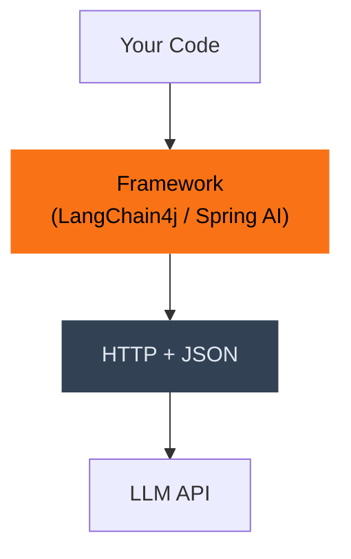
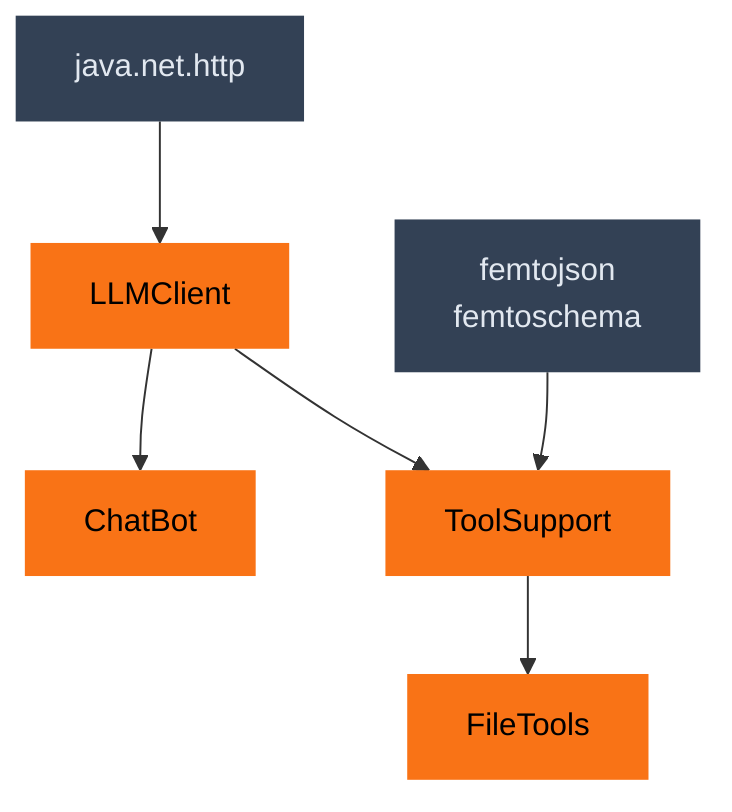
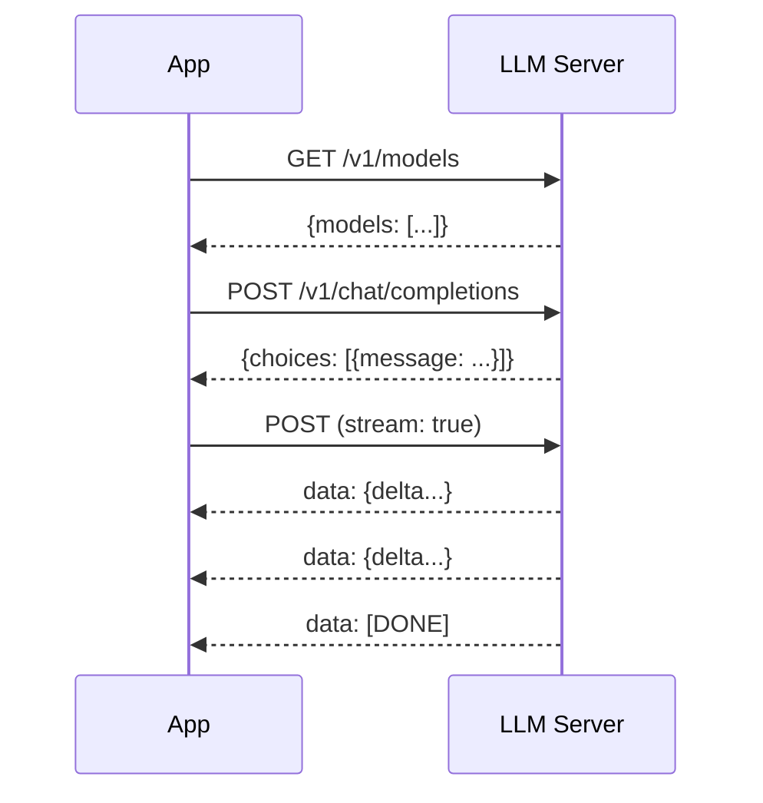
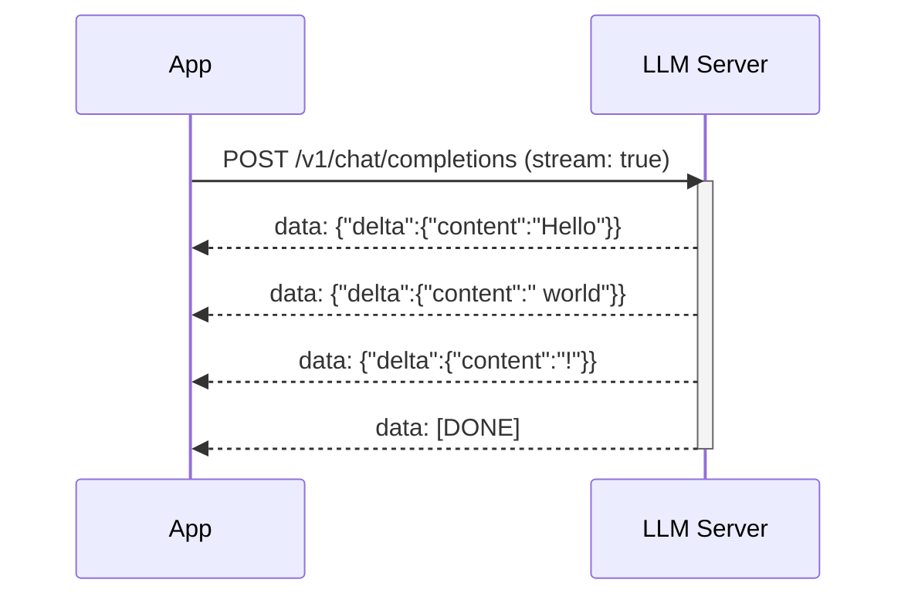
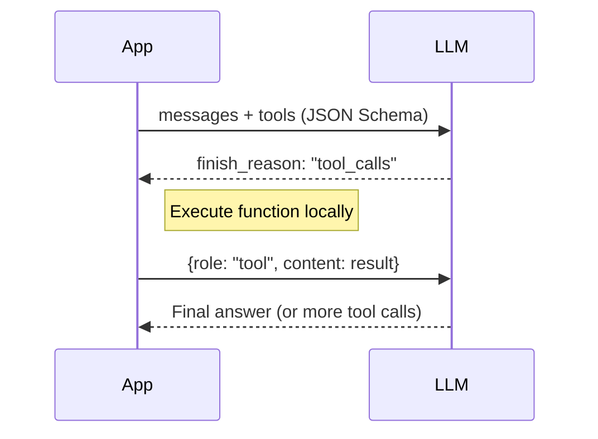
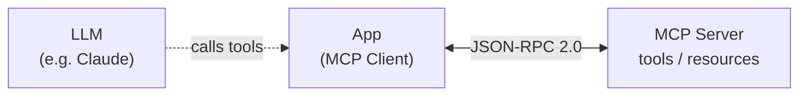
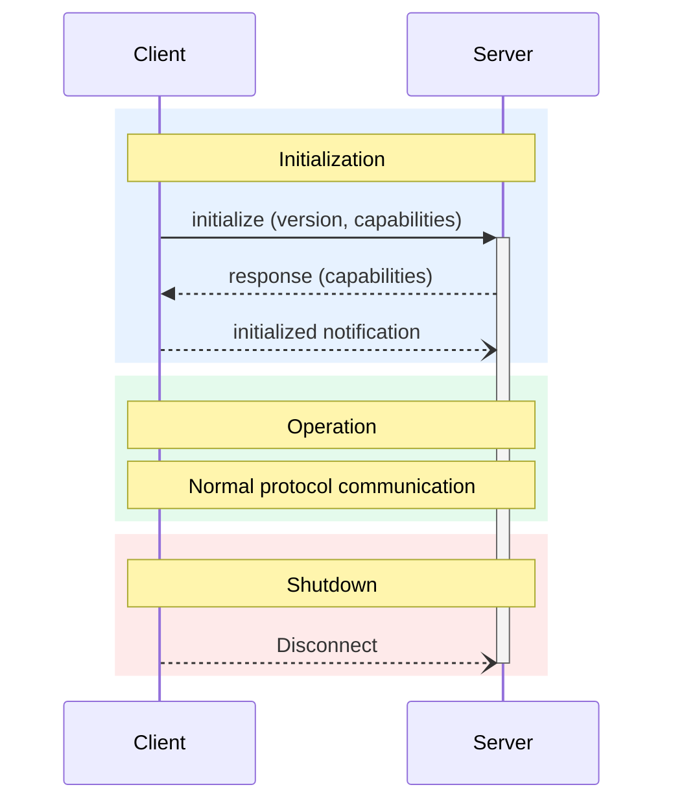
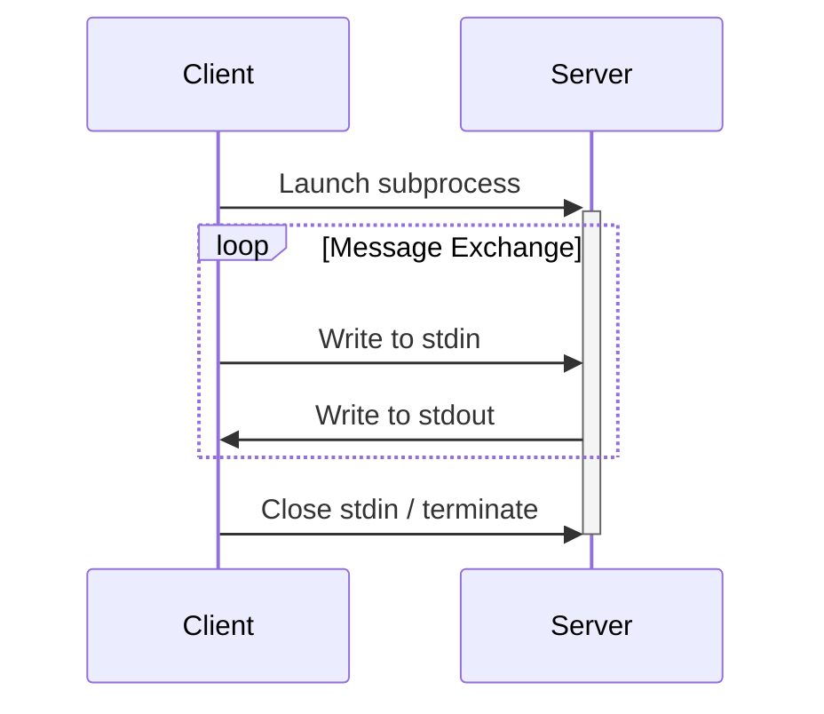
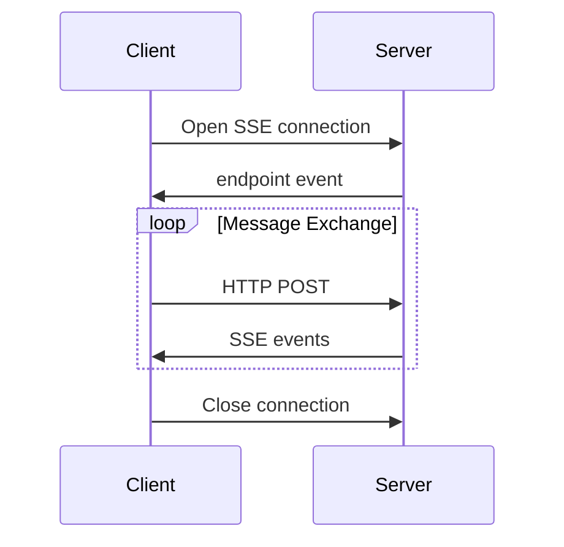
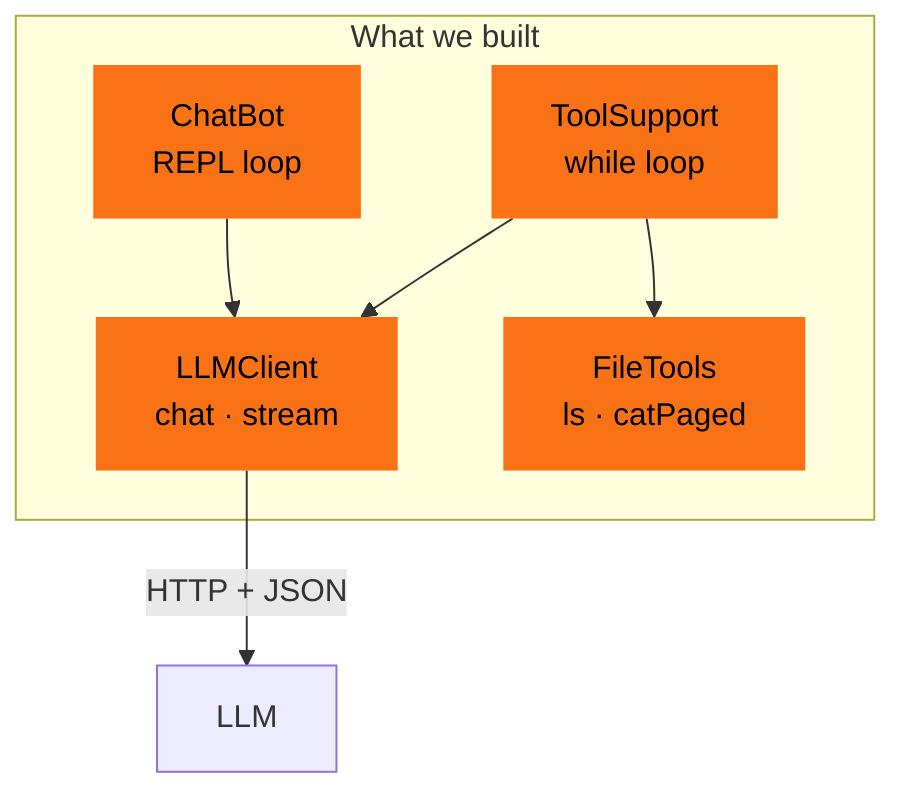

<style>
:root {
  --code-font-size: 1.05rem;
  --code-font-size-px: 13px;
  --code-line-height: 1.6;
  --code-border: rgba(226, 232, 240, 0.15);
}

.slidev-slide pre,
.slidev-slide .shiki {
  font-size: var(--code-font-size);
  line-height: var(--code-line-height);
  border: 1px solid var(--code-border);
  border-radius: 12px;
  padding: 20px 24px;
  box-shadow: 0 12px 24px rgba(15, 23, 42, 0.3);
  max-height: 45vh;
  overflow: auto;
}
.slidev-layout pre, .slidev-layout code {
    -webkit-user-select: text;
    user-select: text;
  font-size: 1em !important;
    white-space: pre;
}

.slidev-page .text-gray-300 { color: #f1f5f9 !important; }
.slidev-page .text-gray-400 { color: #e2e8f0 !important; }
.slidev-page .text-gray-500 { color: #cbd5e1 !important; }

.compact-code pre, .compact-code .shiki {
  font-size: 0.85rem !important;
  line-height: 1.4 !important;
  padding: 12px 14px !important;
}

.quote-slide {
  display: flex;
  flex-direction: column;
  justify-content: center;
  align-items: center;
  text-align: center;
  padding: 7rem 4rem;
  position: relative;
}
.quote-slide::before {
  content: '"';
  position: absolute;
  left: 40px;
  top: 40%;
  transform: translateY(-50%);
  font-size: 15rem;
  font-weight: 900;
  color: rgba(148, 113, 217, 0.15);
  line-height: 1;
  z-index: 0;
  font-family: cursive;
}
.quote-text {
  font-size: 1.85rem;
  line-height: 1.7;
  font-style: italic;
  color: #f8fafc;
  max-width: 820px;
  font-weight: 500;
  position: relative;
  z-index: 1;
}
.quote-attr {
  font-size: 1.05rem;
  color: #e2e8f0;
  margin-top: 1.5rem;
  font-weight: 500;
}

.big-statement p {
  font-size: 3rem;
  font-weight: 800;
  line-height: 1.3;
  text-align: center;
  color: #f8fafc;
  justify-content: center;
  min-height: 100px;
}

.slidev-slide h1,
.slidev-slide h2 {
  font-weight: 800;
  letter-spacing: -0.015em;
}

.slidev-slide ul {
  font-size: 1.15rem;
  line-height: 1.6;
}

.slidev-slide ul li {
  margin: 0.4rem 0;
}

.section-header {
  font-size: 1.2rem;
  text-transform: uppercase;
  letter-spacing: 0.15em;
  color: #94a3b8;
  margin-bottom: 0.5rem;
}

.tool-flow-step {
  background: rgba(59, 130, 246, 0.1);
  border: 1px solid rgba(59, 130, 246, 0.3);
  border-radius: 8px;
  padding: 12px 16px;
  margin: 4px 0;
}

.tool-flow-arrow {
  text-align: center;
  color: #60a5fa;
  font-size: 1.5rem;
  margin: 2px 0;
}
</style>

<script setup>
import { onMounted } from 'vue'
import CodeWithScript from './components/CodeWithScript.vue'
import JsonOverlay from './components/JsonOverlay.vue'

onMounted(() => {
  const rootElement = document.documentElement
  rootElement.style.setProperty('--code-font-size-px', '14px')
})
</script>

<div class="absolute inset-0 bg-black/55 z-0" />

<div class="relative z-10 flex flex-col items-center justify-center h-full">

<div class="text-6xl font-bold leading-tight">Let's create a tiny AI library together</div>
<div class="text-3xl mt-4 text-orange-400 font-semibold">Peeking behind the curtain of LLM libraries</div>

<div class="mt-12 text-xl text-gray-500">
Johannes Bechberger &nbsp;&nbsp;·&nbsp;&nbsp; SAP SE
</div>

</div>

<!--
**[~0:00]** Welcome! "We all want to do it — integrate AI into our tools. Today we're going to look behind the curtain and build one from scratch."
-->

<JsonOverlay v-if="showOverlay" :json="selectedJson" @close="showOverlay = false" />

---

# The Illusion

<div class="mt-8 text-xl leading-relaxed">

Some of us already use <OrangeText>Spring AI</OrangeText> or <OrangeText>LangChain4j</OrangeText>.

Some of us don't use AI in our apps yet — but want to.

</div>

<div class="text-2xl mt-8 font-semibold">

Either way: what <OrangeText>actually happens</OrangeText> under the hood?

</div>

<!--
**[~0:30]** Setup slide — introduce the audience segments.
-->

---

# The Question: Who's Using Frameworks?

<div class="mt-12 text-2xl text-gray-300">

**[Show of hands]** Who here has used an LLM library?

</div>

<div class="mt-8 text-xl text-gray-400">

LangChain4j · Spring AI · Semantic Kernel · Others?

</div>

<div class="mt-12 text-lg text-gray-500">

Keep your hands up for the next question...

</div>

<!--
**[~0:35]** **[SHOW OF HANDS]** First poll. "Who has used one of these frameworks?" Most hands should go up.
-->

---

# The Revelation

<div class="mt-12 text-2xl text-gray-300">

**[Still with hands up]** Who knows exactly what HTTP calls that library makes?

</div>

<!--
**[~0:50]** **[REVEAL]** Second question. Watch the hands drop. This is the dramatic moment.
"Most of you don't have visibility into what's actually happening underneath."
-->

---

# The Gap

<div class="mt-8 text-lg text-gray-400">

This is normal. These libraries are designed to <OrangeText>hide</OrangeText> the HTTP layer.

</div>

<div class="mt-8 text-lg text-gray-400">

But what does it actually look like?

</div>

<div class="mt-8 text-2xl text-gray-300">

**What's in the JSON?**

</div>

<!--
**[~1:00]** Transition. "This is exactly what we're going to close today. By the end, you'll know what's underneath."
-->

---
layout: statement
---

# LLM APIs are boring.

<!--
**[~1:30]** The big reveal upfront. "LLM APIs are boring." Say it confidently.
"The magic is just HTTP + JSON. And once you see it, you can't unsee it."
First time saying the tagline — will repeat it two more times.
-->

---
layout: center
---

<div class="text-2xl text-gray-300">

Frameworks like <OrangeText>LangChain4j</OrangeText> and <OrangeText>Spring AI</OrangeText> just wrap

</div>

<div class="text-3xl font-bold text-orange-400 mt-6">

simple REST calls

</div>

<!--
**[~1:50]** Frame it. "These are sophisticated libraries, but they're wrapping simple HTTP + JSON underneath."
"The frameworks handle retries, tracing, adapters. But the core is REST."
-->

---

# Why That Matters

<div class="mt-8 text-xl text-gray-400">

It's not a bad thing — in fact, it's good news.

</div>

<div class="mt-8 text-lg leading-relaxed">

**Good news:**

- Once you see the HTTP layer, you can <OrangeText>debug</OrangeText> these libraries
- You can <OrangeText>design better</OrangeText> systems by understanding what's underneath  
- You're never trapped by framework limitations

</div>

<!--
**[~2:10]** Positive reframe. "Boring is good. Boring means debuggable. Boring means predictable."
"If you understand REST, you can troubleshoot any LLM library."
-->

---

# What Frameworks Actually Give You

<div class="mt-8 text-xl text-gray-400">

LangChain4j, Spring AI, and similar libraries are <OrangeText>genuinely useful</OrangeText>.

</div>

<div class="mt-12 text-lg">

They're not just wrappers — they add real production value.

</div>

<!--
**[~2:30]** Setup slide. "These libraries aren't magic wrappers. They add real, measurable value on top of the boring REST layer."
-->

---

# The Value They Add

<div class="grid grid-cols-2 gap-8 mt-4">

<div>

- 🔌 **20+ provider adapters** — OpenAI, Anthropic, llama.cpp, Azure…
- 🔄 **Retries & rate limiting** — production-grade resilience
- 🧭 **Tracing, RAG, guardrails** — visibility and safety

These solve <OrangeText>real problems</OrangeText> that raw REST calls don't.

</div>

<div>



<div class="text-sm text-gray-500 text-center">Today we learn the <b>orange layer</b>.</div>

</div>

</div>

<!--
**[~2:50]** Feature slide. "Retries, rate limiting, provider abstractions — these are solid engineering."
"RAG (retrieval-augmented generation) and tracing? Those are hard problems they've solved for us."
-->

---

# Why We're Learning the Layer Below

<Callout variant="blue">
We're NOT saying "don't use them" — we're learning what they wrap so you can <b>debug</b> and <b>design</b> better.
</Callout>

<div class="mt-8 text-lg text-gray-400">

Understanding the REST layer underneath means:

</div>

<div class="mt-4 text-lg">

- When a framework breaks, you can debug it
- You can design better systems by knowing what's underneath
- You can move between frameworks without fear

</div>

<Caption>LangChain4j docs: "The goal of LangChain4j is to simplify integrating LLMs into Java applications." — This is a <b>good goal</b>. We're just learning what gets simplified.</Caption>

<!--
**[~3:15]** Positive framing. "We respect these libraries. We're just pulling back the curtain so you can use them with confidence."
-->

---

# What We're Building Today

<div class="grid grid-cols-2 gap-8 mt-4">

<div>

By the end of this hour:

- ✅ **A streaming chatbot** — ~50 lines of Java
- ✅ **Tool calling** — LLM browses your filesystem
- ✅ **MCP fundamentals** — the protocol tying it together

```java
var client = new LLMClient(baseUrl, model,
    System.out::print);
client.chatStream(messages);
```

</div>

<div>



<div class="text-sm text-gray-500 text-center">Orange = what we build live</div>

</div>

</div>

<!--
**[~3:30]** Show the target. "This is the finish line. A streaming chat client, with tool calling, in a tiny JAR."
"Let me give a small plug: I packaged this approach into femtoai — ~120KB, Java 17, does everything we need."
-->

---

# Local LLMs

<div class="mt-2">

**[Show of hands]** Who has run a local LLM — Ollama, LM Studio, llama.cpp?

</div>

<div class="grid grid-cols-3 gap-6 mt-6">

<div class="text-center">

### llama.cpp
<div class="text-gray-400 mt-2">

C++ inference engine<br/>
One command to start<br/>
<OrangeText>What we use today</OrangeText>

</div>
</div>

<div class="text-center">

### Ollama
<div class="text-gray-400 mt-2">

Easy CLI wrapper<br/>
Built on llama.cpp<br/>
Great for getting started

</div>
</div>

<div class="text-center">

### LM Studio
<div class="text-gray-400 mt-2">

Nice desktop UI<br/>
Built on llama.cpp<br/>
Great for exploration

</div>
</div>

</div>

<div class="mt-4">

<CodeWithScript scriptPath="scripts/00-launch-llm.sh" slideId="launch-llm">

```bash
# Start the server with model caching
./scripts/00-launch-llm.sh --medium
# Runs: llama-server -hf AaryanK/Qwen3.5-9B-GGUF:Q8_0
```

</CodeWithScript>

</div>

<div class="mt-2 text-lg">

Trade-offs: <OrangeText>privacy & cost</OrangeText> vs <RedText>hardware requirements & quality</RedText>

</div>

<!--
**[~4:30]** **[SHOW OF HANDS]** "Who has run a local LLM?"
Quick comparison. We use llama.cpp (llama-server) because it's minimal and has OpenAI-compatible endpoints.
Model: `Qwen/Qwen3-1.7B-GGUF:Q8_0` — small, fast, fits on any modern laptop.
-->

---

# It's All Just REST

<div class="grid grid-cols-2 gap-6 mt-0">

<div>

Many local LLM servers emulate <OrangeText>OpenAI-style endpoints</OrangeText>:

| Endpoint | Method |  |
|----------|--------|-------------|
| `/v1/models` | GET | Available models |
| `/v1/chat/completions` | POST | Send messages|
| `/v1/chat/completions` | POST (+stream) | streaming via SSE |

That's the <OrangeText>entire API</OrangeText> for everything we'll build today.

</div>
<div style="margin-top: -1cm" v-click>



</div>

</div>

<div class="mt-2 text-gray-400">

Teaser: <b>Tool calling</b> is just a structured request/response loop on the same endpoint.<br/>
<b>MCP</b> uses JSON-RPC 2.0 to standardize similar flows — but that's for later.

</div>

<!--
**[~5:30]** "It's all just REST-ish HTTP. Three rows in a table. That's the entire surface we need."
Don't say JSON-RPC here — save it for MCP. OpenAI endpoints are REST, not JSON-RPC.
SSE = Server-Sent Events — a simple HTTP standard where the server keeps the connection open and sends lines prefixed with `data: `. Each line is one token chunk as JSON. The stream ends with `data: [DONE]`. It's the same tech browsers use for live notifications — nothing AI-specific about it.
-->

---
layout: center
---

<div class="section-header">Part 2</div>

<div class="big-statement">

The API

</div>

<div class="text-xl text-gray-400 mt-4">

Let me show you what these libraries are actually doing.

</div>

<!--
**[~6:00]** Transition to curl demos. "Enough slides. Let me prove it."
-->

---

# List Models

<CodeWithScript scriptPath="tiny-llm-demo/scripts/01-list-models.sh" slideId="list-models-curl">

```bash
curl http://localhost:8080/v1/models
```

<template #actions>
<JsonOverlay :json='{"models": [{"name": "Qwen/Qwen3-1.7B-GGUF:Q8_0", "model": "Qwen/Qwen3-1.7B-GGUF:Q8_0", "type": "model", "capabilities": ["completion"], "details": {"format": "gguf"}}], "object": "list", "data": [{"id": "Qwen/Qwen3-1.7B-GGUF:Q8_0", "aliases": ["Qwen/Qwen3-1.7B-GGUF:Q8_0"], "object": "model", "created": 1772405872, "owned_by": "llamacpp", "meta": {"vocab_type": 2, "n_vocab": 151936, "n_ctx_train": 40960, "n_embd": 2048, "n_params": 1720574976, "size": 1828474880}}]}' />
</template>
</CodeWithScript>

<div class="mt-4 text-xl">

One GET request. That's it. <OrangeText>Not very exciting, right?</OrangeText>

</div>

<!--
**[~6:30]** **[REACTION]** Run the curl live. "One GET request. That's the entire model listing."
"Every LLM library starts here — discovering what models are available."
-->

---

# Simple Chat Completion

<CodeWithScript scriptPath="tiny-llm-demo/scripts/02-simple-chat.sh" slideId="simple-chat-curl">

```bash
curl -X POST http://localhost:8080/v1/chat/completions \
  -H "Content-Type: application/json" \
  -d '{
    "model": "Qwen/Qwen3-1.7B-GGUF:Q8_0",
    "messages": [
      {"role": "user", "content": "Make fun of Java in one sentence"}
    ]
  }'
```

<template #actions>
<JsonOverlay :json='{"choices": [{"finish_reason": "stop", "index": 0, "message": {"role": "assistant", "content": "\"Java is the only programming language that requires you to write a full paragraph before you even start coding\u2014because the *equals* method is *always* the last thing you need to worry about.\" \uD83D\uDC0D\uD83D\uDE02", "reasoning_content": "Okay, the user wants me to make a fun sentence about Java. Let me think. Java is known for being verbose, right? So maybe something about the typing and the need for a lot of code.\n\nHmm, \"Java is like a strict teacher who insists on typing every single word, even when you&#39;re already at the end of the line.\" That captures the verbosity. But maybe I can add a bit more humor. \n\nWait, Java also has the \"Hello World\" example, which is a common joke. Maybe compare it to a classic joke. Or mention the \"Object-Oriented\" aspect. \n\nAlternatively, think about the syntax, like the need for semicolons and the \"public class\" thing. Maybe something like \"Java is the only programming language that requires you to write a full paragraph before you even start coding.\" \n\nOr maybe play on the fact that Java is a \"superclass\" of everything. \"Java is the only language that&#39;s so powerful it&#39;s like a superpower, but you have to learn the basics first.\" \n\nWait, the user wants a single sentence. Let me pick the first one. Make sure it&#39;s concise and has a humorous twist. Maybe add a pun or a play on words. \n\nAnother angle: Java&#39;s \"strict\" nature. \"Java is the only language that&#39;s so strict it requires you to write a full sentence before you even start coding.\" \n\nOr maybe something about the \"equals\" method. \"Java is the only programming language that&#39;s so strict it requires you to write a full sentence before you even start coding.\" \n\nWait, the original thought was about the verbosity. Let me go with that. Make sure it&#39;s a single sentence and has a funny twist. Maybe \"Java is the only programming language that requires you to write a full paragraph before you even start coding.\" \n\nYes, that sounds good. It&#39;s a pun on the verbose nature and the need for a lot of text. Alternatively, \"Java is like a strict teacher who insists on typing every single word, even when you&#39;re already at the end of the line.\" \n\nEither way, the key is to make it funny and concise. I think the first one is better. Let me check if it&#39;s a known joke. Maybe not, but it&#39;s a creative take. Alright, that should work."}}], "created": 1772406013, "model": "Qwen/Qwen3-1.7B-GGUF:Q8_0", "system_fingerprint": "b8180-d979f2b17", "object": "chat.completion", "usage": {"completion_tokens": 526, "prompt_tokens": 16, "total_tokens": 542}, "id": "chatcmpl-bqK36dkuhro4Ni33bCjM6KF8Z5jDWsPx", "timings": {"cache_n": 7, "prompt_n": 9, "prompt_ms": 87.611, "prompt_per_token_ms": 9.734555555555556, "prompt_per_second": 102.72682654004635, "predicted_n": 526, "predicted_ms": 4869.571, "predicted_per_token_ms": 9.257739543726236, "predicted_per_second": 108.01772887180411}}' />
</template>
</CodeWithScript>

<div class="text-lg mt-2">

The entire "AI call" is <OrangeText>one JSON POST</OrangeText>. Model name + messages array → response.

</div>

<!--
**[~7:30]** Walk through the JSON. "model, messages array with role and content — that's the request."
"The response has choices[0].message.content — that's where the answer lives."
"This is literally all that LangChain4j's `chat()` does under the hood."
-->

---

# Conversation with History

<CodeWithScript scriptPath="tiny-llm-demo/scripts/03-conversation.sh" slideId="conversation-curl">

```bash
curl -X POST http://localhost:8080/v1/chat/completions \
  -H "Content-Type: application/json" \
  -d '{
    "model": "Qwen/Qwen3-1.7B-GGUF:Q8_0",
    "messages": [
      {"role": "system", "content": "You are a helpful Java expert."},
      {"role": "user", "content": "What is a record in Java?"},
      {"role": "assistant", "content": "A record is a compact class..."},
      {"role": "user", "content": "Show me an example."}
    ]
  }'
```

<template #actions>
<JsonOverlay :json='{"choices": [{"finish_reason": "stop", "index": 0, "message": {"role": "assistant", "content": "Here&#39;s a short example of a `Person` record in Java 16:\n\n```java\npublic record Person(String name, int age) {\n    // No need to define getters or setters; they are auto-generated\n}\n```\n\n### Key Features:\n- **Auto-generated** constructor, `equals()`, `hashCode()`, and `toString()`.\n- **Immutable** by default (fields are `public` and `final`).\n- Simplifies data encapsulation and readability.\n\nExample usage:\n```java\nPerson person = new Person(\"Alice\", 30);\nSystem.out.println(person);  // Output: Person(name=Alice, age=30)\n```", "reasoning_content": "Okay, the user asked for a short example of a Person record in Java. Let me recall what I know about Java records. They were introduced in Java 16, right? So I need to make sure the example is using that version.\n\nFirst, the user wants a Person record. The example should include fields like name and age. Since it&#39;s a record, the fields are automatically generated with getters. Also, the record is immutable, so the fields can&#39;t be modified after creation.\n\nI should start with the import statement for java.lang.Record. Wait, no, in Java 16, the Record interface is part of the java.lang package, so I don&#39;t need to import it. But the user might not know that, so maybe mention that.\n\nThe code structure would be: public record Person(String name, int age) { ... }.\n\nWait, the user might not know about the auto-generated methods. So the example should show the fields and the constructor. Also, the fields are public by default, but maybe it&#39;s better to explicitly state that they are public.\n\nI should also mention that the record is immutable, so the fields can&#39;t be modified. But since the user asked for a short example, maybe just show the code and explain that the fields are public and the record is immutable.\n\nWait, the user might not be aware of the auto-generated methods. So the example should include the fields and the constructor. The getters are automatically generated, but maybe the user wants to see that. However, in the example, the code would just have the fields and the constructor.\n\nSo the example would be:\n\npublic record Person(String name, int age) {\n    // no need to do anything here, as the fields are public and the record is immutable\n}\n\nBut maybe the user wants to see the generated methods. However, in the code, the getters are automatically generated. So the example would be straightforward.\n\nI should also mention that the record is immutable, so the fields can&#39;t be changed after creation. But in the example, the fields are public, so they can be accessed, but the record ensures that they are not modified.\n\nSo the final answer would include the code example and a brief explanation of the record&#39;s features."}}], "created": 1772406418, "model": "Qwen/Qwen3-1.7B-GGUF:Q8_0", "system_fingerprint": "b8180-d979f2b17", "object": "chat.completion", "usage": {"completion_tokens": 596, "prompt_tokens": 83, "total_tokens": 679}, "id": "chatcmpl-eYtjuV93KdHYtayqyLc7Lq4frQgXID2x", "timings": {"cache_n": 0, "prompt_n": 83, "prompt_ms": 119.966, "prompt_per_token_ms": 1.4453734939759035, "prompt_per_second": 691.8626944300886, "predicted_n": 596, "predicted_ms": 5492.612, "predicted_per_token_ms": 9.215791946308725, "predicted_per_second": 108.50939407334798}}' />
</template>
</CodeWithScript>

<v-click>
<Callout variant="orange">
The server is <b>stateless</b> — you manage the conversation history by re-sending all messages every time.
</Callout>
</v-click>

<!--
**[~9:00]** Key insight: "The server doesn't remember anything. You send the entire conversation every time."
"This is the 'context window' you hear about — it's literally this array getting longer."
"Every framework's conversation memory is just... a List<Message>."
-->

---
layout: center
---

<div class="big-statement">

This is what your chatbot's "memory" actually looks like — a <OrangeText>growing list of messages</OrangeText>.

</div>

---

# SSE Is a Web Standard

<div class="text-lg">

SSE = <OrangeText>Server-Sent Events</OrangeText> — defined in the HTML Standard (WHATWG):

<div class="mt-2">

<a class="text-blue-400 underline" href="https://html.spec.whatwg.org/multipage/server-sent-events.html" target="_blank" rel="noreferrer">
html.spec.whatwg.org/multipage/server-sent-events.html
</a>

</div>

Key idea: one long-lived HTTP response with <code>Content-Type: text/event-stream</code>, sending lines like <code>data: ...</code>.

</div>

```json
data: {"choices":[{"delta":{"content":"Hel"}}]}
data: {"choices":[{"delta":{"content":"lo"}}]}
...
data: [DONE]
```

A 2004 standard for live updates in browsers — now the backbone of streaming LLM responses.


<!--
"This is not an AI invention — it's a browser standard." 
"The server keeps the HTTP connection open and pushes events." 
"Events are framed as UTF-8 text lines; blank line separates events." 
-->

---

# Streaming with Server-Sent Events

<CodeWithScript scriptPath="tiny-llm-demo/scripts/04-streaming.sh" slideId="streaming-curl">

```bash
curl -X POST http://localhost:8080/v1/chat/completions \
  -H "Content-Type: application/json" \
  -d '{
    "model": "Qwen/Qwen3-1.7B-GGUF:Q8_0",
    "messages": [
      {"role": "user", "content": "Make fun of Java."}
    ],
    "stream": true
  }'
```

<template #actions>
<JsonOverlay :json='"data: {\"choices\":[{\"finish_reason\":null,\"index\":0,\"delta\":{\"role\":\"assistant\",\"content\":null}}],...}\n\ndata: {\"choices\":[{\"finish_reason\":null,\"index\":0,\"delta\":{\"reasoning_content\":\"Okay\"}}],...}\n\ndata: {\"choices\":[{\"finish_reason\":null,\"index\":0,\"delta\":{\"reasoning_content\":\",\"}}],...}\n\ndata: {\"choices\":[{\"finish_reason\":null,\"index\":0,\"delta\":{\"reasoning_content\":\" the\"}}],...}\n\ndata: {\"choices\":[{\"finish_reason\":null,\"index\":0,\"delta\":{\"reasoning_content\":\" user\"}}],...}\n\ndata: {\"choices\":[{\"finish_reason\":null,\"index\":0,\"delta\":{\"reasoning_content\":\" wants\"}}],...}\n\ndata: {\"choices\":[{\"finish_reason\":null,\"index\":0,\"delta\":{\"reasoning_content\":\" me\"}}],...}\n\ndata: {\"choices\":[{\"finish_reason\":null,\"index\":0,\"delta\":{\"reasoning_content\":\" to\"}}],...}\n\ndata: {\"choices\":[{\"finish_reason\":null,\"index\":0,\"delta\":{\"reasoning_content\":\" make\"}}],...}\n\ndata: {\"choices\":[{\"finish_reason\":null,\"index\":0,\"delta\":{\"reasoning_content\":\" fun\"}}],...}\n\ndata: {\"choices\":[{\"finish_reason\":null,\"index\":0,\"delta\":{\"reasoning_content\":\" of\"}}],...}\n\ndata: {\"choices\":[{\"finish_reason\":null,\"index\":0,\"delta\":{\"reasoning_content\":\" Java\"}}],...}\n\ndata: {\"choices\":[{\"finish_reason\":null,\"index\":0,\"delta\":{\"reasoning_content\":\".\"}}],...}\n\ndata: {\"choices\":[{\"finish_reason\":null,\"index\":0,\"delta\":{\"reasoning_content\":\" Let\"}}],...}\n\ndata: {\"choices\":[{\"finish_reason\":null,\"index\":0,\"delta\":{\"reasoning_content\":\" me\"}}],...}\n\ndata: {\"choices\":[{\"finish_reason\":null,\"index\":0,\"delta\":{\"reasoning_content\":\" think\"}}],...}\n\ndata: {\"choices\":[{\"finish_reason\":null,\"index\":0,\"delta\":{\"reasoning_content\":\" about\"}}],...}\n\ndata: {\"choices\":[{\"finish_reason\":null,\"index\":0,\"delta\":{\"reasoning_content\":\" how\"}}],...}\n\ndata: {\"choices\":[{\"finish_reason\":null,\"index\":0,\"delta\":{\"reasoning_content\":\" to\"}}],...}\n\ndata: {\"choices\":[{\"finish_reason\":null,\"index\":0,\"delta\":{\"reasoning_content\":\" approach\"}}],...}\n\ndata: {\"choices\":[{\"finish_reason\":null,\"index\":0,\"delta\":{\"reasoning_content\":\" this\"}}],...}\n...\ndata: {\"choices\":[{\"finish_reason\":null,\"index\":0,\"delta\":{\"content\":\"*\"}}],...}\n\ndata: {\"choices\":[{\"finish_reason\":null,\"index\":0,\"delta\":{\"content\":\"!\"}}],...}\n\ndata: {\"choices\":[{\"finish_reason\":null,\"index\":0,\"delta\":{\"content\":\" \uD83D\uDE04\"}}],...}\n\ndata: {\"choices\":[{\"finish_reason\":\"stop\",\"index\":0,\"delta\":{}}],\"timings\":{\"predicted_n\":1264,\"predicted_ms\":12464.012,...}}\n\ndata: [DONE]"' title="Raw SSE Stream" buttonText="Raw SSE" />
<JsonOverlay :json='"<think>\nOkay, the user wants me to make fun of Java. Let me think about how to approach this. First, I need to remember that while making jokes, I should keep it light and not offensive. Java is a versatile language, but there are some common criticisms.\n\nI should start with the syntax. Java&#39;s verbosity is a common point of fun. For example, the need to use \"public class\" and all the keywords. Maybe compare it to something else, like a strict language. Also, the \"static\" keyword and the \"final\" keyword are often cited as part of the language&#39;s \"overkill.\"\n\nThen, the type system. Java&#39;s strong typing is a double-edged sword. It helps prevent errors but can be a hassle. Maybe mention how it&#39;s like a strict teacher who&#39;s always checking the homework.\n...\n</think>\nAh, Java! The language that&#39;s as verbose as a cat&#39;s tail and as complex as a maze. Let&#39;s dive into the funny side of Java:\n\n1. **\"Public class\" is the only way to start a Java file.**\n   *\"You can&#39;t just write a class; you have to declare it as public, and it has to be in a file called Main.java.\"*\n   *\"Java&#39;s like a strict teacher who&#39;s always checking your homework.\"*\n\n2. **The \"static\" keyword is a bit of a joke.**\n   *\"You can&#39;t have a static method without a static variable...\"*\n...\n\nAnd that&#39;s just the beginning! Java&#39;s a bit of a joke, but hey, it&#39;s a language that&#39;s as complex as a maze and as verbose as a cat&#39;s tail. \uD83D\uDC31\u2615\uFE0F\n\n=== [DONE] ==="' title="Parsed Output" buttonText="Parsed Result" />
</template>
</CodeWithScript>

<div class="mt-2">

**[Quick poll]** Who's seen SSE before — Server-Sent Events?

Token by token, in real time. Same endpoint, just add `"stream": true` to the request.

</div>

<!--
**[~10:30]** **[QUICK POLL]** "Who's seen SSE before?"
"Same tech your browser uses for live updates. Add stream: true, and you get data: lines with delta content."
"Instead of message.content, you get delta.content — one token at a time."
"The [DONE] sentinel tells you when the stream is finished."
-->

---

# SSE — What's Happening on the Wire

<div style="text-align: center">



</div>

<!--
**[~11:30]** "This is what's actually on the wire. Your InputStream delivers these lines one at a time."
- Each `data:` line carries one token in `delta.content`
- Instead of `message.content` → you parse `delta.content`
- The `[DONE]` sentinel signals the end of the stream
- In Java: BufferedReader on an InputStream — line by line, parse JSON, print the token.
"Our chatStream() method reads line by line, extracts delta.content, and passes each token to the callback."
-->

---

# Multimodal — Just Another Content Type

<div class="mt-8 text-lg">

Vision requests are the same endpoint — the `content` field becomes an array:

</div>

```json
{
  "messages": [{
    "role": "user",
    "content": [
      {"type": "text", "text": "What's in this image?"},
      {"type": "image_url", "image_url": {"url": "data:image/png;base64,..."}}
    ]
  }]
}
```

<div class="mt-4 text-lg">

Same endpoint. Same response shape. Just a richer `content` field.

<span class="text-gray-500">(We won't demo this live — but it's good to know it's not magic either.)</span>

</div>

<!--
**[~12:30]** Quick mention only. "Vision is the same POST — content becomes an array with text and image_url."
"We won't demo this today, but I wanted you to see it's the same boring pattern."
-->

---
layout: center
---

<div class="text-3xl text-gray-400">

That's the <OrangeText>entire API</OrangeText> for basic chat.

</div>

<div class="text-2xl mt-8 font-semibold">

Now let's prove it's this simple by <OrangeText>building it live</OrangeText>.

</div>

<!--
**[~13:00]** "Seven slides. That's the whole API. Now let's write the code."
Transition to live coding — take a breath, switch to the IDE.
-->

---
layout: center
---

<div class="section-header">Part 3</div>

<div class="big-statement">

Let's Build It

</div>

<div class="text-xl text-gray-400 mt-4">

Or how to write a chatbot from scratch.

</div>

<!--
**[~13:00]** "Time to code. Let's turn those curl commands into Java."
Switch to IDE. Make sure font size is 20pt+.
-->

---

# The Boring Part (Pre-Written)

`HttpHelper.java` — thin wrapper around `java.net.http.HttpClient`:

```java
public class HttpHelper {
    private final String baseUrl;
    private final HttpClient client = HttpClient.newHttpClient();

    public String get(String path) { /* ... */ }

    public String postJson(String path, String body) { /* ... */ }

    public InputStream postJsonStream(String path, String body) { /* ... */ }
}
```

<Callout variant="blue">
Returns raw streams so <b>we</b> handle the interesting parts. The helper is boring on purpose.
</Callout>

<!--
**[~14:00]** "I pre-wrote the boring HTTP plumbing so we can focus on the fun part."
"Three methods: GET, POST, and POST-with-streaming. That's it."
"It returns raw InputStreams — we'll parse the SSE ourselves. That's where the interesting code lives."
-->

---

# Live Coding: LLMClient

```java
public class LLMClient {
    private final HttpHelper http;
    private final String model;
    private final Consumer<String> onToken;

    public static Map<String, Object> user(String content) { ... }
    public static Map<String, Object> assistant(String content) { ... }
    public static Map<String, Object> system(String content) { ... }

    // TODO: listModels() — GET /v1/models, parse JSON
    // TODO: chat(messages) — POST, return content
    // TODO: chatStream(messages) — POST with stream:true, parse SSE
}
```

<div class="mt-6 text-xl">

Three methods + <OrangeText>three helper builders</OrangeText>. That's the entire client.

</div>

<!--
**[~14:30]** Start live coding. Constructor takes base URL, model name, and a Consumer<String>.
**CHECKPOINT at ~19 min**: if behind, paste listModels + chat from solution. Focus on chatStream.
-->

---

# Live Coding: ChatBot

```java
public class ChatBot {
    public static void main(String[] args) {
        // Parse --model and --base-url from args
        var messages = new ArrayList<Map<String, Object>>();
        var client = new LLMClient(baseUrl, model, System.out::print);
        // TODO: REPL loop
        //   1. Read user input
        //   2. Append LLMClient.user(input) to messages
        //   3. Call client.chatStream(messages)
        //   4. Append LLMClient.assistant(response) to messages
        //   5. Repeat
    }
}
```

<div class="mt-4 text-lg">

The entire chatbot is a <OrangeText>while loop with a list</OrangeText>.

</div>

<!--
**[~22:00]** "The chatbot is embarrassingly simple. Read input, append to messages, call the client, append the response, repeat."
"We use the helper methods — LLMClient.user() and LLMClient.assistant() — instead of building maps manually."
"The conversation history is just a growing ArrayList. That's all the 'memory' a chatbot has."
Live code the REPL loop. ~3 minutes.
-->

---
layout: center
---

# Demo Time

<div class="text-xl mt-8">

```bash
llama-server -hf Qwen/Qwen3-1.7B-GGUF:Q8_0   # in another terminal

java -jar tiny-llm-demo.jar ChatBot \
  --model Qwen/Qwen3-1.7B-GGUF:Q8_0 \
  --base-url http://localhost:8080
```

</div>

<div class="text-xl mt-8">

<OrangeText>"We just turned a few dozen lines of Java into a conversational AI."</OrangeText>

No magic. Just strings and sockets.

</div>

<!--
**[~25:00]** **[FUN MOMENT]** Run the chatbot. "What should we ask it?" — take a suggestion from the audience.
Watch the streaming output appear token by token.
"We just built ChatGPT. Well, a very tiny ChatGPT. With no dependencies beyond the JDK."
**Safety net**: if it fails, show pre-recorded output. Laugh it off.
-->

---
layout: center
---

<div class="section-header">Part 4</div>

<div class="big-statement">

Tool Calling

</div>

<div class="text-xl text-gray-400 mt-4">

Our chatbot can talk, but it can't <i>do</i> anything. Let's fix that.

</div>

<!--
**[~26:00]** Transition. "Our chatbot is nice, but it's trapped in its training data. What if it could actually interact with the world?"
-->

---

# Tool Calling — Not Magic

<div class="mt-12 text-2xl">

**[Show of hands]** Who has used tool calling or function calling with an LLM?

</div>

<div class="mt-12 text-2xl" v-click>

"It sounds fancy, but it's built on specs old specs."

</div>

<!--
**[~26:30]** **[SHOW OF HANDS]** "Who has used tool calling?"
-->

---

# Two Building Blocks

<div class="mt-8">

1. **JSON** — the data format (you already know this)
2. **JSON Schema** — describing what data looks like (you might not know this)

</div>

<Callout variant="orange">
"Function calling provides a powerful way for models to interface with external systems — but tools that shouldn't be called can still be called, and tools might be called with wrong parameters." — OpenAI docs
</Callout>

<!--
"The entire mechanism is: describe your tools with JSON Schema, the model asks you to call one, you execute it, send the result back."
-->

---

# JSON Schema — Describing Shape

<div class="mt-4 text-xl">

JSON Schema describes the <OrangeText>shape</OrangeText> of data — what keys exist, what types they have.

</div>

```json
{
  "type": "object",
  "properties": {
    "path": { "type": "string", "description": "Directory path" }
  },
  "required": ["path"]
}
```

<div class="mt-4 text-lg">

This is how we tell the LLM <OrangeText>what arguments our tools accept</OrangeText>.

</div>

<!--
**[~28:00]** "JSON Schema — it's a way to say 'this object has a path field, which is a string, and it's required.'"
"The LLM reads this schema and generates matching JSON when it wants to call our tool."
-->

---

# JSON Schema — Valid vs. Invalid

<div class="grid grid-cols-2 gap-8 mt-8">
<div>

### ✅ Valid

```json
{ "path": "/src/main" }
```

</div>
<div>

### ❌ Invalid

```json
{ "path": 42 }
```

</div>
</div>

<div class="mt-12 text-xl text-center">

The LLM reads the schema and generates <OrangeText>matching JSON</OrangeText> when it wants to call a tool.

</div>

<!--
"path must be a string, not a number. The model learns these constraints from the schema."
-->

---

# JSON Schema with femtoschema

```java
// Hand-writing JSON Schema maps is tedious. Use femtoschema:
var schema = Schemas.object()
    .description("List directory contents")
    .required("path", Schemas.string().description("Directory path"))
    .toMap();
```

<div class="mt-4 text-lg">

Same JSON Schema, but <OrangeText>type-safe</OrangeText> and <OrangeText>readable</OrangeText>.

</div>

<!--
**[~29:00]** "Hand-writing JSON Schema gets old fast. femtoschema lets you define schemas from Java records."
"This generates the exact same JSON Schema — but it's type-safe and you can use Java's type system."
-->

---

# The Tool Calling Flow

<div style="text-align: center">

</div>

<!--
**[~30:00]** Walk through the flow:
1. Send messages **+ tool definitions** (JSON Schema)
2. LLM responds with `tool_calls: [{name, arguments}]`
3. **YOU** execute the function, send back the result
4. LLM reads the result → final answer (or loop)
The LLM doesn't call anything — it asks you to call something. You're the executor.
"Step 1: you send your messages plus a tools array with JSON Schema."
"Step 2: the model says 'I want to call ls with path /src'. It doesn't execute anything."
"Step 3: YOU run the tool and send the result back as a tool message."
"Step 4: the model reads the result and either calls another tool or gives the final answer."
"It's a loop. Tool calling is a while loop."
-->

---

# Tool Calling — The Formats

<div class="grid grid-cols-3 gap-6 mt-6">

<div>

<div class="text-sm text-gray-400 mb-2">1) Offer tools (in your request)</div>

```json
{
  "messages": [
    {"role": "user", "content": "What files are in the current directory?"}
  ],
  "tools": [{
    "type": "function",
    "function": {
      "name": "ls",
      "description": "List directory contents",
      "parameters": {
        "type": "object",
        "properties": {"path": {"type": "string"}},
        "required": ["path"]
      }
    }
  }]
}
```

</div>

<div>

<div class="text-sm text-gray-400 mb-2">2) Tool request (model → you)</div>

```json
{
  "choices": [{
    "finish_reason": "tool_calls",
    "message": {
      "role": "assistant",
      "tool_calls": [{
        "id": "call_123",
        "type": "function",
        "function": {
          "name": "ls",
          "arguments": "{\"path\":\".\"}"
        }
      }]
    }
  }]
}
```

</div>

<div>

<div class="text-sm text-gray-400 mb-2">3) Tool result (you → model)</div>

```json
{
  "role": "tool",
  "tool_call_id": "call_123",
  "content": "LICENSE\nREADME.md\n..."
}
```

</div>

</div>

<!--
**[~29:45]** "Three shapes. If you understand these, you understand tool calling."
- Offer: you include `tools` (JSON Schema)
- Request: model returns `finish_reason: tool_calls` + `tool_calls[]`
- Response: you send `{role: tool, tool_call_id, content}` and ask the model again
-->

---

# Tool Calling — The Request

<CodeWithScript scriptPath="scripts/05-tool-call.sh" slideId="tool-call-curl">

<div style="height: 15em; overflow-y: auto;">

```bash
curl -X POST http://localhost:8080/v1/chat/completions \
  -H "Content-Type: application/json" \
  -d '{
    "model": "Qwen/Qwen3-1.7B-GGUF:Q8_0",
    "messages": [
      {"role": "user", "content": "What files are in the current directory?"}
    ],
    "tools": [{
      "type": "function",
      "function": {
        "name": "ls",
        "description": "List directory contents",
        "parameters": {
          "type": "object",
          "properties": {
              "path": {"type": "string", "description": "Directory path"}
          },
          "required": ["path"]
        }
      }
    }]
  }'
```

</div>

<template #actions>
<RawOverlay title="Output" buttonText="Output">

```json
=== Step 1: Send message with tool definitions ===

{
  "choices": [
    {
      "finish_reason": "tool_calls",
      "index": 0,
      "message": {
        "role": "assistant",
        "content": "",
        "reasoning_content": "Okay, the user is asking, \"What files are in the current directory?\" I need to figure out how to respond. Let me check the tools provided. There's a function called 'ls' that lists directory contents. The parameters require a 'path' which is a string. Since the user mentioned the current directory, the path should be the current directory, which is usually '.' in Unix-based systems. So I should call the 'ls' function with the path '.'. That should retrieve the list of files and directories in the current directory. I need to make sure the JSON is correctly formatted with the name 'ls' and the arguments as {\"path\": \".\"}. Let me double-check the required parameters. The 'path' is required, so that's covered. Alright, that's the correct tool call.",
        "tool_calls": [
          {
            "type": "function",
            "function": {
              "name": "ls",
              "arguments": "{\"path\":\".\"}"
            },
            "id": "rh7qnk3U9zQTUvnzrmIh8TSqructwzh5"
          }
        ]
      }
    }
  ],
  "created": 1772407423,
  "model": "Qwen/Qwen3-1.7B-GGUF:Q8_0",
  "system_fingerprint": "b8180-d979f2b17",
  "object": "chat.completion",
  "usage": {
    "completion_tokens": 186,
    "prompt_tokens": 158,
    "total_tokens": 344
  },
  "id": "chatcmpl-zEwFB7uo9LA3vbt0khbSpxq10vWNjAGu",
  "timings": {
    "cache_n": 0,
    "prompt_n": 158,
    "prompt_ms": 164.547,
    "prompt_per_token_ms": 1.0414367088607595,
    "prompt_per_second": 960.2119759096186,
    "predicted_n": 186,
    "predicted_ms": 1884.393,
    "predicted_per_token_ms": 10.131145161290323,
    "predicted_per_second": 98.70552480294717
  }
}

finish_reason: tool_calls
Tool: ls
Arguments: {\"path\":\".\"}

=== Step 2: Execute tool locally ===

LICENSE
plan.md
README.md
scripts
slides
tiny-llm-demo

=== Step 3: Send tool result back to LLM ===

{
  "choices": [
    {
      "finish_reason": "stop",
      "index": 0,
      "message": {
        "role": "assistant",
        "content": "The current directory contains the following files and folders:\n\n- **LICENSE** (legal/license file)\n- **plan.md** (project plan documentation)\n- **README.md** (project overview and instructions)\n- **scripts** (directory for script files)\n- **slides** (directory for presentation files)\n- **tiny-llm-demo** (demo project directory)\n\nLet me know if you need further details!",
        "reasoning_content": "Okay, the user asked, \"What files are in the current directory?\" I used the ls command with the path . to list the files. The response from the tool shows the files are LICENSE, plan.md, README.md, scripts, slides, and tiny-llm-demo. Now I need to present this information clearly.\n\nFirst, I should list each file with a brief description. The user might be checking the contents for a project, so mentioning the types of files (like LICENSE for legal info, README for documentation) adds context. I should also note that these are the files in the current directory. Keep it simple and organized. Let me format the response with each file and its extension, maybe using bullet points. Make sure to mention that these are the files present. No need for extra details unless the user asks for more. Alright, that should cover it."
      }
    }
  ],
  "created": 1772407426,
  "model": "Qwen/Qwen3-1.7B-GGUF:Q8_0",
  "system_fingerprint": "b8180-d979f2b17",
  "object": "chat.completion",
  "usage": {
    "completion_tokens": 272,
    "prompt_tokens": 232,
    "total_tokens": 504
  },
  "id": "chatcmpl-NnE3AOcPGIIFY53mzK683GkvrtDNcnQK",
  "timings": {
    "cache_n": 0,
    "prompt_n": 232,
    "prompt_ms": 309.138,
    "prompt_per_token_ms": 1.3324913793103448,
    "prompt_per_second": 750.4738983884221,
    "predicted_n": 272,
    "predicted_ms": 2612.191,
    "predicted_per_token_ms": 9.60364338235294,
    "predicted_per_second": 104.12714843592985
  }
}

=== Done! Three HTTP calls — that is tool calling. ===`

````

</RawOverlay>
</template>
</CodeWithScript>

<div class="mt-2 text-gray-400">

Same `/v1/chat/completions` endpoint. Just add a `tools` array.

</div>

<!--
**[~31:30]** "Look at the request — same endpoint, same messages. Just add a tools array with JSON Schema."
"This tells the model: you have a tool called ls, it takes a path string."
-->

---

# Security — Tools Are Code Execution

<Callout variant="red">
The model is <b>untrusted</b>. You are the executor.
</Callout>

<div class="mt-6">

- 🔒 **Sandbox root** — all paths resolved relative to it
- 🛡️ **Canonical path checks** — reject `..` and symlink escapes
- 📏 **Output caps** — exclude dotfiles, cap bytes/entries
- 🔄 **Retry on bad JSON** — models return garbage sometimes

</div>

<!--
**[~33:00]** "Read-only, sandboxed, canonical paths, no dotfiles, size limits."
"And retry on bad JSON — because the model WILL sometimes return garbage."
-->

---
layout: center
---

<div class="section-header">Part 5</div>

<div class="big-statement">

Adding Tools

</div>

<div class="text-xl text-gray-400 mt-4">

Now we make our chatbot actually useful.

</div>

<!--
**[~34:00]** Transition to live coding part 2. "We've seen the theory. Let's write it."
-->

---

# Live Coding: ToolSupport

<div class="text-lg mt-2">

The tool-calling loop:

</div>

```java
public class ToolSupport {
    private final Map<String, ToolDef> tools = new HashMap<>();

    // TODO: registerTool(name, description, schema, handler)
    // TODO: buildToolsJson() → JSON array for the API request
    // TODO: handleResponse(response):
    //   while finish_reason == "tool_calls":
    //     for each tool_call:
    //       find handler, execute, collect result
    //     send tool results back to LLM
    //     get next response
    //   return final message
}
```

<div class="mt-4 text-lg">

Tool calling is a <OrangeText>while loop</OrangeText>. That's the secret.

</div>

<!--
**[~34:30]** "Register tools, build the JSON array, and then a while loop: as long as the model says tool_calls, we execute and send results back."
Live code. Talk through each step.
**CHECKPOINT at ~38 min**: if behind, paste registerTool + buildToolsJson from solution.
-->

---

# Live Coding: FileTools

<div class="mt-2 text-lg text-gray-400">

These are <OrangeText>provided</OrangeText> for the demo — we’ll use them, not implement them live.

</div>

```java
public class FileTools {
    private final Path sandboxRoot;

    @Tool(description = "List directory contents")
    public String ls(@Description("Directory path") String path) {
  // (provided) resolve path, enforce sandbox, list files
    }

    @Tool(description = "Read file contents (paged)")
    public String catPaged(
        @Description("File path") String path,
        @Description("Page number (0-based)") int page) {
        // (provided) resolve path, enforce sandbox, read page
    }
}
```

<div class="mt-2 text-lg">

Straightforward Java. The <OrangeText>annotations become JSON Schema</OrangeText> via femtoschema.

</div>

<!--
**[~40:00]** "Two tools: ls and catPaged. Both validate the path against the sandbox root."
"The @Tool and @Description annotations get converted to JSON Schema by femtoschema."
"For time, the implementations are provided — we’re focusing on registering and using tools."
-->

---
layout: center
---

# Tool Demo

<div class="text-2xl mt-8">

```bash
java -jar tiny-llm-demo.jar ToolChatBot \
  --model Qwen/Qwen3-1.7B-GGUF:Q8_0 \
  --base-url http://localhost:8080 \
  --root .
```

</div>

<div class="text-xl mt-8">

"What files are in this project?"

"Our chatbot can now <OrangeText>browse the filesystem</OrangeText>. With ~80 lines of tool support code."

</div>

<!--
**[~43:00]** **[FUN MOMENT]** Run the tool chatbot. "What files are in this project?"
Watch it call ls, read files with catPaged. Take audience suggestions.
"Let's see if we can trick it — try to access /etc/passwd." (Should be rejected by sandbox.)
"~80 lines of tool support. That's it."
**Safety net**: solution files ready to paste.
-->

---
layout: center
---

<div class="section-header">Part 6</div>

<div class="big-statement">

MCP — The Bigger Picture

</div>

<div class="text-xl text-gray-400 mt-4">

MCP is everywhere in the news — here's the boring protocol it's built on.

</div>

<!--
**[~47:00]** Transition to MCP. "We just built tool calling from scratch. MCP standardizes this pattern."
Keep this to 3 minutes. Slides only, no demos.
-->

---

# Model Context Protocol (MCP)

<div class="mt-4 text-lg">

MCP is an <OrangeText>open standard</OrangeText> (by Anthropic) for connecting applications to external tools and data sources.

</div>

<div class="mt-6">



</div>

<div class="mt-4">

**Your app** embeds the MCP Client, talks to the LLM, and connects to servers that expose tools.

</div>

<Caption><a href="https://modelcontextprotocol.io/specification/2024-11-05" target="_blank">modelcontextprotocol.io/specification/2024-11-05</a></Caption>

<!--
**[~47:30]** "MCP uses JSON-RPC 2.0 for communication. Your app embeds the MCP Client, connects to servers that provide tools, and the LLM calls those tools through your app."
-->

---

# MCP — Lifecycle

<div class="mt-2 text-lg">

Three phases: <OrangeText>Initialize</OrangeText> → <b>Operate</b> → Shutdown

</div>

<div class="flex justify-center mt-4">
<div class="w-110">



</div>
</div>

<div class="mt-2 text-base text-gray-400">

Client and server <b>negotiate capabilities</b> first — only use features both sides support.

</div>

<!--
**[~48:00]** "MCP has a strict lifecycle. First the client and server negotiate what they can do, then they communicate, then they shut down cleanly."
-->

---

# MCP — Capability Negotiation

<div class="mt-4">

During initialization, both sides declare what they support:

</div>

<div class="grid grid-cols-2 gap-6 mt-4">

<div>

#### Client capabilities

| Capability     | Description              |
| -------------- | ------------------------ |
| `roots`        | Filesystem roots         |
| `sampling`     | LLM sampling requests    |

</div>

<div>

#### Server capabilities

| Capability     | Description              |
| -------------- | ------------------------ |
| `tools`        | Callable functions       |
| `resources`    | Read-only data           |
| `prompts`      | Prompt templates         |
| `logging`      | Structured log messages  |

</div>

</div>

<div class="mt-6 text-base text-gray-400">

Sub-capabilities: <code>listChanged</code> (change notifications) · <code>subscribe</code> (resource subscriptions)

</div>

<!--
**[~48:30]** "Client says: I support roots and sampling. Server says: I have tools, resources, and prompts. Then they only use what was negotiated."
-->

---

# MCP — Transports

<div class="grid grid-cols-2 gap-8 mt-4">

<div>

#### stdio <Badge>recommended</Badge>

Client launches server as a <b>subprocess</b>. Messages on stdin/stdout, newline-delimited.



</div>

<div>

#### HTTP + SSE

Server runs <b>independently</b>, handles multiple clients.



</div>

</div>

<!--
**[~49:00]** "Two transports: stdio is simplest — launch a subprocess, JSON on stdin/stdout. HTTP+SSE is for remote or multi-client setups."
-->

---

# MCP — What It Standardizes

<div class="grid grid-cols-3 gap-6 mt-12">

<div class="text-center">

### Tools
<div class="text-gray-400 mt-2">

Functions that <b>do</b> things<br/>
(what we just built!)

</div>
</div>

<div class="text-center">

### Resources
<div class="text-gray-400 mt-2">

Read-only data<br/>
for the AI model

</div>
</div>

<div class="text-center">

### Prompts
<div class="text-gray-400 mt-2">

Predefined templates<br/>
and workflows

</div>
</div>

</div>

<div class="mt-12 text-xl text-center">

JSON-RPC calls wrapping <OrangeText>tool definitions and results</OrangeText> — exactly what we built.

</div>

<!--
**[~49:30]** "Three capabilities: Tools (we built those), Resources (read-only data), Prompts (templates)."
-->

---

# The Shell Script Tradeoff

<div class="mt-8 text-lg">

Could the AI just call shell scripts directly?

</div>

<div class="grid grid-cols-2 gap-8 mt-12">

<div>

### ✨ Advantages
- **Fewer tokens** — less overhead than MCP wrapping
- **Faster execution** — direct subprocess calls

</div>

<div>

### ⚠️ Disadvantages
- **Unsafe** — unvalidated input = code injection risk
- **No sandboxing** — AI can access anything on the system
- **Hard to audit** — what did the AI actually run?
- **Error handling** — malformed commands crash the app

</div>

</div>

<div class="mt-12 text-center text-gray-400">

<OrangeText>This is why MCP exists.</OrangeText> The protocol layer ensures safety, auditing, and capability negotiation.

</div>

---

# MCP — Your Homework

<Callout variant="blue">
Implementing an MCP client is just wrapping our tool support in JSON-RPC messages. You've already built the engine — MCP is the protocol wrapper.
</Callout>

<div class="mt-8 text-xl text-center">

Full specification: <a href="https://modelcontextprotocol.io/specification/2024-11-05" target="_blank"><OrangeText>modelcontextprotocol.io/specification/2024-11-05</OrangeText></a>

</div>

<div class="mt-8 text-xl text-center text-gray-400">

"The idea of a protocol that standardizes communication between LLMs and resources like tools, and decouples AI system components, is actually pretty good."

</div>

<Caption>— Reddit r/LocalLLaMA</Caption>

<!--
"You could build an MCP client by wrapping our ToolSupport. MCP is gaining traction. Check the spec."
-->

---
layout: center
---

<div class="section-header">Wrap-Up</div>

<div class="big-statement">

<OrangeText>LLM APIs are boring.</OrangeText>

</div>

<div class="text-2xl text-gray-300 mt-8">

And that's a <OrangeText>good thing</OrangeText>.

</div>

<div class="text-xl text-gray-400 mt-4">

Boring means <b>predictable</b>, <b>well-understood</b>, <b>debuggable</b>.

</div>

<!--
**[~50:00]** Third time saying the tagline. "LLM APIs are boring. And that is the *best* news for Java developers."
"Boring means you can debug it. Boring means you can test it. Boring means it works at 3 AM."
-->

---

# What We Built Together

<div class="grid grid-cols-2 gap-8 mt-4">

<div>

- ✅ **REST API** — three endpoints, one JSON format
- ✅ **Streaming chatbot** — SSE parsing, conversation history, ~50 lines
- ✅ **Tool calling** — JSON Schema, sandbox security, while loop

All with <OrangeText>no dependencies beyond the JDK</OrangeText> and two tiny libs (~120KB).

</div>

<div>



</div>

</div>

<!--
**[~51:00]** Quick recap. Keep it fast — the audience remembers.
-->

---

# Go Build It

<div class="mt-12 text-2xl">

**[Show of hands]** Who thinks they could implement this themselves now?

</div>

<div class="mt-12 text-lg text-gray-400">

🔗 Slides & code: <b>github.com/parttimenerd/tiny-llm-library-demo</b><br/>
🔗 Blog: <b>mostlynerdless.de</b><br/>
🔗 femtoai / femtojson / femtoschema: <b>github.com/parttimenerd</b>

</div>

<!--
**[SHOW OF HANDS]** Final payoff. If most hands go up, the talk succeeded.
-->

---
layout: center
---

<div class="text-5xl font-bold">Thank you!</div>

<div class="text-2xl mt-8 text-gray-400">

Questions?

</div>

<div class="mt-12 text-lg text-gray-500">

Johannes Bechberger · @parttimenerd · mostlynerdless.de

</div>

<!--
**[~52:00]** Q&A time. Have the chatbot running in a terminal in case someone wants to see a live demo during questions.
Expect questions about: model quality, production use, security edge cases, MCP adoption.
-->
