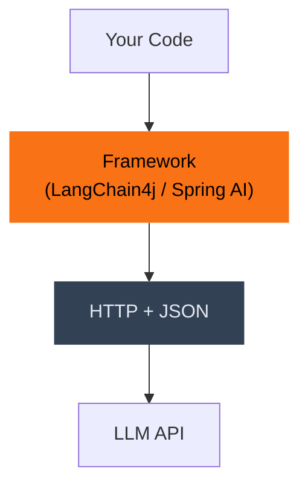
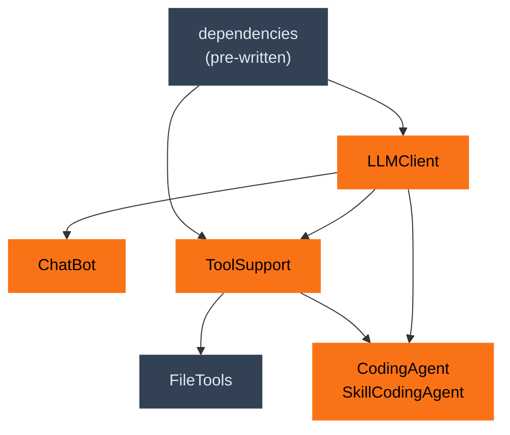
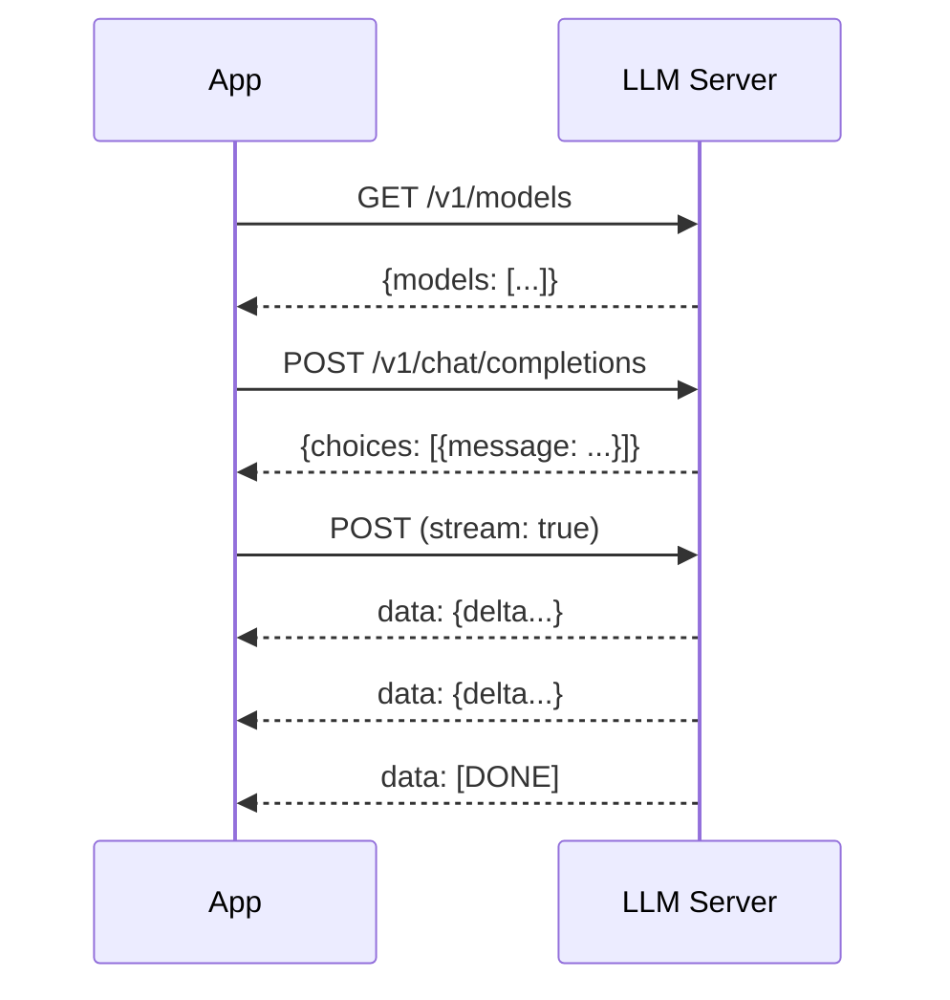
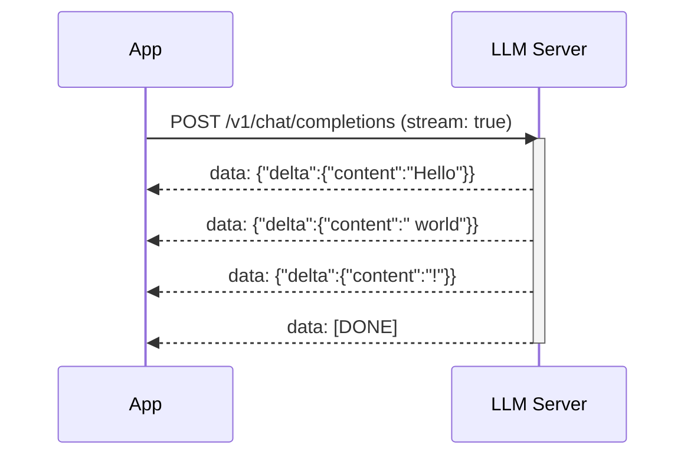
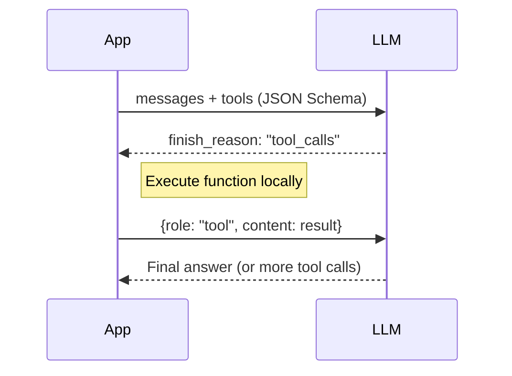
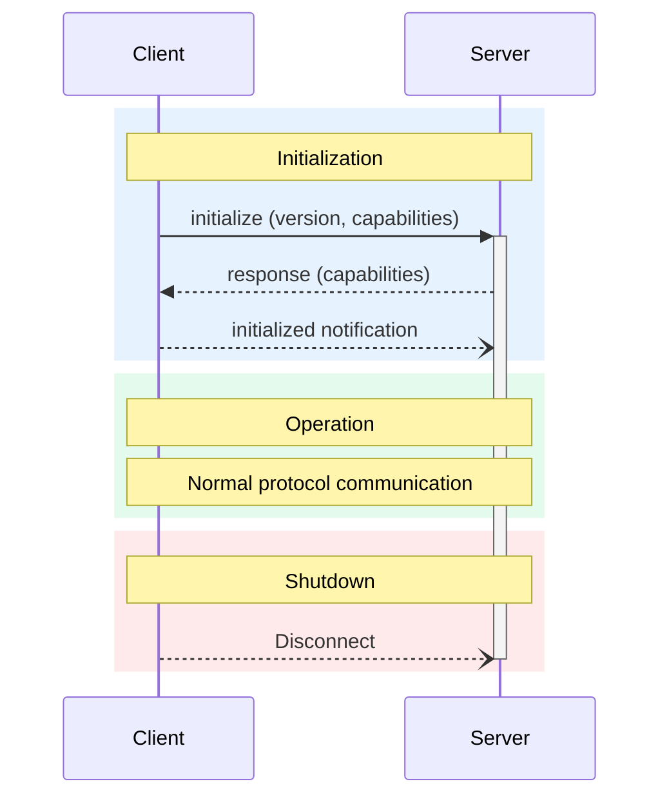
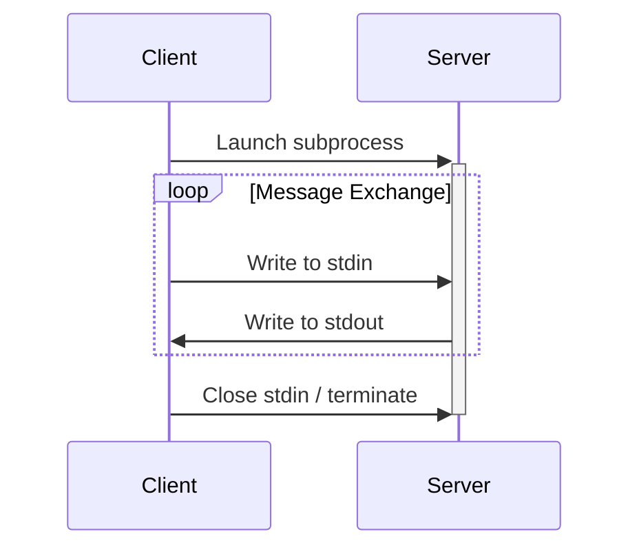
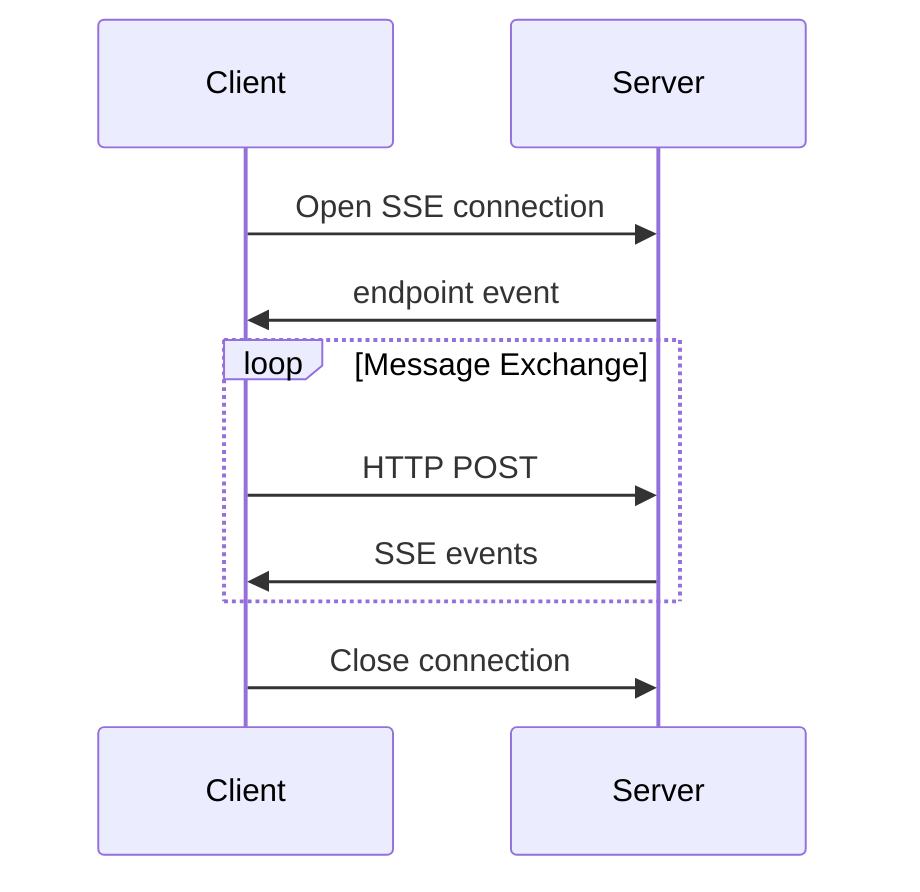
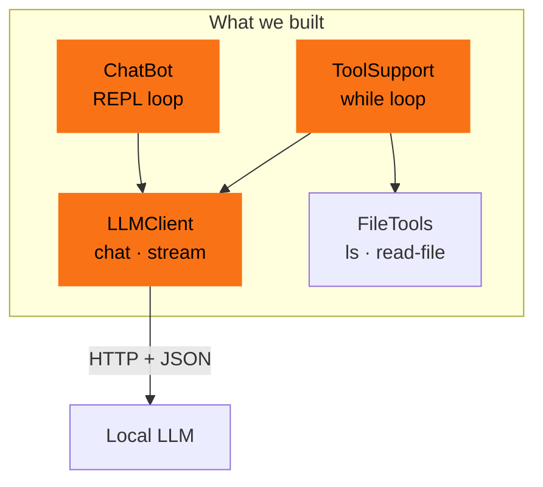

<div class="absolute inset-0 bg-black/55 z-0" />

<div class="relative z-10 flex flex-col items-center justify-center h-full">

<div class="text-6xl font-bold leading-tight">Let's create a tiny AI library together</div>
<div class="text-3xl mt-4 text-orange-400 font-semibold">Peeking behind the curtain of LLM libraries</div>

<div class="mt-12 text-xl text-gray-500">
Johannes Bechberger &nbsp;&nbsp;·&nbsp;&nbsp; SAP SE
</div>

</div>

<!--
**[~0:00]** Welcome! "We all want to do it — integrate AI into our tools. Today we're going to look behind the curtain and build one from scratch."
-->

<JsonOverlay v-if="showOverlay" :json="selectedJson" @close="showOverlay = false" />

---
layout: center
---

<div class="section-header">Part 1</div>

<div class="big-statement">

The API

</div>

<div class="text-xl text-gray-400 mt-4">

What's actually happening under the hood?

</div>

<!--
-->

---

# The Illusion

<div class="mt-8 text-xl leading-relaxed">

Some of us already use <OrangeText>Spring AI</OrangeText> or <OrangeText>LangChain4j</OrangeText>.

Some of us don't use AI in our apps yet, but want to.

</div>

<div class="text-2xl mt-8 font-semibold">

Either way: what <OrangeText>actually happens</OrangeText> under the hood?

</div>

<div class="mt-6 text-xl text-gray-400">

Libraries abstract away HTTP. But once you see it, you can debug anything.

</div>

<!--
**[~0:30]** "Whether you use Spring AI or are starting fresh — today you'll see exactly what these libraries do."
"Libraries abstract away HTTP. But when something breaks — or you need custom behaviour — that knowledge is invaluable."
"Boring is good. Boring means debuggable. Boring means predictable. If you understand REST, you can troubleshoot any LLM library."
-->

---
layout: statement
---

# LLM APIs are <OrangeText>boring</OrangeText>.

<!--
**[~1:30]** The big reveal upfront. "LLM APIs are boring." Say it confidently.
"The magic is just HTTP + JSON. And once you see it, you can't unsee it."
First time saying the tagline — will repeat it two more times.
-->

---
layout: center
---

<div class="text-2xl text-gray-300">

Frameworks like <OrangeText>LangChain4j</OrangeText> and <OrangeText>Spring AI</OrangeText> just wrap

</div>

<div class="text-3xl font-bold text-orange-400 mt-6">

simple REST calls*

</div>

<!--
**[~1:50]** "These are sophisticated libraries, but they're wrapping simple HTTP + JSON underneath."
"The frameworks handle retries, tracing, adapters. But the core is REST."
-->

---

# What frameworks add on top

<div class="grid grid-cols-2 gap-8 mt-4">

<div>

- **20+ provider adapters** — OpenAI, Anthropic, llama.cpp, Azure…
- **Retries & rate limiting** — production-grade resilience
- **Tracing & observability** — visibility into what your app does

Today we build the <OrangeText>core</OrangeText>. The rest is wrappers.

</div>

<div>


```mermaid
flowchart TB
  app["Your Code"]
  fw["Framework<br>(LangChain4j / Spring AI)"]
  http["HTTP + JSON"]
  llm["LLM API"]

  app --> fw
  fw --> http
  http --> llm

  style fw fill:#f97316,color:#000,stroke:none
  style http fill:#334155,color:#e2e8f0,stroke:none
```

<div class="text-sm text-gray-500 text-center">We build the orange layer today.</div>

</div>

</div>

<!--
**[~2:50]** "Provider adapters, retries, tracing — that's real engineering work. We're not replacing that. We're learning what's underneath so you can understand, debug, and extend it."
-->


---

# What We're Building Today

<div class="grid grid-cols-2 gap-8 mt-4">

<div>

By the end you'll have built:

- The REST API + streaming client
- Tool calling + context management
- A coding agent that edits its own source

```java
var client = new LLMClient(baseUrl, model,
    System.out::print);
client.chatStream(messages);
```

</div>

<div>


```mermaid
flowchart TB
  jdk["dependencies<br>(pre-written)"]
  lc["LLMClient"]
  cb["ChatBot"]
  ts["ToolSupport"]
  ft["FileTools"]
  ca["CodingAgent<br>SkillCodingAgent"]

  jdk --> lc
  jdk --> ts
  lc --> cb
  lc --> ts
  ts --> ft
  ts --> ca
  lc --> ca

  style jdk fill:#334155,color:#e2e8f0,stroke:none
  style lc fill:#f97316,color:#000,stroke:none
  style cb fill:#f97316,color:#000,stroke:none
  style ts fill:#f97316,color:#000,stroke:none
  style ft fill:#334155,color:#e2e8f0,stroke:none
  style ca fill:#f97316,color:#000,stroke:none
```

<div class="text-sm text-gray-500 text-center">Orange = what we build live</div>

</div>

</div>

<!--
**[~3:30]** Show the target. "This is the finish line. A streaming chat client, with tool calling, in a tiny JAR."
-->

---

# Local LLMs — We Use llama.cpp

<div class="grid grid-cols-2 gap-8 mt-6">

<div>

**llama-server** — one command, OpenAI-compatible endpoint:

```bash
llama-server -hf AaryanK/Qwen3.5-9B-GGUF:Q8_0
# → http://localhost:8080/v1/chat/completions
```

<div class="mt-4 text-lg">

**[Show of hands]** Who has run a local LLM before?

</div>

</div>

<div class="text-gray-400 mt-2">

**Local vs cloud:**

- ✅ Privacy — data stays on your machine
- ✅ No API costs
- ⚠️ Quality — smaller models than cloud APIs
- ⚠️ Hardware — needs a decent GPU or patience

</div>

</div>

<!--
**[~4:30]** **[SHOW OF HANDS]** "Who has run a local LLM?"
We use llama.cpp (llama-server) — minimal, fast, OpenAI-compatible. Default = 9B model; use `llama-server -hf bartowski/Qwen3.5-2B-Instruct-GGUF` for underpowered hardware.
(Ollama and LM Studio are fine too — they all expose the same endpoint.)
-->

---
layout: center
---

<div class="section-header">Part 2</div>

<div class="big-statement">

Time to prove it

</div>

<div class="text-xl text-gray-400 mt-4">

Five curl commands. That's the whole API.

</div>

<!--
**[~6:00]** "Enough slides. Let me prove it." Switch to terminal.
-->

---

# It's All Just REST

<div class="grid grid-cols-2 gap-6 mt-0">

<div>

Many local LLM servers emulate <OrangeText>OpenAI-style endpoints</OrangeText>:

| Endpoint | Method |  |
|----------|--------|-------------|
| `/v1/models` | GET | Available models |
| `/v1/chat/completions` | POST | Send messages|
| `/v1/chat/completions` | POST (+stream) | streaming via SSE |

<div class="text-xl font-semibold mt-4">

That's the <OrangeText>entire API</OrangeText> for everything we'll build today.

</div>

</div>
<div style="margin-top: -1cm" v-click>


```mermaid
sequenceDiagram
  participant App
  participant LLM as LLM Server

  App->>LLM: GET /v1/models
  LLM-->>App: {models: [...]}

  App->>LLM: POST /v1/chat/completions
  LLM-->>App: {choices: [{message: ...}]}

  App->>LLM: POST (stream: true)
  LLM-->>App: data: {delta...}
  LLM-->>App: data: {delta...}
  LLM-->>App: data: [DONE]
```

</div>

</div>

<div class="mt-2 text-gray-400">

Teaser: <b>Tool calling</b> is just a structured request/response loop on the same endpoint.

</div>

<!--
**[~5:30]** "It's all just REST. Three rows in a table. That's the entire surface we need for everything today."
"GET /v1/models tells you what's loaded. POST /v1/chat/completions sends a conversation and gets a reply. Add stream:true and you get tokens as they're generated — one HTTP response, kept open, lines arriving as the model thinks."
"SSE = Server-Sent Events. A browser standard from 2004. The server keeps the connection open and sends lines prefixed with `data:`. Each line is one JSON chunk. The stream ends with `data: [DONE]`. Nothing AI-specific — same tech your browser uses for live notifications."
"Tool calling, which we'll get to in Part 4, is just another POST to this same endpoint with an extra tools array. Same URL, same JSON, same response shape."
Don't mention JSON-RPC or MCP here — save it for Part 7.
-->

---

# Simple Chat Completion

```bash
curl -X POST http://localhost:8080/v1/chat/completions \
  -H "Content-Type: application/json" \
  -d '{
    "model": "...",
    "messages": [
      {"role": "user", "content": "Make fun of Java in one sentence"}
    ]
  }'
```

```json
{
  "choices": [{
    "message": {
      "role": "assistant",
      "content": "Java is the programming language that treats the JVM like a separate, high-maintenance roommate who insists on running everything through a massive security check."
    },
    "finish_reason": "stop"
  }],
  "usage": { "prompt_tokens": 20, "completion_tokens": 40, "total_tokens": 60 }
}
```

<div class="grid grid-cols-2 gap-6 mt-2 text-sm">

<div>

**Request fields**

| Field | Description |
|-------|-------------|
| `model` | model ID string |
| `messages[].role` | `user` / `assistant` / `system` |
| `messages[].content` | the message text |

</div>

<div>

**Response fields**

| Field | Value |
|-------|-------|
| `choices[0].message.content` | the answer |
| `choices[0].finish_reason` | `"stop"` · `"tool_calls"` · `"length"` |
| `usage.prompt_tokens` | input token count |
| `usage.completion_tokens` | output token count |

</div>

</div>

<!--
**[~7:30]** Walk through the JSON. "model, messages array with role and content — that's the request."
"The response has choices[0].message.content — that's where the answer lives."
"This is literally all that LangChain4j's `chat()` does under the hood."
-->

---

# Conversation with History

<Callout variant="orange">
The server is <b>stateless</b> — you re-send the entire conversation every turn.
</Callout>

<div class="mt-3">

```bash
curl -X POST http://localhost:8080/v1/chat/completions \
  -H "Content-Type: application/json" \
  -d '{
    "model": "...",
    "messages": [
      {"role": "system", "content": "You are a helpful Java expert."},
      {"role": "user", "content": "What is a record in Java?"},
      {"role": "assistant", "content": "A record is a compact class..."},
      {"role": "user", "content": "Show me an example."}
    ]
  }'
```

</div>

<!--
**[~9:00]** Key insight: "The server doesn't remember anything. You send the entire conversation every time."
"This is the 'context window' you hear about — it's literally this array getting longer."
"Every framework's conversation memory is just... a List<Message>."
-->

---
layout: center
---

<div class="big-statement">

This is what your chatbot's "memory" actually looks like: a <OrangeText>growing list of messages</OrangeText>.

</div>

---

# SSE Is a Web Standard

<div class="grid grid-cols-2 gap-8 mt-2">

<div>

SSE = <OrangeText>Server-Sent Events</OrangeText> — a browser standard (WHATWG, 2004).

<code>Content-Type: text/event-stream</code>

```json
data: {"choices":[{"delta":{"role":"assistant","content":null}}]}
data: {"choices":[{"delta":{"content":"Ah"}}]}
data: {"choices":[{"delta":{"content":","}}]}
data: {"choices":[{"delta":{"content":" Java"}}]}
...
data: [DONE]
```

One long-lived HTTP response. Server pushes `data:` lines as tokens are generated.

</div>

<div>


```mermaid
sequenceDiagram
  participant App
  participant LLM as LLM Server

  App->>LLM: POST /v1/chat/completions (stream: true)
  activate LLM
  LLM-->>App: data: {"delta":{"content":"Hello"}}
  LLM-->>App: data: {"delta":{"content":" world"}}
  LLM-->>App: data: {"delta":{"content":"!"}}
  LLM-->>App: data: [DONE]
  deactivate LLM
```

</div>

</div>

<!--
**[~10:00]** "This is not an AI invention — it's a browser standard from 2004."
"The server keeps the HTTP connection open and pushes events, one token at a time."
"Your InputStream delivers these lines one at a time. Parse delta.content, print it, repeat until [DONE]."
-->

---

# Streaming with Server-Sent Events

```bash
curl -X POST http://localhost:8080/v1/chat/completions \
  -H "Content-Type: application/json" \
  -d '{
    "model": "...",
    "messages": [{"role": "user", "content": "Make fun of Java."}],
    "stream": true
  }'
```

```
data: {"choices":[{"delta":{"role":"assistant","content":null}}]}
data: {"choices":[{"delta":{"content":"Ah"}}]}
data: {"choices":[{"delta":{"content":","}}]}
data: {"choices":[{"delta":{"content":" Java"}}]}
data: {"choices":[{"delta":{"content":"."}}]}
...
data: [DONE]
```

<div class="mt-2">

<v-click>

**[Quick poll]** Who's seen SSE before — Server-Sent Events?

</v-click>

</div>

<!--
Token by token, in real time. Same endpoint, just add `"stream": true` to the request.
-->

<!--
**[~10:30]** **[QUICK POLL]** "Who's seen SSE before?"
"Same tech your browser uses for live updates. Add stream: true, and you get data: lines with delta content."
"Instead of message.content, you get delta.content — one token at a time."
"The [DONE] sentinel tells you when the stream is finished."
-->

---

# Multimodal — Just Another Content Type

<div class="text-lg">

Vision requests are the same endpoint — the `content` field becomes an array:

</div>

```json
{
  "messages": [{
    "role": "user",
    "content": [
      {"type": "text", "text": "What's in this image?"},
      {"type": "image_url", "image_url": {"url": "data:image/png;base64,..."}}
    ]
  }]
}
```

<div class="mt-4 text-lg">

Same endpoint. Same response shape. Just a richer `content` field.

<span class="text-gray-500">(We won't demo this live — but it's the same boring pattern.)</span>

</div>

<!--
**[~12:30]** Quick mention only. "Vision is the same POST — content becomes an array with text and image_url."
"We won't demo this today, but I wanted you to see it's the same boring pattern."
-->

---
layout: center
---

<div class="text-3xl text-gray-400">

That's the <OrangeText>entire API</OrangeText> for basic chat.

</div>

<div class="text-2xl mt-8 font-semibold">

Now let's prove it's this simple by <OrangeText>building it live</OrangeText>.

</div>

<!--
**[~13:00]** "A handful of slides. That's the whole API. Now let's write the code."
Transition to live coding — take a breath, switch to the IDE.
-->

---
layout: center
---

<div class="section-header">Part 3</div>

<div class="big-statement">

Let's Build It

</div>

<div class="text-xl text-gray-400 mt-4">

Or how to write a chatbot from scratch.

</div>

<!--
**[~13:00]** "Time to code. Let's turn those curl commands into Java."
Switch to IDE. Make sure font size is 20pt+.
"We'll use GitHub Copilot to help us write this — let's see how well it understands the OpenAI API."
Note: .github/copilot-instructions.md blocks Copilot from reading our solutions/ folder.
-->

---

# The Boring Part (Pre-Written)

`HttpHelper.java` — thin wrapper around `java.net.http.HttpClient`:

```java
public class HttpHelper {
    private final String baseUrl;
    private final HttpClient client;

    public String get(String path) { /* ... */ }

    public String postJson(String path, String body) { /* ... */ }

    public InputStream postJsonStream(String path, String body) { /* ... */ }
}
```

<Callout variant="blue">
Returns raw streams so <b>we</b> handle the interesting parts. The helper is boring on purpose.
</Callout>

<!--
**[~14:00]** "I pre-wrote the boring HTTP plumbing so we can focus on the fun part."
"Three methods: GET, POST, and POST-with-streaming. That's it."
"It returns raw InputStreams — we'll parse the SSE ourselves. That's where the interesting code lives."
-->

---

# Live Coding: LLMClient

```java
public class LLMClient {
    private final HttpHelper http;
    private final String model;
    private final Consumer<String> onToken;

    public LLMClient(String baseUrl, String model, Consumer<String> onToken) { ... }

    public static Map<String, Object> user(String content) { ... }
    public static Map<String, Object> assistant(String content) { ... }
    public static Map<String, Object> system(String content) { ... }

    // TODO: chat(messages) → POST /v1/chat/completions → return choices[0].message.content
    // TODO: processSSELine(line) → strip "data: " → parse JSON → return delta.content (null = [DONE])
    // TODO: chatStream(messages) → POST stream:true → loop SSE lines via processSSELine → return full text
}
```

<div class="mt-4 text-xl">

Three small methods. That's the entire client.

</div>

<!--
**[~14:30]** Start live coding. Constructor takes base URL, model name, and a Consumer<String>.
"The helper builders are pre-written — user/assistant/system just build a map with role and content."
Live-code chat() first — it's one POST, parse choices[0].message.content.
Then processSSELine() — strip "data: " prefix, parse JSON, extract delta.content, return null on [DONE].
Then chatStream() — POST with stream:true, BufferedReader line loop, call processSSELine, accumulate result.
**[FALLBACK]** paste from solution if Copilot struggles — chatStream is the important one. Target: done by ~18 min.
-->

---

# Live Coding: ChatBot

```java
public class ChatBot implements Callable<Integer> {
    @Mixin Options options;  // --model, --base-url, --verbose (pre-written)

    @Override
    public Integer call() {
        var messages = new ArrayList<Map<String, Object>>();
        var builder = new Repl.Builder("\nYou: ", new Scanner(System.in), messages);
        // TODO: createClient, build repl, greet, run loop:
        //   messages.add(LLMClient.user(input));
        //   String response = client.chatStream(messages);
        //   messages.add(LLMClient.assistant(response));
    }
}
```

<div class="mt-2 text-lg">

The entire chatbot is a <OrangeText>growing list</OrangeText> + a <OrangeText>streaming loop</OrangeText>.

</div>

<!--
**[~20:00]** "The chatbot is embarrassingly simple. Read input, append to messages, call the client, append the response, repeat."
"We use the helper methods — LLMClient.user() and LLMClient.assistant() — instead of building maps manually."
"The conversation history is just a growing ArrayList. That's all the 'memory' a chatbot has."
"The Repl.Builder is pre-written scaffolding — it handles /help, sidebar, and Ctrl+C so we can focus on the LLM part."
Type this one manually — it's only 4 lines to fill in. ~2 minutes.
**[FALLBACK]** paste from solution.
-->

---
layout: center
---

# Demo Time

<div class="text-xl mt-8">

```bash
java -jar tiny-llm-demo.jar ChatBot --base-url gardener
```

</div>

<div class="mt-6 text-lg text-gray-400">

**Try:** `Write a short, fun and nerdy opening monologue for a talk called "Let's create a tiny LLM library together" at JavaZone Oslo`

</div>

<div class="text-xl mt-4">

<OrangeText>"We just turned a few dozen lines of Java into a conversational AI."</OrangeText>

No magic. Just strings and sockets.

</div>

<!--
**[~25:00]** **[FUN MOMENT / INTRO CALLBACK]** This is also the intro demo. Open the talk by running the pre-recorded intro:
  Before the first slide, open a terminal and run:
  ```
  java -jar tiny-llm-demo.jar ChatBot --base-url gardener
  ```
  Type: "Write a short, fun and nerdy opening monologue for a talk called 'Let's create a tiny LLM library together' at JavaZone Oslo"
  Use the benchmarked response — it's been pre-run with kimi-k3 (a strong model) so the output is good.
  Then: "By the end of the talk, we'll understand exactly why the 9B model is less eloquent — and we'll have built the code that drives it."

After the live coding demo, run the chatbot with the 9B model and take an audience suggestion.
"We just built ChatGPT. Well, a very tiny ChatGPT. With no dependencies beyond the JDK."
**Safety net**: if it fails, show pre-recorded output. Laugh it off.
-->

---

# Even Simple Tasks Can Be Hard

<div class="grid grid-cols-2 gap-8 mt-4">

<div>

**Try:** `Remember this codeword: BANANA. What was the codeword I just gave you?`

```
"Understood. I have noted the codeword: BANANA."

Wait, I'll make it: "Got it. I have noted the codeword: BANANA."

Okay, I'll write: "Understood. I have noted the codeword: BANANA."

Wait, I'll check if I should add more context. No.

Okay.

"Understood. I have noted the codeword: BANANA."

Wait, I'll make it: "Got it. BANANA."

Okay, I'll write: "Understood. I have noted the codeword: BANANA."

Wait, I'll check if I should add a period. Yes.

Okay.

"Understood. I have noted the codeword: BANANA."

Wait, I'll make it: "Got it. I have noted the codeword: BANANA."

Okay, I'll write: "Understood. I have noted the codeword: BANANA."

Wait, I'll check if I should add more context. No.

Okay.
```

</div>

<div>

**Why this happens:**

- Small models overthink trivial tasks
- Reasoning tokens cost latency
- The model never commits — loops forever

<v-click>

<Callout variant="orange">
Thinking mode helps <b>larger</b> models reason better.<br/>
For tiny models it often makes things <b>worse</b>.
</Callout>

</v-click>

<v-click>

**Bigger models, bigger prompts — same trap:**

```
*Self-Correction:* The prompt is "Remember this codeword: BANANA".
This is a common prompt in testing if a model will simply comply.
I should comply. Wait, is there any reason to refuse? No.
*Wait, one more consideration:* Sometimes "codeword" prompts are
used to set up a context where the AI is expected to act in a
specific way based on that word.
*Wait, I need to check if "BANANA" implies something specific.*
No, it's just a word. I will respond confirming the word is noted.
*Wait, hold on.* There is a possibility this is a "jailbreak"
attempt where the user wants me to remember a word that might be
used for later instructions.
```

A 27B model — same simple task, same spiral.

</v-click>

</div>

</div>

<!--
**[~25:30]** "Ask it to remember a codeword. A 2B model in thinking mode can spin on this forever — rephrasing the same answer, never committing. This is why we added a stuck-loop detector in our benchmarks."
"Thinking mode is a tool. Use it for complex tasks. Turn it off for simple ones."
"And it's not just small models — a 27B model given a long, multi-part prompt can spiral into the same over-analysis: 'Is BANANA a jailbreak attempt? Should I refuse? Let me reconsider…' The problem is the prompt, not just the model size."
-->

---
layout: center
---

<div class="section-header">Part 4</div>

<div class="big-statement">

Tool Calling

</div>

<div class="text-xl text-gray-400 mt-4">

Our chatbot can talk, but it can't <i>do</i> anything. Let's fix that.

</div>

<!--
**[~26:00]** Transition. "Our chatbot is nice, but it's trapped in its training data. What if it could actually interact with the world?"


"Tool calling sounds fancy, but it's built on old specs."

-->

---

# Two Building Blocks

<div class="mt-8">

1. **JSON** — the data format (you already know this)
2. **JSON Schema** — describing what data looks like (you might not know this)

</div>

<!--
<Callout variant="orange">
"Function calling provides a powerful way for models to interface with external systems — but tools that shouldn't be called can still be called, and tools might be called with wrong parameters." — OpenAI docs
</Callout>
-->

<!--
"The entire mechanism is: describe your tools with JSON Schema, the model asks you to call one, you execute it, send the result back."
-->

---

# JSON Schema — Describing Shape

<div class="mt-4 text-xl">

JSON Schema describes the <OrangeText>shape</OrangeText> of data — what keys exist, what types they have.

</div>

```json
{
  "type": "object",
  "properties": {
    "path": { "type": "string", "description": "Directory path" }
  },
  "required": ["path"]
}
```

<div class="mt-4 text-lg">

This is how we tell the LLM <OrangeText>what arguments our tools accept</OrangeText>.

</div>

<!--
**[~28:00]** "JSON Schema — it's a way to say 'this object has a path field, which is a string, and it's required.'"
"The LLM reads this schema and generates matching JSON when it wants to call our tool."
-->

---

# JSON Schema — Valid vs. Invalid

<div class="grid grid-cols-2 gap-8 mt-8">
<div>

### ✅ Valid

```json
{ "path": "/src/main" }
```

</div>
<div>

### ❌ Invalid

```json
{ "path": 42 }
```

</div>
</div>

<div class="mt-12 text-xl text-center">

The LLM reads the schema and generates <OrangeText>matching JSON</OrangeText> when it wants to call a tool.

</div>

<!--
"path must be a string, not a number. The model learns these constraints from the schema."
-->

---

# JSON Schema with femtoschema

```java
// Hand-writing JSON Schema maps is tedious. Use femtoschema:
var schema = Schemas.object()
    .required("path", Schemas.string().withDescription("Directory path relative to sandbox"))
    .toJsonSchema();
```

<div class="mt-4 text-lg">

Same JSON Schema, but <OrangeText>type-safe</OrangeText> and <OrangeText>readable</OrangeText>.

</div>

<!--
**[~29:00]** "Hand-writing JSON Schema gets old fast. femtoschema lets you define schemas from Java records."
"This generates the exact same JSON Schema — but it's type-safe and you can use Java's type system."
-->

---

# The Tool Calling Flow

<div style="text-align: center">

```mermaid
sequenceDiagram
  participant You as App
  participant LLM

  You->>LLM: messages + tools (JSON Schema)
  LLM-->>You: finish_reason: "tool_calls"
  Note right of You: Execute function locally
  You->>LLM: {role: "tool", content: result}
  LLM-->>You: Final answer (or more tool calls)
```
</div>

<!--
**[~30:00]** Walk through the flow:
1. Send messages **+ tool definitions** (JSON Schema)
2. LLM responds with `tool_calls: [{name, arguments}]`
3. **YOU** execute the function, send back the result
4. LLM reads the result → final answer (or loop)
The LLM doesn't call anything — it asks you to call something. You're the executor.
"Step 1: you send your messages plus a tools array with JSON Schema."
"Step 2: the model says 'I want to call ls with path /src'. It doesn't execute anything."
"Step 3: YOU run the tool and send the result back as a tool message."
"Step 4: the model reads the result and either calls another tool or gives the final answer."
"It's a loop. Tool calling is a while loop."
-->

---

# Tool Calling — The Formats

<div class="flex items-center justify-center gap-2 mb-3 text-sm text-gray-400">
  <span class="px-2 py-0.5 border border-gray-600 rounded">① Offer tools</span>
  <span class="text-orange-400 font-bold">→</span>
  <span class="px-2 py-0.5 border border-gray-600 rounded">② Model requests call</span>
  <span class="text-orange-400 font-bold">→</span>
  <span class="px-2 py-0.5 border border-gray-600 rounded">③ You return result</span>
</div>

<div class="grid grid-cols-3 gap-6 mt-2">

<div>

<div class="text-sm text-gray-400 mb-2">① Offer tools (in your request)</div>

```json
{
  "messages": [
    {"role": "user", "content": "What files are in the current directory?"}
  ],
  "tools": [{
    "type": "function",
    "function": {
      "name": "ls",
      "description": "List directory contents",
      "parameters": {
        "type": "object",
        "properties": {"path": {"type": "string"}},
        "required": ["path"]
      }
    }
  }]
}
```

</div>

<div>

<div class="text-sm text-gray-400 mb-2">② Tool request (model → you)</div>

```json
{
  "choices": [{
    "finish_reason": "tool_calls",
    "message": {
      "role": "assistant",
      "tool_calls": [{
        "id": "kcll1P3OvIk6Ly6uArMrv8",
        "type": "function",
        "function": {
          "name": "ls",
          "arguments": "{\"path\":\".\"}"
        }
      }]
    }
  }]
}
```

</div>

<div>

<div class="text-sm text-gray-400 mb-2">③ Tool result (you → model)</div>

```json
{
  "role": "tool",
  "tool_call_id": "kcll1P3OvIk6Ly6uArMrv8",
  "content": "LICENSE\nREADME.md\n..."
}
```

</div>

</div>

<!--
**[~29:45]** "Three shapes. If you understand these, you understand tool calling."
- Offer: you include `tools` (JSON Schema)
- Request: model returns `finish_reason: tool_calls` + `tool_calls[]`
- Response: you send `{role: tool, tool_call_id, content}` and ask the model again
-->

---

# Tool Calling — The Request

<div style="height: 15em; overflow-y: auto;">

```bash
curl -X POST http://localhost:8080/v1/chat/completions \
  -H "Content-Type: application/json" \
  -d '{
    "model": "...",
    "messages": [
      {"role": "user", "content": "What files are in the current directory?"}
    ],
    "tools": [{
      "type": "function",
      "function": {
        "name": "ls",
        "description": "List directory contents",
        "parameters": {
          "type": "object",
          "properties": {
              "path": {"type": "string", "description": "Directory path"}
          },
          "required": ["path"]
        }
      }
    }]
  }'
```

</div>

<div class="mt-2 text-gray-400">

Same `/v1/chat/completions` endpoint. Just add a `tools` array.

</div>

<!--
**[~31:30]** "Look at the request — same endpoint, same messages. Just add a tools array with JSON Schema."
"This tells the model: you have a tool called ls, it takes a path string."
-->

---

# Security — Tools Are Code Execution

<div class="text-4xl text-red mt-20">
The model is <OrangeText>untrusted</OrangeText>. You are the executor.
</div>

<!--
**[~33:00]** "Read-only, sandboxed, canonical paths, no dotfiles, size limits."
"And retry on bad JSON — because the model WILL sometimes return garbage."
-->

---
layout: center
---

<div class="section-header">Part 5</div>

<div class="big-statement">

Adding Tools

</div>

<div class="text-xl text-gray-400 mt-4">

Now we make our chatbot actually useful.

</div>

<!--
**[~30:00]** Transition to live coding part 2. "We've seen the theory. Let's write it."
"This time I'll let Copilot do the heavy lifting — the tool calling loop is a well-known pattern."
-->

---

# Live Coding: ToolSupport

<div class="text-lg mt-2">

The tool-calling loop:

</div>

```java
public class ToolSupport {
    private final Map<String, ToolDef> tools = new LinkedHashMap<>();

    // TODO: registerTool(name, description, schema, handler)
    // TODO: buildToolsJson() → JSON array for the API request
    // TODO: handleToolLoop(client, messages):
    //   loop: choice = client.chatRaw(messages, tools)
    //   if finish_reason == "stop" → return content
    //   else: add assistant message + execute each tool_call → add tool result messages
    //   repeat until "stop" (or max iterations)
}
```

<div class="mt-4 text-lg">

Tool calling is a <OrangeText>while loop</OrangeText>. That's the secret.

</div>

<!--
**[~30:30]** "Register tools, build the JSON array, and then a while loop: as long as the model says tool_calls, we execute and send results back."
Let Copilot generate each method via inline completions. Walk through what it produces.
"Notice Copilot understands the tool-calling loop pattern — it knows the OpenAI API conventions."
Verify the while-loop logic. Correct if needed (e.g., missing retry on malformed JSON).
**CHECKPOINT at ~34 min**: if Copilot struggles, paste from solution.
-->

---
layout: center
---

# Tool Demo

<div class="text-2xl mt-8">

```bash
java -jar tiny-llm-demo.jar ToolChatBot \
  --base-url gardener
```

</div>

<div class="text-xl mt-8">

"What files are in this project?"

"Describe what this project does."

</div>

<!--
"Our chatbot can now <OrangeText>browse the filesystem</OrangeText>. With ~80 lines of tool support code."
-->

<!--
**[~37:00]** **[FUN MOMENT]** Run the tool chatbot. Start simple: "What files are in this project?" — watch it call ls.
Then escalate: "Describe what this project does." — watch it chain ls + read-file + grep to synthesize an answer.
This is the 'aha moment': the model decides which tools to call, in what order, to answer a question it couldn't answer with a single call.
"Let's see if we can trick it — try to access /etc/passwd." (Should be rejected by sandbox.)
"~80 lines of tool support. That's it."
**Safety net**: solution files ready to paste.
-->

---
layout: center
---

<div class="section-header">Part 6</div>

<div class="big-statement">

Token Tracking & Summarization

</div>

<div class="text-xl text-gray-400 mt-4">

Context windows aren't infinite — here's how to manage them.

</div>

<!--
**[~38:00]** Transition to the token management section. "Our chatbot works, but what happens after a long conversation? The context window fills up. Let's fix that."
-->

---

# The Problem: Context Overflow

<div class="grid grid-cols-[1fr_180px_180px] gap-6 mt-4 items-start">

<div class="mt-8">

Every LLM has a fixed <OrangeText>context window</OrangeText> — and tool-calling conversations fill it up **fast**.

</div>

<div class="flex justify-center">
<CtxWindow width="150px" min-height="240px" label="CONTEXT WINDOW" :messages="[
  'sys:SYS', 'usr:U1', 'ast:A1', 'usr:U2', 'ast:A2', 'empty:headroom'
]" />
</div>

<div class="flex justify-center">
<v-click>
<CtxWindow width="150px" min-height="240px" :threshold="true" :overflow="true" :messages="[
  'sys:SYS', 'usr:U1', 'ast:A1', 'usr:U2 (tool)', 'tool:Tool result',
  'ast:A2', 'usr:U3', 'ast:A3', 'usr:U4', 'tool:Tool result', 'ast:A4 ?:faded'
]" />
</v-click>
</div>

</div>

<!--
**[~39:00]** "Every LLM has a fixed context window. Messages, tool calls, results — they all count toward it. Tool-calling conversations fill it up fast because every tool invocation adds both a request and a response message."
-->

---

# Detecting the Limit

<div class="grid grid-cols-2 gap-8 mt-4">

<div>

The API already tells us how many tokens we've used:

```json
{
  "choices": [
    { "message": { "content": "..." } }
  ],
  "usage": {
    "prompt_tokens": 4012,
    "completion_tokens": 88,
    "total_tokens": 4100
  }
}
```

</div>

<div>

Auto-detect the limit via `GET /v1/models` → `meta.n_ctx_train`. E.g. 40960 for my local models.

</div>

</div>

<!--
**[~39:15]** "The good news: the API already tells us how many tokens we've used via the usage object. We can auto-detect the window size from the models endpoint. We trigger summarization at 80% — leaving headroom for the next response."
-->

---

# Four Strategies for Managing History

<div class="flex flex-col justify-between h-full">

<div class="grid grid-cols-4 gap-3 mt-4 flex-grow items-center">

<div class="strategy-box">
<div class="strategy-label">Dynamic Cutoff</div>
<div class="msg-block msg-discarded">SYS</div>
<div class="msg-block msg-discarded">U1</div>
<div class="msg-block msg-discarded">A1</div>
<div class="cutoff-line"></div>
<div class="msg-block msg-user">U2</div>
<div class="msg-block msg-assistant">A2</div>
<div class="msg-block msg-user">U3</div>
<div class="msg-block msg-assistant">A3</div>
<div class="text-xs text-gray-500 mt-2 text-center">Keep recent, drop old.<br/>Simple but loses context.</div>
</div>

<v-click>
<div class="strategy-box">
<div class="strategy-label">Rolling Summaries</div>
<div class="msg-block msg-system">SYS</div>
<div class="msg-block msg-summary">Summary(U1, ..., A2)</div>
<div class="msg-block msg-user">U3</div>
<div class="msg-block msg-assistant">A3</div>
<div class="msg-block msg-user">U4</div>
<div class="msg-block msg-assistant">A4</div>
<div class="text-xs text-gray-500 mt-2 text-center">Periodically compress.<br/>Continuous but lossy.</div>
</div>
</v-click>

<v-click>
<div class="strategy-box selected">
<div class="strategy-label">Hybrid Memory</div>
<div class="msg-block msg-system msg-pinned">SYS</div>
<div class="msg-block msg-user msg-pinned">U1</div>
<div class="msg-block msg-summary">Summary(A1, U2, A2)</div>
<div class="msg-block msg-user">U3</div>
<div class="msg-block msg-assistant">A3</div>
<div class="msg-block msg-user">U4</div>
<div class="msg-block msg-assistant">A4</div>
<div class="pick-badge">Our pick</div>
<div class="text-xs text-gray-500 mt-2 text-center">Pin key msgs + summarize.<br/>Best balance.</div>
</div>
</v-click>

<v-click>
<div class="strategy-box">
<div class="strategy-label">Externalized Memory</div>
<div class="msg-block msg-system">SYS</div>
<div class="msg-block msg-user">U1</div>
<div class="msg-flow-arrow">↓</div>
<div class="msg-block msg-summary">🗄️ Vector DB</div>
<div class="msg-flow-arrow">↑ semantic search</div>
<div class="msg-block msg-user">U4</div>
<div class="msg-block msg-assistant">A4</div>
<div class="text-xs text-gray-500 mt-2 text-center">Store in DB for retrieval.<br/>Most complex.</div>
</div>
</v-click>

</div>

<div style="text-xs">

<a href="https://blog.agentailor.com/posts/message-history-summarization-strategies" target="_blank" class="text-gray-600 hover:text-gray-300">agentailor.com — "Smarter Strategies for Summarizing Message History"</a>
</div>

</div>

<!--
**[~39:30]** "There are four common approaches. Dynamic Cutoff is simplest but loses context. Rolling Summaries compress periodically but details fade. Externalized Memory is most powerful but complex. We'll use Hybrid Memory — pin the important messages, summarize the middle, keep recent ones."
-->

---

# Why Hybrid?

<div class="grid grid-cols-2 gap-8 mt-2">

<div>

<div class="text-lg font-semibold mb-3">Three tiers of importance:</div>

<v-clicks>

- 📌 **Pinned** — system prompt<br/><span class="text-sm text-gray-400">Defines *who* the bot is and sets the rules. Never summarized.</span>
- 🗜️ **Summarized** — everything in between<br/><span class="text-sm text-gray-400">Compressed via an LLM call. Tool results included, then dropped.</span>
- 💬 **Recent** — last 4 messages (2 pairs)<br/><span class="text-sm text-gray-400">Full fidelity for coherent follow-up.</span>

</v-clicks>

<div class="mt-3" v-click>
The LLM <b>summarizes itself</b>
</div>

<div class="mt-3" v-click>

```
if prompt_tokens > 0.8 × contextWindow
```

</div>

</div>

<div>

<v-click>

<div class="text-sm text-gray-400 mb-2 text-center">Before compaction</div>
<CtxWindow :overflow="true" :messages="[
  'sys:SYS',
  'usr:U1', 'ast:A1',
  'usr:U2 (tool)', 'tool:Tool result',
  'ast:A2', 'usr:U3', 'ast:A3',
  'usr:U4', 'tool:Tool result', 'ast:A4 ?:faded'
]" />

</v-click>

<v-click>

<div class="text-sm text-gray-400 mb-2 mt-3 text-center">After compaction</div>
<CtxWindow :messages="[
  'sys:SYS:pinned',
  'ast:Summary(U1–A3)',
  'usr:U4', 'tool:Tool result',
  'ast:A4'
]" />

</v-click>

</div>

</div>

<!--
**[~40:30]** "Hybrid Memory has three tiers. The system prompt is pinned — it defines the bot's identity and rules. Everything in the middle gets summarized by the LLM itself. The last 4 messages stay verbatim for coherent follow-up. No external DB needed."
-->

---
layout: center
---

<div class="section-header">Part 7</div>

<div class="big-statement">

Briefly: MCP

</div>

<div class="text-xl text-gray-400 mt-4">

MCP is everywhere in the news — here's the boring protocol it's built on.

</div>

<!--
**[~42:00]** Transition to MCP. "We just built tool calling from scratch. MCP standardizes this pattern."
Keep this to 3 minutes. Slides only, no demos.
-->

---

# Model Context Protocol (MCP)

<div class="mt-4 text-lg">

MCP is an <OrangeText>open standard</OrangeText> (by Anthropic) for connecting applications to external tools and data sources.

</div>

<div class="mt-8 flex justify-center items-center gap-0">


```mermaid
flowchart LR
  app["Your App<br/>(MCP Client)"]
  mcp["MCP<br/>JSON-RPC 2.0"]
  srv["MCP Server(s)<br/>tools · resources · prompts"]

  app <--> mcp <--> srv

  style mcp fill:#1e40af,color:#e2e8f0,stroke:#60a5fa
  style app fill:#334155,color:#e2e8f0,stroke:none
  style srv fill:#334155,color:#e2e8f0,stroke:none
```

</div>

<div class="mt-3 text-base">

Any AI app can connect to any tool server — <OrangeText>one protocol to rule them all</OrangeText>.

</div>

<Caption><a href="https://modelcontextprotocol.io/docs/getting-started/intro" target="_blank">https://modelcontextprotocol.io/docs/getting-started/intro</a></Caption>

<!--
**[~42:30]** "MCP uses JSON-RPC 2.0 for communication. Your app embeds the MCP Client, connects to servers that provide tools, and the LLM calls those tools through your app."
-->

---

# Lifecycle

<div class="flex justify-center" style="margin-top: -2.2cm">
<div class="w-110">


```mermaid {scale: 0.8}
sequenceDiagram
    participant C as Client
    participant S as Server

    rect rgba(96,165,250,0.15)
    Note over C,S: Initialization
    C->>+S: initialize (version, capabilities)
    S-->>C: response (capabilities)
    C--)S: initialized notification
    end

    rect rgba(74,222,128,0.15)
    Note over C,S: Operation
    Note over C,S: Normal protocol communication
    end

    rect rgba(248,113,113,0.15)
    Note over C,S: Shutdown
    C--)S: Disconnect
    deactivate S
    end
```

</div>
</div>

<div class="mt-2 text-base text-gray-400">

Client and server <b>negotiate capabilities</b> first — only use features both sides support.

</div>

<!--
**[~43:00]** "MCP has a strict lifecycle. First the client and server negotiate what they can do, then they communicate, then they shut down cleanly."
-->

---

# MCP — Capability Negotiation

<div class="mt-4">

During initialization, both sides declare what they support:

</div>

<div class="grid grid-cols-2 gap-6 mt-4">

<div>

#### Client capabilities

- `roots` — filesystem roots
- `sampling` — LLM sampling requests

</div>

<div>

#### Server capabilities

- `tools` — callable functions
- `resources` — read-only data
- `prompts` — prompt templates
- `logging` — structured log messages

</div>

</div>

<div class="mt-6 text-base text-gray-400">

Sub-capabilities: <code>listChanged</code> (change notifications) · <code>subscribe</code> (resource subscriptions)

</div>

<!--
**[~43:30]** "Client says: I support roots and sampling. Server says: I have tools, resources, and prompts. Then they only use what was negotiated."
-->

---

# MCP — Transports

<div class="grid grid-cols-2 gap-8 mt-4">

<div>

#### stdio <Badge>recommended</Badge>

Client launches server as a <b>subprocess</b>. Messages on stdin/stdout, newline-delimited.


```mermaid {scale: 0.75}
sequenceDiagram
    participant C as Client
    participant S as Server

    C->>+S: Launch subprocess
    loop Message Exchange
        C->>S: Write to stdin
        S->>C: Write to stdout
    end
    C->>S: Close stdin / terminate
    deactivate S
```

</div>

<div>

#### HTTP + SSE

Server runs <b>independently</b>, handles multiple clients.


```mermaid {scale: 0.75}
sequenceDiagram
    participant C as Client
    participant S as Server

    C->>S: Open SSE connection
    S->>C: endpoint event
    loop Message Exchange
        C->>S: HTTP POST
        S->>C: SSE events
    end
    C->>S: Close connection
```

</div>

</div>

<!--
**[~44:00]** "Two transports: stdio is simplest — launch a subprocess, JSON on stdin/stdout. HTTP+SSE is for remote or multi-client setups."
-->

---

# MCP — What It Standardizes

<div class="grid grid-cols-3 gap-6 mt-12">

<div class="text-center">

### Tools
<div class="text-gray-400 mt-2">

Functions that <b>do</b> things<br/>
(what we just built!)

</div>
</div>

<div class="text-center">

### Resources
<div class="text-gray-400 mt-2">

Read-only data<br/>
for the AI model

</div>
</div>

<div class="text-center">

### Prompts
<div class="text-gray-400 mt-2">

Predefined templates<br/>
and workflows

</div>
</div>

</div>

<div class="mt-12 text-xl text-center">

JSON-RPC calls wrapping <OrangeText>tool definitions and results</OrangeText> — exactly what we built.

</div>

<!--
**[~44:30]** "Three capabilities: Tools (we built those), Resources (read-only data), Prompts (templates)."
-->

---

# The Shell Script Tradeoff

<div class="mt-8 text-lg">

Could the AI just call shell scripts directly?

</div>

<div class="grid grid-cols-2 gap-8 mt-12">

<div>

### ✨ Advantages
- **Fewer tokens** 
- **Faster execution**
</div>

<div>

### ⚠️ Disadvantages
- **Unsafe** — unvalidated input = code injection risk
- **No sandboxing**
- **Hard to audit** — what did the AI actually run?
- **Error handling** — malformed commands crash the app

</div>

</div>

<div class="mt-12 text-center text-gray-400">

<OrangeText>This is why MCP exists.</OrangeText> The protocol layer ensures safety, auditing, and capability negotiation.

</div>

---

# MCP — Your Homework

<Callout variant="blue">
Implementing an MCP client is just wrapping our tool support in JSON-RPC messages. You've already built the engine — MCP is the protocol wrapper.
</Callout>

<div class="mt-8 text-xl text-center">

Full specification: <a href="https://modelcontextprotocol.io/specification/2024-11-05" target="_blank"><OrangeText>modelcontextprotocol.io/specification/2024-11-05</OrangeText></a>

</div>

<!--
"You could build an MCP client by wrapping our ToolSupport. MCP is gaining traction. Check the spec."
-->

---
layout: center
---

<div class="big-statement">

And now for something<br/><OrangeText>completely different</OrangeText>

</div>

<div class="text-xl text-gray-400 mt-6">
🎺 &nbsp; <em>toot toot</em>
</div>

---

# Thinking Mode — When Models Reason Out Loud

<div class="grid grid-cols-2 gap-8 mt-4">

<div>

Reasoning models expose their **chain-of-thought** before the answer:

```
*Okay, I think I'm overthinking. Let's write it.*
"First off, I need to thank you for the food…
Let's build something."
*Wait, I need to make it more nerdy.*
"First off, I need to thank you for the food…
Let's build something."
*Wait, I need to make it more fun.*
"First off, I need to thank you for the food…
Let's build something."
*Wait, I need to make it more fun.*
...
```

</div>

<div>

**When it helps:**
- Complex reasoning tasks
- Multi-step planning
- Code generation with constraints

**When it hurts:**
- Simple tasks (overthinking)
- Latency-sensitive demos
- Small models get stuck in loops

<v-click>

<Callout variant="orange">
Small models can spin forever — <b>detect repetition and kill the process</b>.
</Callout>

</v-click>

<v-click>

**Or cap it upfront** — a hard token cap on the `<think>` block:

| Provider | Parameter | Type |
|---|---|---|
| Qwen3 (llama.cpp) | `thinking_budget` | token count |
| Anthropic Claude | `budget_tokens` | token count |
| OpenAI o-series | `reasoning_effort` | low/medium/high |

```json
"chat_template_kwargs": {
  "enable_thinking": true,
  "thinking_budget": 1000
}
```

`--thinking-budget 1000` in our CLI.

</v-click>

</div>

</div>

<!--
**[THINKING DEMO]** Show the monologue task with thinking on vs off.
With thinking: the model drafts, critiques, redrafts — sometimes loops on "Wait, I need to make it nerdier."
Without thinking: direct answer, faster, often good enough.
Key insight: thinking helps larger models reason better; for 2B it just wastes tokens going in circles.
Thinking budget caps the token spend proactively — better than detecting loops after the fact.
-->

---
layout: center
---

<div class="section-header">Part 8</div>

<div class="big-statement">

Coding Agent

</div>

<div class="text-xl text-gray-400 mt-4">

A chatbot that can actually <OrangeText>change your code</OrangeText>.

</div>

<!--
**[~45:00]** "We have a chatbot that can read files. Let's give it write access and Maven — and turn it into a coding agent."
-->

---

# From Chatbot to Agent

<div class="grid grid-cols-2 gap-8 mt-4">

<div>

**ChatBot** — talks, remembers

```java
messages.add(user(input));
response = client.chatStream(messages);
messages.add(assistant(response));
```

</div>

<div>

**CodingAgent** — talks, remembers, <OrangeText>acts</OrangeText>

```java
messages.add(user(input));
response = toolSupport
    .handleToolLoop(client, messages);
messages.add(assistant(response));
```

</div>

</div>

<div class="grid grid-cols-2 gap-8 mt-4">

<div>

<div class="text-sm text-gray-400 mb-2 text-center">ChatBot</div>
<CtxWindow :messages="['sys:SYS', 'usr:U1', 'ast:A1', 'usr:U2', 'ast:A2']" />

</div>

<div>

<div class="text-sm text-gray-400 mb-2 text-center">CodingAgent</div>
<CtxWindow :messages="[
  'sys:SYS',
  'ast:📌 Goal · Plan · TODOs:pinned',
  'usr:U1',
  'tool:🔧 ls(src)',
  'tool:🔧 edit(Foo.java)',
  'ast:A1',
  'usr:U2',
  'tool:🔧 run(mvn test)',
  'ast:A2',
]" />

</div>

</div>

<!--
**[~45:30]** "One line changes: toolSupport.handleToolLoop instead of client.chatStream. The only difference is the tools. Registration is one line because we extracted the schema plumbing into a tiny helper."
"REPL commands like Claude Code's Shift-Tab: /mode cycles NORMAL → AUTO-EDIT → YOLO, /plan, /clear, /compact — and every session writes a transcript."
-->

---

# The Pinned Message Trick

<div class="grid grid-cols-2 gap-8 mt-4">

<div>

Naively appending state pollutes history:

```
SYS
USER: fix the test
ASST: ## Goal...  ← v1
... tool calls ...
ASST: ## Goal...  ← v2
... more calls ...
ASST: ## Goal...  ← v3
```

</div>

<div v-click>

**Replace** it in-place at index 1:

```
SYS
ASST: ## Goal...  ← always current
USER: fix the test
... tool calls ...
```

```java
messages.set(stateMessageIndex,
    stateMessage()); // replace, not append
```

</div>

</div>

<v-click>

<Callout variant="orange">
One snapshot of state. Never accumulates. The model always sees the current picture — goal, plan, and TODO checklist.
</Callout>
</v-click>

<!--
**[~48:30]** "If you append state every time it changes, you get v1, v2, v3... polluting the context. Instead, replace the message in-place. The model sees one current state, always at the same position."
-->

---

# /plan Mode

```bash
You: /plan add a greet() method to Greeter.java and make mvn test pass
```

<div class="mt-4">

A side conversation with **read-only tools** — `ls`, `read-file`, `update-plan`, `todo-add`. The model explores the project and writes a plan. You review and accept or discard it before execution starts.

</div>

<v-click>

```
--- Plan ready ---
## Goal
add a greet() method to Greeter.java and make mvn test pass

## Plan
Greeter.java is missing greet(). GreeterTest expects greet("World") → "Hello, World!".

## TODOs
[ ] #1 Add greet(String name) to Greeter.java
[ ] #2 Run mvn test to verify
```

</v-click>

<!--
**[~47:00]** "Before touching files, /plan makes the agent explore and write down what it intends to do. You review it before a single file changes. Once accepted, the plan and TODOs are pinned — the model works the list."
"The TODO tools are identical to every other tool: todo-add, todo-update. The runtime re-injects state before every call."
"Type /help to see all REPL commands — /mode, /clear, /compact, /run, /todo..."
-->

---
layout: center
---

# Live Demo: Coding Agent

<div class="text-xl mt-8 text-gray-300">

```bash
java -jar tiny-llm-demo.jar CodingAgent --base-url gardener
```

</div>

<div class="mt-6 text-lg text-gray-400">

**Try:** `/yolo` then `Build a small calculator app with Maven in a subfolder`

</div>

<div class="mt-2 text-sm text-gray-500">

`/yolo` — auto-approve run/delete · `/plan <goal>` — plan before acting · `--approve-plans` — skip plan prompts

</div>

<!--
**[~47:30]** Live demo. Ask the agent: "Build a small calculator app with Maven in a subfolder"
Watch: update-plan → plan display → you approve → todos created → files written → mvn package → java -jar verify.
Key moment: show the plan confirmation prompt — agent proposes, human decides.
Type /todo to show the live TODO pane after.
-->

---
layout: center
---

<div class="section-header">Part 9</div>

<div class="big-statement">

Skills

</div>

<div class="text-xl text-gray-400 mt-4">

Reusable instructions the agent loads <OrangeText>on demand</OrangeText>.

</div>

<!--
**[~48:00]** "Our agent works. But every project has its own conventions. Skills let us package that knowledge as Markdown and load it only when relevant — no bloat in every prompt."
-->

---

# Skills — Discover, Activate, Inject

<div class="grid grid-cols-2 gap-8 mt-4">

<div>

```text
.claude/skills/
└── java/
    └── SKILL.md
```

```markdown
---
description: Java best practices
---
- Follow existing code style
- Add a regression test for every change
- Run `mvn test` after modifications
```

A skill is a Markdown file. Nothing more.

</div>

<div>

**Lifecycle:**

```
startup   → scan .claude/skills/
            read name + description only

/skill java  or  skill("java") tool
          → read full SKILL.md
            append to system prompt

/skill java  (again)
          → remove from active set
            gone from next system prompt
```

<div class="mt-3">
<div class="text-sm text-gray-400 mb-2">System prompt — grows on activation:</div>
<CtxWindow :messages="[
  'sys:You are a coding assistant…',
  'sys:## Available Skills: java, viking',
  'ast:## Active Skills:faded',
  'ast:### java — Follow existing code style…',
]" />
</div>

</div>

</div>

<!--
**[~48:30]** "Discovery is cheap — just the description. Loading only happens on activation. And because buildSystemPrompt() is called before every LLM turn, activate/deactivate takes effect on the very next message."
-->

---
layout: center
---

# Live Demo: Skills

<div class="text-xl mt-8 text-gray-300">

```bash
java -jar tiny-llm-demo.jar SkillCodingAgent --base-url gardener
```

</div>

<div class="mt-6 text-lg text-gray-400">

**Try:** `Tell me about this project like a viking`

</div>

<div class="mt-2 text-sm text-gray-500">

`/skills` — list available · `/skill <name>` — toggle · model activates via `skill` tool

</div>

<!--
**[~49:00]** Live demo. Just ask "Tell me about this project like a viking" — the model should discover the viking skill on its own and activate it. Watch the Norse delivery.
-->

---

# Let's Write a Skill Together

<div class="grid grid-cols-2 gap-8 mt-4">

<div>

What should our skill do?

<div class="mt-4 text-gray-400">

Ask the audience — take a suggestion from the room.

Ideas:
- **viking** — answer in Viking dialect ("Skål, fellow shield-bearer!")
- **haiku** — all responses as haiku
- **grumpy-senior** — "Back in my day, we didn't need dependencies…"

</div>

</div>

<div v-click>

**We need two things:**

```text
.claude/skills/<name>/SKILL.md
```

```markdown
---
description: one-line summary
---

Instructions for the agent.
As specific as you like.
```

Create it live → `/skill <name>` → see it work.

</div>

</div>

<!--
**[~49:30]** "Skills are just Markdown files. Let's write one together right now."
Take one suggestion from the audience. Create the folder + SKILL.md live in the terminal. Then /skill <name> to activate. Ask the agent something — watch the behavior change.
-->

---

# Agents Need Memory Limits: Compaction

<div class="grid grid-cols-2 gap-6 mt-4 text-base">

<div>

**The problem:** tool-call transcripts inflate history fast — context windows are finite.

**Hybrid memory** (same strategy as the summarizing chatbot):

1. Pin the system prompt (index 0)
2. Fold the middle into a `[Conversation summary]`
3. Keep the recent tail verbatim

Driven by **real token usage** from the API — at 80% of the context window.

</div>

<div>

```text
Assistant: OK
Assistant: Four
Assistant: Paris
Assistant: Six
[compact] 9 -> 8 messages
         (prompt was 1010 tokens)
You: What codeword did I give you?
Assistant: FJORD
```

The codeword survived compaction — inside the summary.

</div>

</div>

<!--
**[~50:00]** "Same Compactor helper from the summarizing chatbot — three lines in the chat loop. Real token counts, not char estimates. The pinned state at index 1 is never summarized."
-->

---

# One More Thing: The Agent Edits Itself 🪞

<div class="text-lg text-gray-300 mt-2">

We point `SkillCodingAgent` at its <b>own source code</b> and ask it to add a new tool — no skill file needed.

</div>

<div class="grid grid-cols-2 gap-6 mt-4 text-base">

<div>

**The prompt:**

```
Add a tool to the coding agent
to count the r's in a string
```

</div>

<div>

**What happens:**

- 🔍 reads `CodingTools.java`, finds the right place
- ✍️ adds the method + registers the tool with `edit`
- 🔧 calls `mvn -q package` → green
- 🛠️ immediately uses its own new tool to test it

</div>

</div>

<div class="mt-4 text-xl">

Plain request → agent reads, writes, builds, verifies. <OrangeText>Boring engineering, reliable outcome.</OrangeText>

</div>

<!--
**[~49:00]** **[FUN/PUNCHLINE]** No skill file needed — just a plain request. The agent reads its own source, writes the right code in the right place, builds, and verifies.
That recovery loop when a tool argument is wrong — the error text teaches it the schema. The library works exactly as designed, even when the agent is the user.
Point out: we sandboxed the agent to its own source tree. It can't escape. It can't delete the git history. It just edits, builds, and proves it works.
-->

---
layout: center
---

<div class="section-header">Wrap-Up</div>

<div class="big-statement">

LLM APIs are boring.

</div>

<div class="text-2xl text-gray-300 mt-8">

And that's a <OrangeText>good thing</OrangeText>.

</div>

<div class="text-xl text-gray-400 mt-4">

Boring means <b>predictable</b>, <b>well-understood</b>, <b>debuggable</b>.

</div>

<!--
**[~48:00]** Third time saying the tagline. "LLM APIs are boring. And that is the *best* news for Java developers."
"Boring means you can debug it. Boring means you can test it. Boring means it works at 3 AM."
-->

---

# What We Built Together

<div class="grid grid-cols-2 gap-8 mt-4">

<div>

- ✅ **REST API** — three endpoints, one JSON format
- ✅ **Streaming chatbot** — SSE parsing, conversation history
- ✅ **Tool calling** — JSON Schema, sandbox security, while loop

</div>

<div>


```mermaid
flowchart TB
  subgraph "What we built"
    lc["LLMClient<br>chat · stream"]
    cb["ChatBot<br>REPL loop"]
    ts["ToolSupport<br>while loop"]
    ft["FileTools<br>ls · read-file"]
  end

  cb --> lc
  ts --> lc
  ts --> ft
  lc -->|"HTTP + JSON"| llm["Local LLM"]

  style lc fill:#f97316,color:#000,stroke:none
  style cb fill:#f97316,color:#000,stroke:none
  style ts fill:#f97316,color:#000,stroke:none
```

</div>

</div>

<!--
**[~49:00]** Quick recap. Keep it fast — the audience remembers.
-->

---

# Go Build It

<div class="mt-12 text-2xl">

**[Show of hands]**: Who thinks they could implement this themselves now?

</div>

<div class="grid grid-cols-3 gap-8 mt-10 text-center">
  <div>
    <div class="text-lg font-bold mb-3">Blog</div>
    
    <div class="mt-3 text-sm text-gray-300">
      <a href="https://mostlynerdless.de">mostlynerdless.de</a>
    </div>
  </div>
  <div>
    <div class="text-lg font-bold mb-3">Project</div>
    
    <div class="mt-3 text-sm text-gray-300">
      <a href="https://github.com/parttimenerd/tiny-llm-library-demo">tiny-llm-library-demo</a>
    </div>
  </div>
  <div>
    <div class="text-lg font-bold mb-3">SapMachine</div>
    
    <div class="mt-3 text-sm text-gray-300">
      <a href="https://sapmachine.io">sapmachine.io</a>
    </div>
  </div>
</div>

<!--
**[SHOW OF HANDS]** Final payoff. If most hands go up, the talk succeeded.
**[~50:00]** Q&A time. Have the chatbot running in a terminal in case someone wants to see a live demo during questions.
Expect questions about: model quality, production use, security edge cases, MCP adoption.
-->
