<div class="absolute inset-0 bg-black/50 z-0" />

<div class="relative z-10 flex flex-col items-center justify-center h-full">

<div class="text-6xl font-bold leading-tight">Let's create a tiny AI library together</div>
<div class="text-3xl mt-4 text-orange-400 font-semibold">Peeking behind the curtain of LLM libraries</div>

<div class="mt-12 text-xl text-gray-500">
Johannes Bechberger &nbsp;&nbsp;·&nbsp;&nbsp; SAP SE
</div>

</div>

<!--
**[~0:00]** Welcome! "We all want to do it — integrate AI into our tools. Today we're going to look behind the curtain and build one from scratch."
Image: LOC librarians with card catalog, public domain via Wikimedia Commons.
-->

<JsonOverlay v-if="showOverlay" :json="selectedJson" @close="showOverlay = false" />

---
layout: center
---

<div class="relative z-10">
<div class="section-header">Part 1</div>

<div class="big-statement">

The API

</div>

<div class="text-xl text-gray-400 mt-4">

What's actually happening under the hood?

</div>
</div>

<!--
-->

---
layout: center
---

<div class="relative z-10">

<div class="big-statement">

LLM APIs are <OrangeText>boring</OrangeText>.

</div>

<div class="text-2xl text-gray-300 mt-8">

Boring means <OrangeText>debuggable</OrangeText>. Boring means <OrangeText>predictable</OrangeText>.

</div>

</div>

<!--
**[~0:30]** The big reveal upfront. "LLM APIs are boring." Say it confidently.
"Whether you use Spring AI or are starting fresh — today you'll see exactly what these libraries do."
"Boring is good. Boring means debuggable. Boring means predictable."
First time saying the tagline — will repeat at the Wrap-Up.
-->

---

# What frameworks add on top

<div class="grid grid-cols-2 gap-8 mt-4">

<div>

<div class="text-xl font-bold">20+ provider adapters</div>
<div class="text-gray-400 mb-4">OpenAI, Anthropic, llama.cpp, Azure...</div>

<div class="text-xl font-bold">Retries + rate limiting</div>
<div class="text-gray-400 mb-4">Production-grade resilience</div>

<div class="text-xl font-bold">Tracing + observability</div>
<div class="text-gray-400 mb-4">Visibility into what your app does</div>

Today we build the <OrangeText>core</OrangeText>.
<div class="text-gray-400">The rest is wrappers.</div>

</div>

<div>

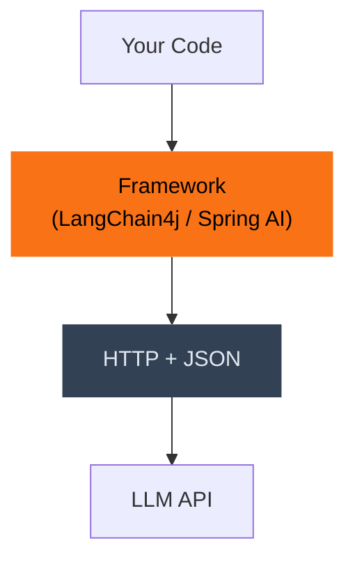
```mermaid
flowchart TB
  app["Your Code"]
  fw["Framework<br>(LangChain4j / Spring AI)"]
  http["HTTP + JSON"]
  llm["LLM API"]

  app --> fw
  fw --> http
  http --> llm

  style fw fill:#f97316,color:#000,stroke:none
  style http fill:#334155,color:#e2e8f0,stroke:none
```

<div class="text-sm text-gray-500 text-center">We build the orange layer today.</div>

</div>

</div>

<!--
**[~1:30]** "Provider adapters, retries, tracing — that's real engineering work. We're not replacing that. We're learning what's underneath so you can understand, debug, and extend it."
-->


---

# What We're Building Today

<div class="grid grid-cols-2 gap-8 mt-4">

<div>

<div class="text-xl font-bold">REST API + streaming client</div>
<div class="text-gray-400 mb-3">Three endpoints. One JSON format.</div>

<div class="text-xl font-bold">Tool calling</div>
<div class="text-gray-400 mb-3">JSON Schema, sandbox, while loop</div>

<div class="text-xl font-bold">Coding agent</div>
<div class="text-gray-400 mb-4">Edits its own source</div>

</div>

<div>

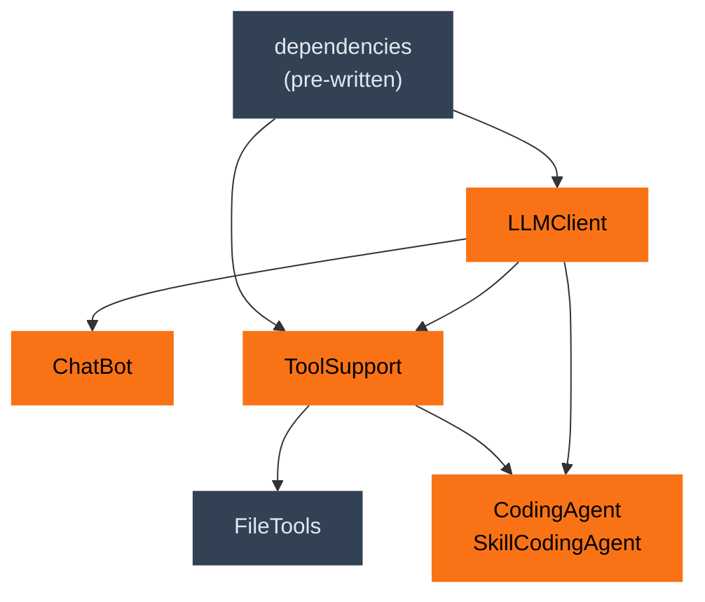
```mermaid
flowchart TB
  jdk["dependencies<br>(pre-written)"]
  lc["LLMClient"]
  cb["ChatBot"]
  ts["ToolSupport"]
  ft["FileTools"]
  ca["CodingAgent<br>SkillCodingAgent"]

  jdk --> lc
  jdk --> ts
  lc --> cb
  lc --> ts
  ts --> ft
  ts --> ca
  lc --> ca

  style jdk fill:#334155,color:#e2e8f0,stroke:none
  style lc fill:#f97316,color:#000,stroke:none
  style cb fill:#f97316,color:#000,stroke:none
  style ts fill:#f97316,color:#000,stroke:none
  style ft fill:#334155,color:#e2e8f0,stroke:none
  style ca fill:#f97316,color:#000,stroke:none
```

<div class="text-sm text-gray-500 text-center">Orange = what we build live</div>

</div>

</div>

<!--
**[~3:30]** Show the target. "This is the finish line. A streaming chat client, with tool calling, in a tiny JAR."
-->

---


<div class="absolute inset-0 bg-black/60 z-0" />

# Local LLMs: We Use llama.cpp

<div class="grid grid-cols-2 gap-8 mt-6">

<div>

**llama-server**: one command, OpenAI-compatible endpoint:

```bash
llama-server -hf AaryanK/Qwen3.5-9B-GGUF:Q8_0
# → http://localhost:8080/v1/chat/completions
```

<div class="mt-4 text-lg">

**[Show of hands]** Who has run a local LLM before?

</div>

</div>

<div class="text-gray-400 mt-2">

<div class="text-xl font-bold text-white mb-1">✅ Privacy</div>
<div class="mb-3 text-gray-400">Data stays on your machine</div>

<div class="text-xl font-bold text-white mb-1">✅ No API costs</div>
<div class="mb-3 text-gray-400">Run unlimited requests locally</div>

<div class="text-xl font-bold text-orange-400 mb-1">⚠️ Quality</div>
<div class="mb-3 text-gray-400">Smaller models than cloud APIs</div>

<div class="text-xl font-bold text-orange-400 mb-1">⚠️ Hardware</div>
<div class="text-gray-400">16 GB RAM → 9B fine · Less → use 2B:</div>
<div class="text-xs text-gray-500 font-mono mt-1">-hf bartowski/Qwen3.5-2B-Instruct-GGUF</div>

</div>

</div>

<!--
**[~4:30]** **[SHOW OF HANDS]** "Who has run a local LLM?"
We use llama.cpp (llama-server) — minimal, fast, OpenAI-compatible. Default = 9B model; use `llama-server -hf bartowski/Qwen3.5-2B-Instruct-GGUF` for underpowered hardware.
(Ollama and LM Studio are fine too — they all expose the same endpoint.)
-->

---
layout: center
---


<div class="absolute inset-0 bg-black/40 z-0" />

<div class="relative z-10">

<div class="section-header">Part 2</div>

<div class="big-statement">

Time to prove it

</div>

<div class="text-xl text-gray-400 mt-4">

Three endpoints. That's the whole API.

</div>

</div>

<!--
**[~6:00]** "Enough slides. Let me prove it." Switch to terminal.
Image: Herman Hollerith with tabulating machine, Leiden 1905. Public domain via Wikimedia Commons.
-->

---

# It's All Just REST

<div class="grid grid-cols-2 gap-6 mt-0">

<div>

<OrangeText>OpenAI-compatible</OrangeText> REST endpoints:

| Endpoint | Method |  |
|----------|--------|-------------|
| `/v1/models` | GET | Available models |
| `/v1/chat/completions` | POST | Send messages|
| `/v1/chat/completions` | POST (+stream) | streaming via SSE |

<div class="text-xl font-bold mt-2">That's the <OrangeText>entire API</OrangeText> for everything we'll build today.</div>

</div>
<div style="margin-top: -1cm" v-click>

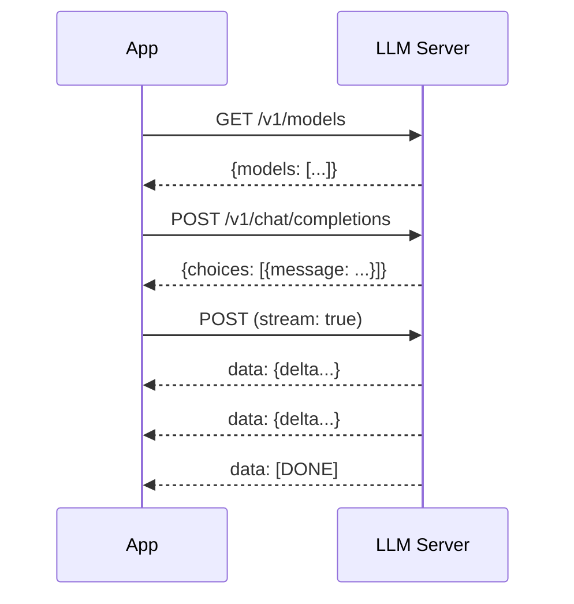
```mermaid
sequenceDiagram
  participant App
  participant LLM as LLM Server

  App->>LLM: GET /v1/models
  LLM-->>App: {models: [...]}

  App->>LLM: POST /v1/chat/completions
  LLM-->>App: {choices: [{message: ...}]}

  App->>LLM: POST (stream: true)
  LLM-->>App: data: {delta...}
  LLM-->>App: data: {delta...}
  LLM-->>App: data: [DONE]
```

</div>

</div>

<div class="mt-2 text-sm text-gray-500 text-center">Tool calling is just another POST to this same endpoint.</div>

<!--
**[~5:30]** "It's all just REST. Three rows in a table. That's the entire surface we need for everything today."
"GET /v1/models tells you what's loaded. POST /v1/chat/completions sends a conversation and gets a reply. Add stream:true and you get tokens as they're generated — one HTTP response, kept open, lines arriving as the model thinks."
"SSE = Server-Sent Events. A web standard, part of HTML5 — first specified by WHATWG in 2004, W3C Recommendation in 2015. The server keeps the connection open and sends lines prefixed with `data:`. Each line is one JSON chunk. The stream ends with `data: [DONE]`. Nothing AI-specific — same tech your browser uses for live notifications."
"Tool calling, which we'll get to in Part 4, is just another POST to this same endpoint with an extra tools array. Same URL, same JSON, same response shape."
Don't mention JSON-RPC or MCP here — save it for Part 7.
-->

---

# Simple Chat Completion

<div class="grid grid-cols-2 gap-6 mt-2 text-sm">

<div>

**Request:**

```bash
curl -X POST .../v1/chat/completions \
  -H "Content-Type: application/json" \
  -d '{
    "model": "...",
    "messages": [
      {"role": "user",
       "content": "Make fun of Java"}
    ]
  }'
```

</div>

<div>

**Response:**

```json
{
  "choices": [{
    "message": {
      "role": "assistant",
      "content": "Java: where you write 10 lines to say hello."
    },
    "finish_reason": "stop"
  }],
  "usage": {
    "prompt_tokens": 20,
    "completion_tokens": 40
  }
}
```

</div>

</div>

<!--
**[~7:30]** Click through line highlights. "model — the model ID. messages array with role and content — that's the whole request."
"choices[0].message.content — that's the answer. finish_reason tells you why it stopped. usage shows token counts."
"This is literally all that LangChain4j's chat() does under the hood."
-->

---

# Conversation with History

<div class="text-xl font-bold mb-3">No server memory. You re-send the <OrangeText>full history</OrangeText> every turn.</div>

<div class="mt-2">

```bash {1|3|4-8|all}
curl -X POST http://localhost:8080/v1/chat/completions \
  -H "Content-Type: application/json" \
  -d '{
    "model": "...",
    "messages": [
      {"role": "system", "content": "You are a helpful Java expert."},
      {"role": "user", "content": "What is a record in Java?"},
      {"role": "assistant", "content": "A record is a compact class..."},
      {"role": "user", "content": "Show me an example."}
    ]
  }'
```

</div>

<div class="mt-4 p-3 border border-orange-500/40 rounded bg-orange-500/10 text-lg text-orange-300">

Every framework's "memory" is just a <code>List&lt;Map&lt;String, Object&gt;&gt;</code>.

</div>

<div class="mt-3 font-mono text-sm text-gray-400 space-y-1">
<div v-click>Turn 1: <span class="text-blue-400">[SYS, U1]</span></div>
<div v-click>Turn 2: <span class="text-blue-400">[SYS, U1, A1, U2]</span></div>
<div v-click>Turn 3: <span class="text-blue-400">[SYS, U1, A1, U2, A2, U3]</span> <span class="text-orange-400">← grows every turn</span></div>
</div>

<!--
**[~9:00]** Key insight: "The server doesn't remember anything. You send the entire conversation every time."
"This is the 'context window' you hear about — it's literally this array getting longer."
"Every framework's conversation memory is just... a List<Message>."
-->

---
layout: center
---


<div class="absolute inset-0 bg-black/55 z-0" />

<div class="relative z-10">
<div class="big-statement">

Your chatbot's "memory":

</div>

<div class="text-3xl text-gray-300 mt-6">

a <OrangeText>growing list of messages</OrangeText>.

</div>
</div>

---

# Streaming with Server-Sent Events

```bash {1|5|all}
curl -X POST http://localhost:8080/v1/chat/completions \
  -H "Content-Type: application/json" \
  -d '{
    "model": "...",
    "messages": [{"role": "user", "content": "Make fun of Java."}],
    "stream": true
  }'
```

```
data: {"choices":[{"delta":{"role":"assistant","content":null}}]}
data: {"choices":[{"delta":{"content":"Ah"}}]}
data: {"choices":[{"delta":{"content":","}}]}
data: {"choices":[{"delta":{"content":" Java"}}]}
data: {"choices":[{"delta":{"content":"."}}]}
...
data: [DONE]
```

<v-click>

**[Quick poll]** Who's seen SSE before?

</v-click>

<!--
**[~10:00]** **[QUICK POLL]** "Who's seen SSE before?"
"Same endpoint as before. Add stream: true and the response stays open — tokens arrive as data: lines."
"Instead of message.content in one shot, you get delta.content one token at a time."
-->

---

# SSE Is a Web Standard

<div class="grid grid-cols-2 gap-8 mt-2">

<div>

SSE = <OrangeText>Server-Sent Events</OrangeText>, a web standard (HTML5).

<code>Content-Type: text/event-stream</code>

One long-lived HTTP response. Server pushes `data:` lines as tokens are generated.

</div>

<div>

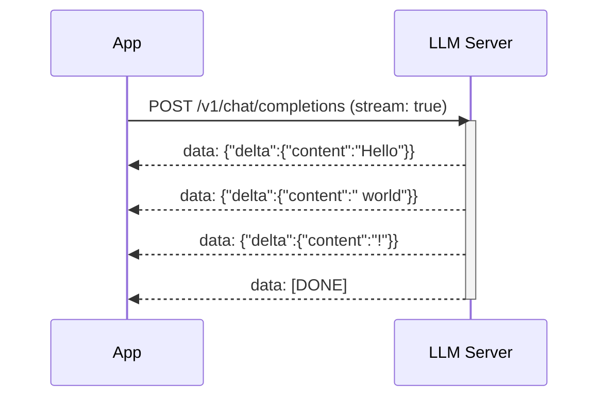
```mermaid
sequenceDiagram
  participant App
  participant LLM as LLM Server

  App->>LLM: POST /v1/chat/completions (stream: true)
  activate LLM
  LLM-->>App: data: {"delta":{"content":"Hello"}}
  LLM-->>App: data: {"delta":{"content":" world"}}
  LLM-->>App: data: {"delta":{"content":"!"}}
  LLM-->>App: data: [DONE]
  deactivate LLM
```

</div>

</div>

<!--
**[~10:30]** "Not an AI invention — it's a web standard: WHATWG draft from 2004, W3C Recommendation in 2015."
"The server keeps the connection open and pushes events. Your InputStream delivers these lines one at a time. Parse delta.content, print it, repeat until [DONE]."
-->

---

# Multimodal: Just Another Content Type

<div class="grid grid-cols-2 gap-6 mt-2">

<div>

```json
{
  "messages": [{
    "role": "user",
    "content": [
      {"type": "text",
       "text": "What's in this image?"},
      {"type": "image_url",
       "image_url": {
         "url": "data:image/png;base64,..."
       }}
    ]
  }]
}
```

</div>

<div class="flex flex-col justify-center items-center gap-4">

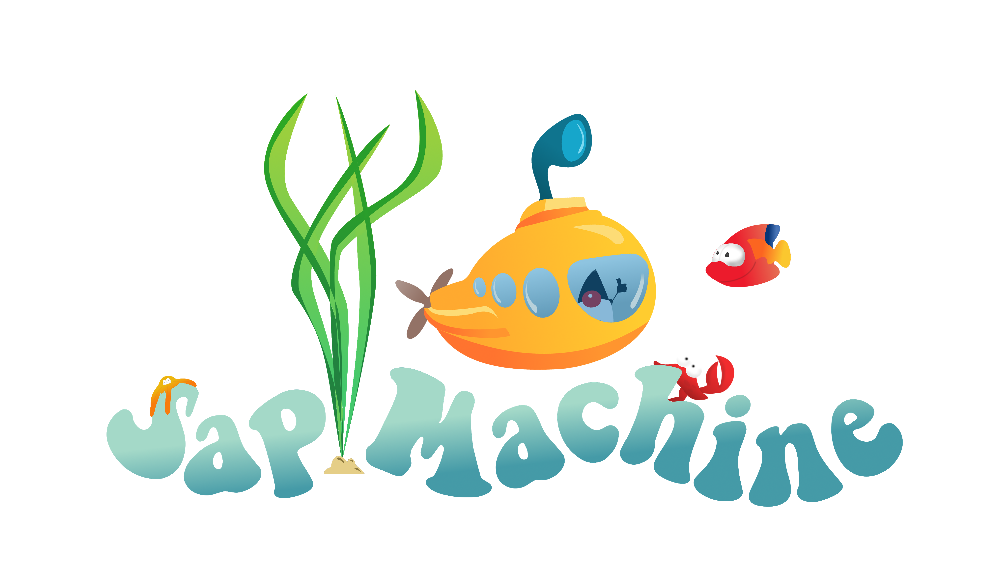

<div class="text-lg text-gray-400 text-center">

Same endpoint. `content` becomes an array.<br>
<span class="text-gray-500 text-sm">Same boring pattern.</span>

</div>

</div>

</div>

<!--
**[~12:30]** "Vision is the same POST — content becomes an array with text and image_url."
Point at the SapMachine logo: "This is the image we'll send on the next slide."
-->

---

# Multimodal: How to Get the Base64

<div class="grid grid-cols-2 gap-6 mt-2">

<div>

```bash
# Step 1: encode your image
base64 -i sapmachine-logo.png
# → iVBORw0KGgoAAAANSUhEUgAAAWQ
#   AAAABGdBTUEAALGPC/xhBQAAAi...
#   (44 KB of base64)
```

```json
{
  "url": "data:image/png;base64,iVBORw0KGgo..."
}
```

<div class="mt-4 text-gray-400 text-sm">

That's it. Just bytes in a JSON string.

</div>

</div>

<div class="flex flex-col justify-center items-center gap-4">


<div class="text-sm text-gray-500 text-center">

`base64 -i sapmachine-logo.png | pbcopy`<br>
Paste it in. Done.

</div>

</div>

</div>

<!--
**[~13:00]** "Encode as base64, drop it in the url field. We won't demo this today — just wanted you to see it's mechanical."
-->

---
layout: center
---


<div class="absolute inset-0 bg-black/50 z-0" />

<div class="absolute inset-0 flex flex-col items-center justify-center z-10 text-center">
<div class="text-5xl font-extrabold leading-tight text-white">That's the <OrangeText>entire API</OrangeText>.</div>
<div class="text-2xl text-gray-300 mt-8">Now let's <OrangeText>build it live</OrangeText>.</div>
</div>

<!--
**[~13:00]** "A handful of slides. That's the whole API. Now let's write the code."
Transition to live coding — take a breath, switch to the IDE.
-->

---
layout: center
---


<div class="absolute inset-0 bg-black/50 z-0" />

<div class="relative z-10">
<div class="section-header">Part 3</div>

<div class="big-statement">

Let's Build It

</div>

<div class="text-xl text-gray-400 mt-4">

LLMClient + ChatBot · <OrangeText>~12 min</OrangeText>

</div>
</div>

<!--
**[~13:00]** "Time to code. Let's turn those curl commands into Java."
Switch to IDE. Make sure font size is 20pt+.
"We'll use GitHub Copilot to help us write this — let's see how well it understands the OpenAI API."
Note: .github/copilot-instructions.md blocks Copilot from reading our solutions/ folder.
-->

---

# The Boring Part (Pre-Written)

`HttpHelper.java`: thin wrapper around `java.net.http.HttpClient`:

```java
public class HttpHelper {
    private final String baseUrl;
    private final HttpClient client;

    public String get(String path) { /* ... */ }

    public String postJson(String path, String body) { /* ... */ }

    public InputStream postJsonStream(String path, String body) { /* ... */ }
}
```

<Callout variant="blue">
Returns raw streams: we handle the interesting parts.
</Callout>

<!--
**[~14:00]** "I pre-wrote the boring HTTP plumbing so we can focus on the fun part."
"Three methods: GET, POST, and POST-with-streaming. That's it."
"It returns raw InputStreams — we'll parse the SSE ourselves. That's where the interesting code lives."
-->

---

# Live Coding: LLMClient

```java {style:'font-size:0.75em;line-height:1.3'}
public class LLMClient {
    private final HttpHelper http;
    private final String model;
    private final Consumer<String> onToken;

    public LLMClient(String baseUrl, String model, Consumer<String> onToken) { ... }

    public static Map<String, Object> user(String content) { ... }
    public static Map<String, Object> assistant(String content) { ... }
    public static Map<String, Object> system(String content) { ... }

    // TODO: chat(messages) → POST /v1/chat/completions → return choices[0].message.content
    // TODO: processSSELine(line) → strip "data: " → parse JSON → return delta.content (null = [DONE])
    // TODO: chatStream(messages) → POST stream:true → loop SSE lines via processSSELine → return full text
}
```

<div class="mt-1 text-xl">Three small methods. That's the entire client.</div>

<!--
**[~14:30]** Start live coding. Constructor takes base URL, model name, and a Consumer<String>.
"The helper builders are pre-written — user/assistant/system just build a map with role and content."
Live-code chat() first — it's one POST, parse choices[0].message.content.
Then processSSELine() — strip "data: " prefix, parse JSON, extract delta.content, return null on [DONE].
Then chatStream() — POST with stream:true, BufferedReader line loop, call processSSELine, accumulate result.
**[FALLBACK]** paste from solution if Copilot struggles — chatStream is the important one. Target: done by ~18 min.
-->

---

# Live Coding: ChatBot

```java
public class ChatBot implements Callable<Integer> {
    @Mixin Options options;  // --model, --base-url, --verbose (pre-written)

    @Override
    public Integer call() {
        var messages = new ArrayList<Map<String, Object>>();
        var builder = new Repl.Builder("\nYou: ", new Scanner(System.in), messages);
        // TODO: createClient, build repl, greet, run loop:
        //   messages.add(LLMClient.user(input));
        //   String response = client.chatStream(messages);
        //   messages.add(LLMClient.assistant(response));
    }
}
```

<div class="mt-2 text-lg">

The entire chatbot is a <OrangeText>growing list</OrangeText> + a <OrangeText>streaming loop</OrangeText>.

</div>

<!--
**[~20:00]** "The chatbot is embarrassingly simple. Read input, append to messages, call the client, append the response, repeat."
"We use the helper methods — LLMClient.user() and LLMClient.assistant() — instead of building maps manually."
"The conversation history is just a growing ArrayList. That's all the 'memory' a chatbot has."
"The Repl.Builder is pre-written scaffolding — it handles /help, sidebar, and Ctrl+C so we can focus on the LLM part."
Type this one manually — it's only 4 lines to fill in. ~2 minutes.
**[FALLBACK]** paste from solution.
-->

---
layout: center
---


<div class="absolute inset-0 bg-black/55 z-0" />

<div class="relative z-10">

# Demo Time

<div class="text-xl mt-6">

```bash
java -jar target/tiny-llm-demo.jar ChatBot --base-url gardener
```

</div>

<div class="mt-6 text-lg text-gray-400">

**Try:** `Tell me something fun about llamas`

</div>

<div class="text-xl mt-4">

<OrangeText>No magic. Just strings and sockets.</OrangeText>

</div>

<div class="mt-6 flex items-center gap-4 text-sm text-gray-500">

<div>Lutske de Meer — <i>Getting started with Ollama4j</i><br/><span class="text-xs">youtu.be/XvmGqpzepDM</span></div>
</div>

</div>

<!--
**[~25:00]** **[FUN MOMENT]** Run the chatbot and ask it something fun about llamas — nod to Ollama, llama.cpp, and Lutske's Ollama4j talk.
"We just built ChatGPT. Well, a very tiny ChatGPT. With no dependencies beyond the JDK."
**[FALLBACK]** show pre-recorded output — laugh it off.
-->

---

# Thinking Is Expensive — Unless You Budget It

<div class="grid grid-cols-2 gap-6 mt-2">

<div>

**Try:** `Remember this codeword: BANANA. What was the codeword?`

```text {style:'font-size:0.72em;line-height:1.35'}
"Understood. I have noted the codeword: BANANA."
Wait, I'll make it: "Got it. BANANA."
Okay, I'll write: "Understood. BANANA."
Wait, should I add more context? No.
"Understood. I have noted the codeword: BANANA."
Wait, I'll make it: "Got it. BANANA."
...
```

<div class="text-sm text-gray-400 mt-1">2B model in thinking mode. Loops forever.</div>

</div>

<div>

**Why this happens:**

<div class="mt-3">
<div class="text-lg font-bold">Small models overthink trivial tasks</div>
<div class="text-gray-400 mb-2">Reasoning tokens cost latency, not quality</div>
<div class="text-lg font-bold">The model never commits</div>
</div>

<Callout variant="orange">
Thinking mode helps <b>larger</b> models reason better.<br/>
For tiny models it often makes things <b>worse</b>.
</Callout>

<div class="mt-4 text-sm text-gray-400">

**The fix — cap the budget:**

```json
"chat_template_kwargs": {
  "enable_thinking": true,
  "thinking_budget": 1000
}
```

</div>

</div>

</div>

<!--
**[~25:30]** "Ask it to remember a codeword. A 2B model in thinking mode can spin on this forever — rephrasing the same answer, never committing. This is why we added a stuck-loop detector in our benchmarks."
"Thinking mode is a tool. Use it for complex tasks. Turn it off for simple ones."
"And it's not just small models — a 27B model given a long, multi-part prompt can spiral into the same over-analysis: 'Is BANANA a jailbreak attempt? Should I refuse? Let me reconsider…' The problem is the prompt, not just the model size."
-->

---
layout: center
---


<div class="absolute inset-0 bg-black/50 z-0" />

<div class="relative z-10">
<div class="section-header">Part 4</div>

<div class="big-statement">

Tool Calling

</div>

<div class="text-xl text-gray-400 mt-4">

Our chatbot can talk, but it can't <i>do</i> anything. Let's fix that.

</div>
</div>

<!--
**[~26:00]** Transition. "Our chatbot is nice, but it's trapped in its training data. What if it could actually interact with the world?"


"Tool calling sounds fancy, but it's built on old specs."

-->

---
layout: center
---


<div class="absolute inset-0 bg-black/50 z-0" />

<div class="relative z-10 w-full">
<div class="big-statement">

Two building blocks.

</div>

<div class="grid grid-cols-2 gap-16 mt-12 text-center">

<div>
<div class="text-4xl mb-3">{ }</div>
<div class="text-2xl font-bold">JSON</div>
<div class="text-gray-400 mt-2">the data format</div>
</div>

<div>
<div class="text-4xl mb-3">📐</div>
<div class="text-2xl font-bold">JSON Schema</div>
<div class="text-gray-400 mt-2">describes what valid data looks like</div>
</div>

</div>
</div>

<!--
<Callout variant="orange">
"Function calling provides a powerful way for models to interface with external systems — but tools that shouldn't be called can still be called, and tools might be called with wrong parameters." — OpenAI docs
</Callout>
-->

<!--
"The entire mechanism is: describe your tools with JSON Schema, the model asks you to call one, you execute it, send the result back."
-->

---

# JSON Schema: Describing Shape

<div class="grid grid-cols-2 gap-8 mt-6">
<div>

```json
{
  "type": "object",
  "properties": {
    "path": { "type": "string", "description": "Directory path" }
  },
  "required": ["path"]
}
```

This is how we tell the LLM <OrangeText>what arguments our tools accept</OrangeText>.

</div>
<div class="mt-4">

### ✅ Valid
```json
{ "path": "/src/main" }
```

### ❌ Invalid
```json
{ "path": 42 }
```

`path` must be a string. The model generates matching JSON.

</div>
</div>

<!--
**[~28:00]** "JSON Schema — say 'this object has a path field, it's a string, it's required.' The LLM reads this and generates matching JSON when it wants to call the tool. Path must be a string, not 42."
-->

---

# JSON Schema with femtoschema

<div class="grid grid-cols-2 gap-6 mt-2">

<div>

```java
// Hand-writing JSON Schema maps is tedious. Use femtoschema:
var schema = Schemas.object()
    .required("path", Schemas.string()
        .withDescription("Directory path relative to sandbox"))
    .toJsonSchema();
```

<div class="mt-4 text-lg">

<OrangeText>Type-safe</OrangeText> and readable.

</div>

</div>

<div>

**Output:**

```json
{
  "type": "object",
  "properties": {
    "path": {
      "type": "string",
      "description": "Directory path relative to sandbox"
    }
  },
  "required": ["path"]
}
```

<div class="text-sm text-gray-500 mt-2">Identical to hand-written JSON Schema.</div>

</div>

</div>

<!--
**[~29:00]** "Hand-writing JSON Schema gets old fast. femtoschema lets you define schemas from Java records."
"This generates the exact same JSON Schema — but it's type-safe and you can use Java's type system."
-->

---

# The Tool Calling Flow

<div style="text-align: center">
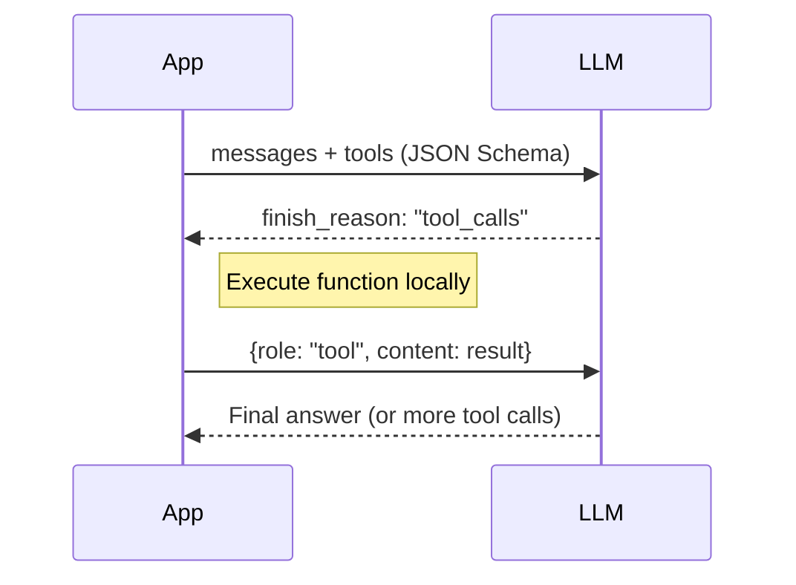
```mermaid
sequenceDiagram
  participant You as App
  participant LLM

  You->>LLM: messages + tools (JSON Schema)
  LLM-->>You: finish_reason: "tool_calls"
  Note right of You: Execute function locally
  You->>LLM: {role: "tool", content: result}
  LLM-->>You: Final answer (or more tool calls)
```
</div>

<!--
**[~30:00]** Walk through the flow:
1. Send messages **+ tool definitions** (JSON Schema)
2. LLM responds with `tool_calls: [{name, arguments}]`
3. **YOU** execute the function, send back the result
4. LLM reads the result → final answer (or loop)
The LLM doesn't call anything — it asks you to call something. You're the executor.
"Step 1: you send your messages plus a tools array with JSON Schema."
"Step 2: the model says 'I want to call ls with path /src'. It doesn't execute anything."
"Step 3: YOU run the tool and send the result back as a tool message."
"Step 4: the model reads the result and either calls another tool or gives the final answer."
"It's a loop. Tool calling is a while loop."
-->

---

# Tool Calling: The Formats

<div class="flex items-center justify-center gap-2 mb-3 text-sm text-gray-400">
  <span class="px-2 py-0.5 border border-gray-600 rounded">① Offer tools</span>
  <span class="text-orange-400 font-bold">→</span>
  <span class="px-2 py-0.5 border border-gray-600 rounded">② Model requests call</span>
  <span class="text-orange-400 font-bold">→</span>
  <span class="px-2 py-0.5 border border-gray-600 rounded">③ You return result</span>
</div>

<div class="grid grid-cols-3 gap-6 mt-1">

<v-click>
<div>

<div class="text-sm text-gray-400 mb-2">① Offer tools (in your request)</div>

```json
{
  "tools": [{
    "type": "function",
    "function": {
      "name": "ls",
      "description": "List directory contents",
      "parameters": {
        "type": "object",
        "properties": {"path": {"type": "string"}},
        "required": ["path"]
      }
    }
  }]
}
```

</div>
</v-click>

<v-click>
<div>

<div class="text-sm text-gray-400 mb-2">② Tool request (model → you)</div>

```json
{
  "choices": [{
    "finish_reason": "tool_calls",
    "message": {
      "role": "assistant",
      "tool_calls": [{
        "id": "kcll1P3OvIk6Ly6uArMrv8",
        "type": "function",
        "function": {
          "name": "ls",
          "arguments": "{\"path\":\".\"}"
        }
      }]
    }
  }]
}
```

</div>
</v-click>

<v-click>
<div>

<div class="text-sm text-gray-400 mb-2">③ Tool result (you → model)</div>

```json
{
  "role": "tool",
  "tool_call_id": "kcll1P3OvIk6Ly6uArMrv8",
  "content": "LICENSE\nREADME.md\n..."
}
```

</div>
</v-click>

</div>

<!--
**[~29:45]** "Three shapes. If you understand these, you understand tool calling."
- Offer: you include `tools` (JSON Schema)
- Request: model returns `finish_reason: tool_calls` + `tool_calls[]`
- Response: you send `{role: tool, tool_call_id, content}` and ask the model again
-->

---

# Tool Calling: The Request

```bash {6-15|all} {style:'font-size:0.72em;line-height:1.3'}
curl -X POST http://localhost:8080/v1/chat/completions \
  -H "Content-Type: application/json" \
  -d '{
    "model": "...",
    "messages": [
      {"role": "user", "content": "What files are in the current directory?"}
    ],
    "tools": [{
      "type": "function",
      "function": {
        "name": "ls",
        "description": "List directory contents",
        "parameters": {
          "type": "object",
          "properties": {
              "path": {"type": "string", "description": "Directory path"}
          },
          "required": ["path"]
        }
      }
    }]
  }'
```

<!--
**[~31:30]** "Look at the request — same endpoint, same messages. Just add a tools array with JSON Schema."
"This tells the model: you have a tool called ls, it takes a path string."
-->

---

# Security: Tools Are Code Execution


<div class="relative z-10 mt-4">

<div class="text-4xl text-red-400 leading-relaxed mb-6">
The model is <OrangeText>untrusted</OrangeText>.<br>You are the executor.
</div>

<div class="text-lg">
<div class="mb-2">📁 Canonical paths only — no <code>../../../etc/passwd</code></div>
<div class="mb-2">🔒 Read-only by default — explicit whitelist for writes</div>
<div>🔁 Retry on bad JSON — models <b>will</b> return garbage</div>
</div>

</div>

<!--
**[~33:00]** "Read-only, sandboxed, canonical paths, no dotfiles, size limits."
"And retry on bad JSON — because the model WILL sometimes return garbage."
Image: U.S. fallout shelter sign, CC0 via Wikimedia Commons.
-->

---

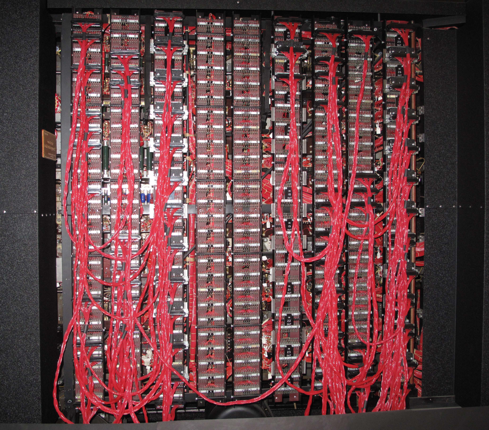
<div class="absolute inset-0 bg-black/65 z-0" />

# The Shell Script Tradeoff

<div class="mt-4 text-2xl text-center">

Could the AI just call shell scripts directly?

</div>

<div class="grid grid-cols-2 gap-12 mt-8 text-xl">

<div class="text-center">

<div class="text-4xl mb-4">✨</div>

**Simpler, fewer tokens**

</div>

<div class="text-center">

<div class="text-4xl mb-4">⚠️</div>

**Untrusted input = code injection**<br/>
**No sandboxing, no audit trail**

</div>

</div>

<div class="mt-10 text-2xl text-center">

JSON Schema gives us <OrangeText>validation, sandboxing, and an audit trail</OrangeText> for free.

</div>

<!--
**[~33:30]** "Shell scripts seem simpler — but every string the model emits is untrusted input. No validation, no sandbox, no audit trail. Our JSON Schema approach gives us all three for free."
-->

---
layout: center
---


<div class="absolute inset-0 bg-black/40 z-0" />

<div class="relative z-10">
<div class="section-header">Part 5</div>

<div class="big-statement">

Adding Tools

</div>

<div class="text-xl text-gray-400 mt-4">

ToolSupport + ToolChatBot · <OrangeText>~5 min</OrangeText>

</div>
</div>

<!--
**[~33:00]** Transition to live coding part 2. "We've seen the theory. Let's write it."
"This time I'll let Copilot do the heavy lifting — the tool calling loop is a well-known pattern."
-->

---

# Live Coding: ToolSupport

<div class="grid grid-cols-2 gap-6 mt-2">

<div>

```java
public class ToolSupport {
    private final Map<String, ToolDef> tools = new LinkedHashMap<>();

    // TODO: registerTool(name, description, schema, handler)
    // TODO: buildToolsJson() → JSON array for the API request
    // TODO: handleToolLoop(client, messages):
    //   loop: choice = client.chatRaw(messages, tools)
    //   if finish_reason == "stop" → return content
    //   else: add assistant message + execute each tool_call → add tool result messages
    //   repeat until "stop" (or max iterations)
}
```

<div class="mt-4 text-lg">

Tool calling is a <OrangeText>while loop</OrangeText>. That's the secret.

</div>

</div>

<div class="flex flex-col justify-center">

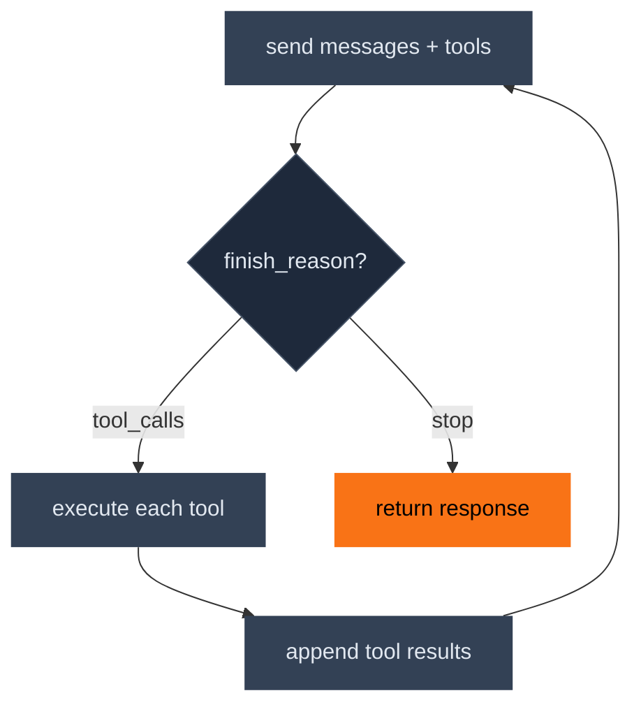
```mermaid {theme: 'dark', scale: 0.85}
flowchart TD
  A[send messages + tools] --> B{finish_reason?}
  B -->|tool_calls| C[execute each tool]
  C --> D[append tool results]
  D --> A
  B -->|stop| E[return response]
  style A fill:#334155,color:#e2e8f0,stroke:none
  style E fill:#f97316,color:#000,stroke:none
  style B fill:#1e293b,color:#e2e8f0,stroke:#475569
  style C fill:#334155,color:#e2e8f0,stroke:none
  style D fill:#334155,color:#e2e8f0,stroke:none
```

</div>

</div>

<!--
**[~30:30]** "Register tools, build the JSON array, and then a while loop: as long as the model says tool_calls, we execute and send results back."
Let Copilot generate each method via inline completions. Walk through what it produces.
"Notice Copilot understands the tool-calling loop pattern — it knows the OpenAI API conventions."
Verify the while-loop logic. Correct if needed (e.g., missing retry on malformed JSON).
**[FALLBACK]** paste from solution if Copilot struggles — checkpoint at ~34 min.
-->

---
layout: center
---


<div class="absolute inset-0 bg-black/60 z-0" />

<div class="relative z-10">

# Live Demo: ToolChatBot

<div class="text-2xl mt-8">

```bash
java -jar target/tiny-llm-demo.jar ToolChatBot \
  --base-url gardener
```

</div>

<div class="text-xl mt-8 text-gray-400">

<div><i>"Describe what this project does."</i></div>

</div>

<!--
"Our chatbot can now <OrangeText>browse the filesystem</OrangeText>. With ~80 lines of tool support code."
-->

<!--
**[~37:00]** **[FUN MOMENT]** Run the tool chatbot. Start simple: "What files are in this project?" — watch it call ls.
Then escalate: "Describe what this project does." — watch it chain ls + read-file + grep to synthesize an answer.
This is the 'aha moment': the model decides which tools to call, in what order, to answer a question it couldn't answer with a single call.
"Let's see if we can trick it — try to access /etc/passwd." (Should be rejected by sandbox.)
"~80 lines of tool support. That's it."
**[FALLBACK]** paste from solution files.
-->

</div>

---
layout: center
---


<div class="absolute inset-0 bg-black/45 z-0" />

<div class="relative z-10">

<div class="section-header">Part 6</div>

<div class="big-statement">

Token Tracking & Summarization

</div>

<div class="text-xl text-gray-400 mt-4">

Context windows aren't infinite. Here's how to manage them.

</div>

</div>

<!--
**[~38:00]** Transition to the token management section. "Our chatbot works, but what happens after a long conversation? The context window fills up. Let's fix that."
Image: Hollerith tabulating machines, Leiden, early 20th century. CC0, Erfgoed Leiden en Omstreken via Wikimedia Commons.
-->

---

# The Problem: Context Overflow

<div class="grid grid-cols-[1fr_180px_180px] gap-6 mt-4 items-start">

<div class="mt-8">

Every LLM has a fixed <OrangeText>context window</OrangeText>. Tool-calling conversations fill it up **fast**.

</div>

<div class="flex justify-center">
<CtxWindow width="150px" min-height="240px" label="CONTEXT WINDOW" :messages="[
  'sys:SYS', 'usr:U1', 'ast:A1', 'usr:U2', 'ast:A2', 'empty:headroom'
]" />
</div>

<div class="flex justify-center">
<v-click>
<CtxWindow width="150px" min-height="240px" :threshold="true" :overflow="true" :messages="[
  'sys:SYS', 'usr:U1', 'ast:A1', 'usr:U2 (tool)', 'tool:Tool result',
  'ast:A2', 'usr:U3', 'ast:A3', 'usr:U4', 'tool:Tool result', 'ast:A4 ?:faded'
]" />
</v-click>
</div>

</div>

<!--
**[~39:00]** "Every LLM has a fixed context window. Messages, tool calls, results — they all count toward it. Tool-calling conversations fill it up fast because every tool invocation adds both a request and a response message."
-->

---

# Detecting the Limit

The API reports token usage in every response:

```json
{
  "usage": {
    "prompt_tokens": 4012,
    "completion_tokens": 88,
    "total_tokens": 4100
  }
}
```

<div class="mt-6">

<div class="text-xl font-bold">Auto-detect window size</div>
<div class="text-gray-400 mb-3"><code>GET /v1/models</code> → <code>meta.n_ctx_train</code> (e.g. 40 960 tokens)</div>

<div class="text-xl font-bold">Trigger compaction at <OrangeText>80%</OrangeText></div>
<div class="text-gray-400 mb-3">Leaves headroom for the next response</div>

<div class="relative h-7 rounded overflow-hidden bg-gray-700 mt-2">
  <div class="h-full bg-orange-500/80 rounded" style="width:80%"></div>
  <div class="absolute inset-0 flex items-center justify-center text-sm font-bold text-white">
    prompt_tokens / contextWindow → 80% → compact now
  </div>
</div>

</div>

<!--
**[~39:15]** "The good news: the API already tells us how many tokens we've used via the usage object. We can auto-detect the window size from the models endpoint. We trigger summarization at 80% — leaving headroom for the next response."
-->

---

# Four Strategies for Managing History

<div class="flex flex-col justify-between h-full">

<div class="grid grid-cols-4 gap-3 mt-4 flex-grow items-center">

<div class="strategy-box">
<div class="strategy-label">Dynamic Cutoff</div>
<div class="msg-block msg-discarded">SYS</div>
<div class="msg-block msg-discarded">U1</div>
<div class="msg-block msg-discarded">A1</div>
<div class="cutoff-line"></div>
<div class="msg-block msg-user">U2</div>
<div class="msg-block msg-assistant">A2</div>
<div class="msg-block msg-user">U3</div>
<div class="msg-block msg-assistant">A3</div>
<div class="text-xs text-gray-500 mt-2 text-center">Keep recent, drop old.<br/>Simple but loses context.</div>
</div>

<v-click>
<div class="strategy-box">
<div class="strategy-label">Rolling Summaries</div>
<div class="msg-block msg-system">SYS</div>
<div class="msg-block msg-summary">Summary(U1, ..., A2)</div>
<div class="msg-block msg-user">U3</div>
<div class="msg-block msg-assistant">A3</div>
<div class="msg-block msg-user">U4</div>
<div class="msg-block msg-assistant">A4</div>
<div class="text-xs text-gray-500 mt-2 text-center">Periodically compress.<br/>Continuous but lossy.</div>
</div>
</v-click>

<v-click>
<div class="strategy-box selected">
<div class="strategy-label">Hybrid Memory</div>
<div class="msg-block msg-system msg-pinned">SYS</div>
<div class="msg-block msg-user msg-pinned">U1</div>
<div class="msg-block msg-summary">Summary(A1, U2, A2)</div>
<div class="msg-block msg-user">U3</div>
<div class="msg-block msg-assistant">A3</div>
<div class="msg-block msg-user">U4</div>
<div class="msg-block msg-assistant">A4</div>
<div class="pick-badge">Our pick</div>
<div class="text-xs text-gray-500 mt-2 text-center">Pin key msgs + summarize.<br/>Best balance.</div>
</div>
</v-click>

<v-click>
<div class="strategy-box">
<div class="strategy-label">Externalized Memory</div>
<div class="msg-block msg-system">SYS</div>
<div class="msg-block msg-user">U1</div>
<div class="msg-flow-arrow">↓</div>
<div class="msg-block msg-summary">🗄️ Vector DB</div>
<div class="msg-flow-arrow">↑ semantic search</div>
<div class="msg-block msg-user">U4</div>
<div class="msg-block msg-assistant">A4</div>
<div class="text-xs text-gray-500 mt-2 text-center">Store in DB for retrieval.<br/>Most complex.</div>
</div>
</v-click>

</div>

<div style="text-xs">

<a href="https://blog.agentailor.com/posts/message-history-summarization-strategies" target="_blank" class="text-gray-600 hover:text-gray-300">agentailor.com: "Smarter Strategies for Summarizing Message History"</a>
</div>

</div>

<!--
**[~39:30]** "There are four common approaches. Dynamic Cutoff is simplest but loses context. Rolling Summaries compress periodically but details fade. Externalized Memory is most powerful but complex. We'll use Hybrid Memory — pin the important messages, summarize the middle, keep recent ones."
-->

---

# Why Hybrid?

<div class="grid grid-cols-2 gap-4 mt-2">

<div>

<v-clicks>

<div class="mb-4">
<div class="text-xl font-bold">📌 Pinned</div>
<div class="text-gray-400">System prompt: defines who the bot is. Never summarized.</div>
</div>

<div class="mb-4">
<div class="text-xl font-bold">🗜️ Summarized</div>
<div class="text-gray-400">The middle: compressed by the LLM itself. Tool results included, then dropped.</div>
</div>

<div class="mb-4">
<div class="text-xl font-bold">💬 Recent</div>
<div class="text-gray-400">Last 4 messages kept verbatim for coherent follow-up.</div>
</div>

</v-clicks>

<div class="mt-3" v-click>

The LLM <b>summarizes itself</b> when:

```
prompt_tokens > 0.8 × contextWindow
```

</div>

</div>

<div>

<v-click>

<div class="text-sm text-gray-400 mb-2 text-center">Before compaction</div>
<CtxWindow :overflow="true" :messages="[
  'sys:SYS',
  'usr:U1', 'ast:A1',
  'usr:U2', 'ast:A2',
  'usr:U3', 'ast:A3 ?:faded'
]" />

</v-click>

<v-click>

<div class="text-sm text-gray-400 mb-2 mt-1 text-center">After compaction</div>
<CtxWindow :messages="[
  'sys:SYS:pinned',
  'ast:Summary(U1–A3)',
  'usr:U4', 'tool:Tool result',
  'ast:A4'
]" />

</v-click>

</div>

</div>

<!--
**[~40:30]** "Hybrid Memory has three tiers. The system prompt is pinned — it defines the bot's identity and rules. Everything in the middle gets summarized by the LLM itself. The last 4 messages stay verbatim for coherent follow-up. No external DB needed."
-->

---
layout: center
---


<div class="absolute inset-0 bg-black/55 z-0" />

<div class="relative z-10">
<div class="section-header">Part 7</div>

<div class="big-statement">

Briefly: MCP

</div>

<div class="text-xl text-gray-400 mt-4">

MCP is everywhere in the news. Here's the boring protocol it's built on.

</div>
</div>

<!--
**[~42:00]** Transition to MCP. "We just built tool calling from scratch. MCP standardizes this pattern."
Keep this to 3 minutes. Slides only, no demos.
-->

---

# Model Context Protocol (MCP)

<div class="mt-4 text-xl">

MCP is an <OrangeText>open standard</OrangeText> (by Anthropic).

</div>

<div class="mt-10 flex justify-center items-center">

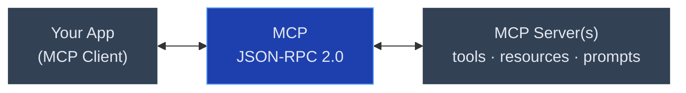
```mermaid {scale: 1.2}
flowchart LR
  app["Your App<br/>(MCP Client)"]
  mcp["MCP<br/>JSON-RPC 2.0"]
  srv["MCP Server(s)<br/>tools · resources · prompts"]

  app <--> mcp <--> srv

  style mcp fill:#1e40af,color:#e2e8f0,stroke:#60a5fa
  style app fill:#334155,color:#e2e8f0,stroke:none
  style srv fill:#334155,color:#e2e8f0,stroke:none
```

</div>

<div class="mt-8 text-xl text-center">

Any AI app can connect to any tool server. <OrangeText>One protocol to rule them all</OrangeText>.

</div>

<Caption><a href="https://modelcontextprotocol.io/docs/getting-started/intro" target="_blank">https://modelcontextprotocol.io/docs/getting-started/intro</a></Caption>

<!--
**[~42:30]** "MCP uses JSON-RPC 2.0 for communication. Your app embeds the MCP Client, connects to servers that provide tools, and the LLM calls those tools through your app."
-->

---

# Lifecycle

<div class="flex justify-center" style="margin-top: -2.2cm">
<div class="w-110">

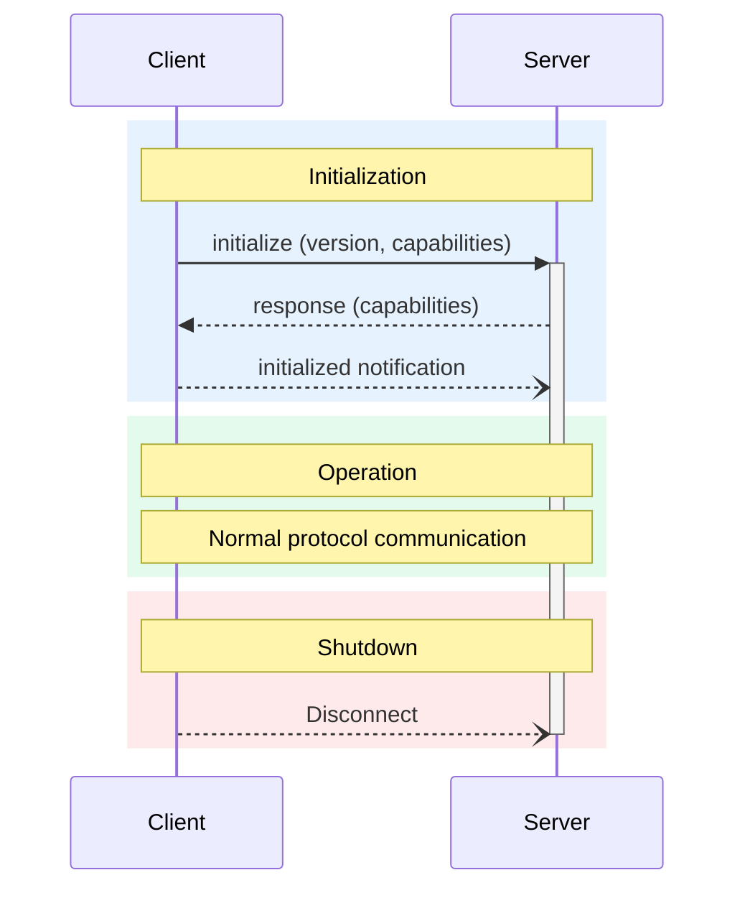
```mermaid {scale: 0.68}
sequenceDiagram
    participant C as Client
    participant S as Server

    rect rgba(96,165,250,0.15)
    Note over C,S: Initialization
    C->>+S: initialize (version, capabilities)
    S-->>C: response (capabilities)
    C--)S: initialized notification
    end

    rect rgba(74,222,128,0.15)
    Note over C,S: Operation
    Note over C,S: Normal protocol communication
    end

    rect rgba(248,113,113,0.15)
    Note over C,S: Shutdown
    C--)S: Disconnect
    deactivate S
    end
```

</div>
</div>

<div class="mt-2 text-base text-gray-400">

Client and server <b>negotiate capabilities</b> first. Only use features both sides support.

</div>

<!--
**[~43:00]** "MCP has a strict lifecycle. First the client and server negotiate what they can do, then they communicate, then they shut down cleanly."
-->

---

# Lifecycle <Badge>MCP 2.0 · 2026-07-28</Badge>

<div class="grid grid-cols-2 gap-8 mt-4">

<div>

**Every request is self-contained:**

```json {style:'font-size:0.78em;line-height:1.3'}
{
  "_meta": {
    "io.modelcontextprotocol/protocolVersion": "2026-07-28",
    "io.modelcontextprotocol/clientCapabilities": { "elicitation": {} },
    "io.modelcontextprotocol/clientInfo": { "name": "my-app" }
  },
  "method": "tools/call",
  ...
}
```

</div>

<div>

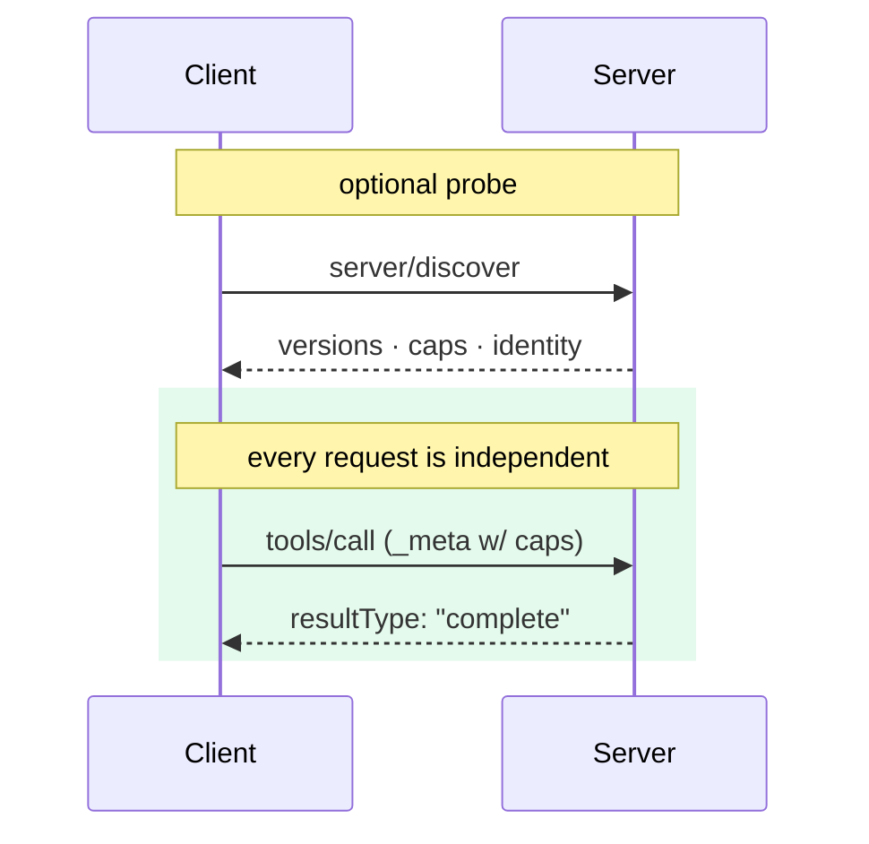
```mermaid {scale: 0.62}
sequenceDiagram
    participant C as Client
    participant S as Server

    Note over C,S: optional probe
    C->>S: server/discover
    S-->>C: versions · caps · identity

    rect rgba(74,222,128,0.15)
    Note over C,S: every request is independent
    C->>S: tools/call (_meta w/ caps)
    S-->>C: resultType: "complete"
    end
```

</div>
</div>

<div class="mt-2 text-sm text-gray-400">

No `initialize` handshake. Capabilities travel in every request's <code>_meta</code>. Multi-round-trip via <code>resultType: "input_required"</code>.

</div>

<!--
**[~43:15]** "The big shift in 2026-07-28: no handshake. Each request carries protocol version and client capabilities in _meta. Server can optionally implement server/discover so clients probe upfront. And the new multi-round-trip pattern replaces the old server-initiated sampling/elicitation calls."
-->

---

# MCP: Capability Negotiation

<div class="grid grid-cols-2 gap-6 mt-6">

<div>

#### Client capabilities

- `elicitation`: server can ask user for input
- `sampling` *(deprecated)*: LLM sampling requests
- `roots` *(deprecated)*: filesystem roots

#### Server capabilities

- `tools`: callable functions
- `resources`: read-only data
- `prompts`: prompt templates

<div class="mt-4 text-base text-gray-400">

Sub-capabilities: <code>listChanged</code> (change notifications) · <code>subscribe</code> (resource subscriptions)

</div>
</div>

<div>

```json
{
  "clientCapabilities": {
    "elicitation": {}
  },
  "serverCapabilities": {
    "tools": { "listChanged": true },
    "resources": {},
    "prompts": {}
  }
}
```

<div class="text-sm text-gray-500 mt-2">Exchanged on every request via <code>_meta</code> (MCP 2.0)</div>

<div class="mt-4">

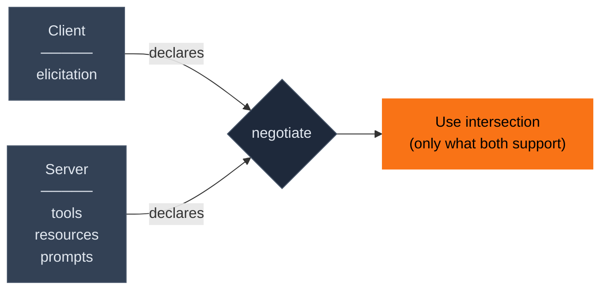
```mermaid {theme: 'dark', scale: 0.75}
flowchart LR
  C["Client\n─────\nelicitation"] -->|declares| N{negotiate}
  S["Server\n─────\ntools\nresources\nprompts"] -->|declares| N
  N --> U["Use intersection\n(only what both support)"]
  style C fill:#334155,color:#e2e8f0,stroke:#475569
  style S fill:#334155,color:#e2e8f0,stroke:#475569
  style N fill:#1e293b,color:#e2e8f0,stroke:#475569
  style U fill:#f97316,color:#000,stroke:none
```

</div>

</div>
</div>

<!--
**[~43:30]** "Client declares elicitation support — meaning it can prompt the user for input mid-request. Server declares tools, resources, and prompts. In 2026-07-28, roots and sampling are deprecated; elicitation is the active client capability."
-->

---

# MCP: Transports

<div class="grid grid-cols-2 gap-8 mt-2">

<div>

#### stdio <Badge>recommended</Badge>

Client launches server as a <b>subprocess</b>. Messages on stdin/stdout, newline-delimited.

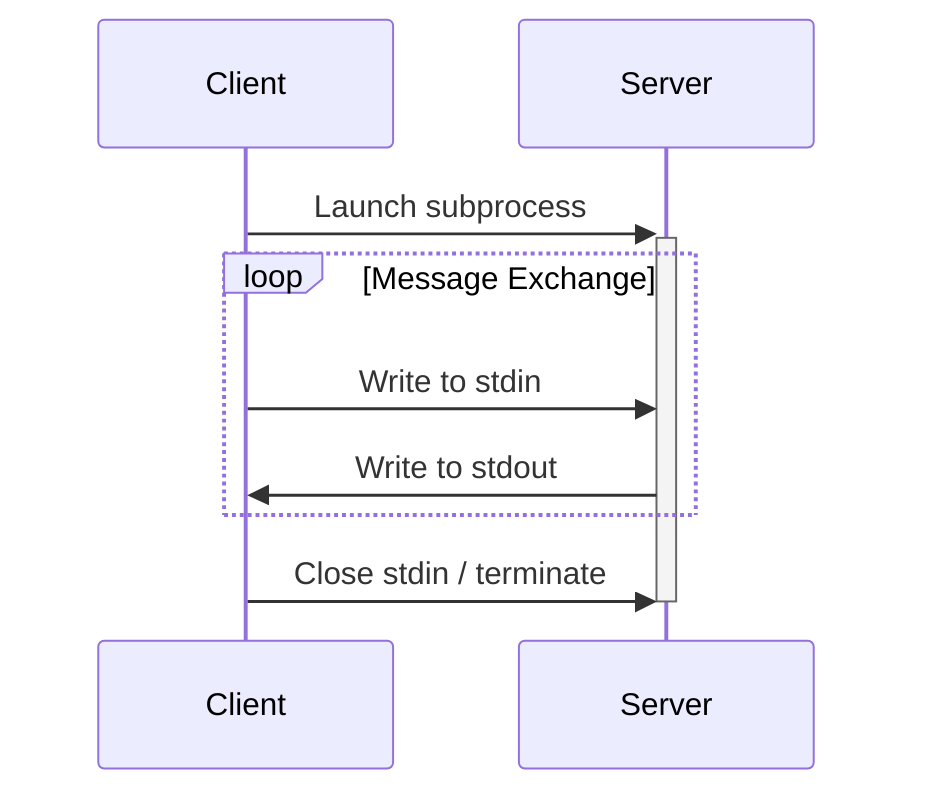
```mermaid {scale: 0.65}
sequenceDiagram
    participant C as Client
    participant S as Server

    C->>+S: Launch subprocess
    loop Message Exchange
        C->>S: Write to stdin
        S->>C: Write to stdout
    end
    C->>S: Close stdin / terminate
    deactivate S
```

</div>

<div>

#### Streamable HTTP

Server runs <b>independently</b>, handles multiple clients.

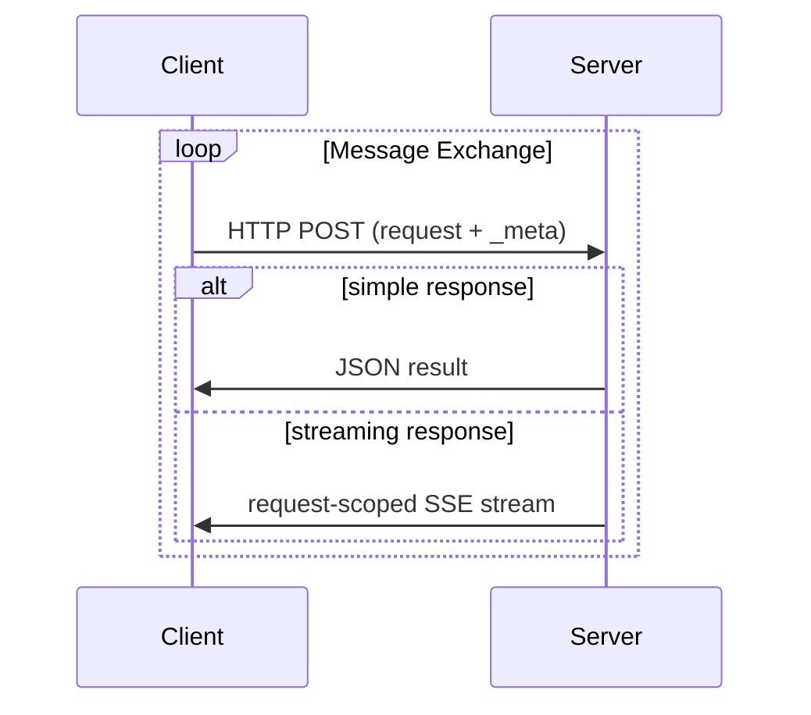
```mermaid {scale: 0.65}
sequenceDiagram
    participant C as Client
    participant S as Server

    loop Message Exchange
        C->>S: HTTP POST (request + _meta)
        alt simple response
            S->>C: JSON result
        else streaming response
            S->>C: request-scoped SSE stream
        end
    end
```

</div>

</div>

<!--
**[~44:00]** "Two transports: stdio is simplest — launch a subprocess, JSON on stdin/stdout. Streamable HTTP is for remote or multi-client setups — every message is a POST to a single endpoint; the server replies with JSON or opens a request-scoped SSE stream."
-->

---

# MCP: What It Standardizes

<div class="grid grid-cols-3 gap-6 mt-10">

<div class="text-center border border-gray-700 rounded-xl p-6">
<div class="text-5xl mb-4">🔧</div>

### Tools
<div class="text-gray-400 mt-2">

Functions that **do** things

</div>
<div class="text-sm text-gray-500 mt-4">
<code>tools/list</code><br/>
<code>tools/call</code>
</div>
</div>

<div class="text-center border border-gray-700 rounded-xl p-6">
<div class="text-5xl mb-4">📄</div>

### Resources
<div class="text-gray-400 mt-2">

Read-only data<br/>
for the AI model

</div>
<div class="text-sm text-gray-500 mt-4">
<code>resources/list</code><br/>
<code>resources/read</code>
</div>
</div>

<div class="text-center border border-gray-700 rounded-xl p-6">
<div class="text-5xl mb-4">💬</div>

### Prompts
<div class="text-gray-400 mt-2">

Predefined templates<br/>
and workflows

</div>
<div class="text-sm text-gray-500 mt-4">
<code>prompts/list</code><br/>
<code>prompts/get</code>
</div>
</div>

</div>

<!--
**[~44:30]** "Three capabilities: Tools (we built those), Resources (read-only data), Prompts (templates)."
-->

---

# MCP: Your Homework


<div class="absolute inset-0 bg-black/65 z-0" />

<Callout variant="blue">
You've already built the engine. MCP is just the protocol wrapper around it.
</Callout>

<div class="grid grid-cols-2 gap-8 mt-6">

<div class="text-xs">

| | 2024-11-05 | MCP 2.0 · 2026-07-28 |
|---|---|---|
| Auth | none | OAuth 2.1 |
| Transport | HTTP+SSE | Streamable HTTP |
| Tool annotations | — | read-only / destructive |
| Structured output | — | ✓ |
| Elicitation | — | server asks user |
| Handshake | `initialize` | stateless `_meta` |

</div>

<div class="flex flex-col items-center justify-center gap-3">
  
  <div class="text-xs text-gray-400 text-center">modelcontextprotocol.io<br/>specification/2026-07-28</div>
</div>

</div>

<!--
"You could build an MCP client by wrapping our ToolSupport. MCP is gaining traction fast — four versions since Nov 2024. The July 2026 spec made it fully stateless: no handshake, capabilities travel in every request. Check the spec."
-->

---
layout: center
---


<div class="absolute inset-0 bg-black/60 z-0" />

<div class="absolute inset-0 flex flex-col items-center justify-center z-10 text-center">
<div class="text-4xl font-extrabold text-white">One more thing about models:</div>
<div class="text-3xl text-gray-300 mt-8">
<code class="text-orange-400">reasoning_content</code>
</div>
</div>

<!--
**[~45:00]** "Before we build the agent — one thing worth knowing about models themselves. You saw `reasoning_content` appear in the SSE stream. Here's what that is."
Segue: connects the SSE parsing we just coded to the thinking demo.
-->

---

# Thinking Mode: When Models Reason Out Loud


<div class="grid grid-cols-2 gap-10 mt-4 relative z-10">

<div>

```
*Okay, I think I'm overthinking. Let's write it.*
"First off, I need to thank you for the food…"
*Wait, I need to make it more nerdy.*
"First off, I need to thank you for the food…"
*Wait, I need to make it more fun.*
...
```

<div class="mt-4 text-gray-400">This is <code>reasoning_content</code> in the SSE stream.</div>

</div>

<div class="flex flex-col gap-5 justify-center">

<div class="text-2xl font-bold">Helps: complex tasks, planning, code</div>

<div class="text-2xl font-bold text-orange-400">Hurts: simple tasks, small models</div>

<Callout variant="orange">
Set a <b>token budget</b> upfront.<br/>
<code>--thinking-budget 1000</code> in our CLI.
</Callout>

</div>

</div>

<!--
**[THINKING DEMO]** Show the monologue task with thinking on vs off.
With thinking: the model drafts, critiques, redrafts — sometimes loops on "Wait, I need to make it nerdier."
Without thinking: direct answer, faster, often good enough.
Key insight: thinking helps larger models reason better; for 2B it just wastes tokens going in circles.

Budget parameters by provider:
- Qwen3 via llama.cpp: `"chat_template_kwargs": {"enable_thinking": true, "thinking_budget": 1000}`
- Anthropic Claude: `thinking: {type: "enabled", budget_tokens: 1000}` (nested object)
- OpenAI o-series: `reasoning: {effort: "low"|"medium"|"high"|"max"}` (nested object, not flat)

`--thinking-budget 1000` sets this in our CLI. Detecting repetition after the fact works too but wastes latency.
-->

---
layout: center
---


<div class="absolute inset-0 bg-black/45 z-0" />

<div class="relative z-10">

<div class="section-header">Part 8</div>

<div class="big-statement">

Coding Agent

</div>

<div class="text-xl text-gray-400 mt-4">

A chatbot that can actually <OrangeText>change your code</OrangeText>.

</div>

</div>

<!--
**[~45:00]** "We have a chatbot that can read files. Let's give it write access and Maven — and turn it into a coding agent."
Image: Apollo 10 Mission Control, NASA, public domain.
-->

---

# From Chatbot to Agent

<div class="grid grid-cols-2 gap-8 mt-2">

<div>

**ChatBot**: talks, remembers

```java
messages.add(user(input));
response = client.chatStream(messages);
messages.add(assistant(response));
```

</div>

<div>

**CodingAgent**: talks, remembers, <OrangeText>acts</OrangeText>

```java
messages.add(user(input));
response = toolSupport
    .handleToolLoop(client, messages);
messages.add(assistant(response));
```

</div>

</div>

<div class="grid grid-cols-2 gap-6 mt-2">

<div>

<div class="text-sm text-gray-400 mb-2 text-center">ChatBot</div>
<CtxWindow :messages="['sys:SYS', 'usr:U1', 'ast:A1', 'usr:U2', 'ast:A2']" />

</div>

<div>

<div class="text-sm text-gray-400 mb-2 text-center">CodingAgent</div>
<CtxWindow :messages="[
  'sys:SYS',
  'ast:📌 Goal · Plan · TODOs:pinned',
  'usr:U1',
  'tool:🔧 ls(src)',
  'tool:🔧 edit(Foo.java)',
  'ast:A1',
  'usr:U2',
]" />

</div>

</div>

<!--
**[~45:30]** "One line changes: toolSupport.handleToolLoop instead of client.chatStream. The only difference is the tools. Registration is one line because we extracted the schema plumbing into a tiny helper."
"REPL commands like Claude Code's Shift-Tab: /mode cycles NORMAL → AUTO-EDIT → YOLO, /plan, /clear, /compact — and every session writes a transcript."
-->

---

# The Pinned Message Trick

<div class="grid grid-cols-2 gap-8 mt-4">

<div>

Naively appending state pollutes history:

```
SYS
USER: fix the test
ASST: ## Goal...  ← v1
... tool calls ...
ASST: ## Goal...  ← v2
... more calls ...
ASST: ## Goal...  ← v3
```

</div>

<div v-click>

**Replace** it in-place at index 1:

```
SYS
ASST: ## Goal...  ← always current
USER: fix the test
... tool calls ...
```

```java
messages.set(stateMessageIndex,
    stateMessage()); // replace, not append
```

</div>

</div>

<v-click>

<Callout variant="orange">
One snapshot of state. Never accumulates. The model always sees the current picture: goal, plan, and TODO checklist.
</Callout>
</v-click>

<v-click>
<div class="mt-3 font-mono text-sm grid grid-cols-2 gap-6">
<div>
<div class="text-gray-500 mb-1">naive — appending:</div>
<div><span class="text-gray-600">[0]</span> SYS</div>
<div><span class="text-gray-600">[1]</span> <span class="text-yellow-400">STATE v1</span></div>
<div><span class="text-gray-600">[2]</span> U1, A1 …</div>
<div><span class="text-gray-600">[3]</span> <span class="text-yellow-400">STATE v2</span> ← extra</div>
<div><span class="text-gray-600">[4]</span> U2, A2 …</div>
<div><span class="text-red-400">[5]</span> <span class="text-yellow-400">STATE v3</span> ← bloat</div>
</div>
<div>
<div class="text-gray-500 mb-1">pinned — replace in-place:</div>
<div><span class="text-gray-600">[0]</span> SYS</div>
<div><span class="text-orange-400">[1]</span> <span class="text-orange-300">STATE (always current)</span></div>
<div><span class="text-gray-600">[2]</span> U1, A1 …</div>
<div><span class="text-gray-600">[3]</span> U2, A2 …</div>
<div class="text-green-400 mt-1">messages.set(1, newState)</div>
</div>
</div>
</v-click>

<!--
**[~48:30]** "If you append state every time it changes, you get v1, v2, v3... polluting the context. Instead, replace the message in-place. The model sees one current state, always at the same position."
-->

---

# /plan Mode

```bash
You: /plan add a greet() method to Greeter.java and make mvn test pass
```

<div class="mt-4 text-gray-400 text-lg">

Read-only exploration. You review the plan before execution starts.

</div>

<v-click>

```
--- Plan ready ---
## Goal
add a greet() method to Greeter.java and make mvn test pass

## Plan
Greeter.java is missing greet(). GreeterTest expects greet("World") → "Hello, World!".

## TODOs
[ ] #1 Add greet(String name) to Greeter.java
[ ] #2 Run mvn test to verify
```

</v-click>

<!--
**[~47:00]** "Before touching files, /plan makes the agent explore and write down what it intends to do. You review it before a single file changes. Once accepted, the plan and TODOs are pinned — the model works the list."
"The TODO tools are identical to every other tool: todo-add, todo-update. The runtime re-injects state before every call."
"Type /help to see all REPL commands — /mode, /clear, /compact, /run, /todo..."
-->

---
layout: center
---


<div class="absolute inset-0 bg-black/60 z-0" />

<div class="relative z-10">

# Live Demo: Coding Agent

<div class="text-xl mt-8 text-gray-300">

```bash
java -jar target/tiny-llm-demo.jar CodingAgent --base-url gardener
```

</div>

<div class="mt-6 text-lg text-gray-400">

**Try:** `/yolo` then `Build a small calculator CLI tool with Maven in a subfolder`

</div>

<div class="mt-2 text-sm text-gray-500">

`/yolo` · `/plan <goal>` · `--approve-plans`

</div>

</div>

<!--
**[~47:30]** Live demo. Ask the agent: "Build a small calculator CLI tool with Maven in a subfolder"
Watch: update-plan → plan display → you approve → todos created → files written → mvn package → java -jar verify.
Key moment: show the plan confirmation prompt — agent proposes, human decides.
Type /todo to show the live TODO pane after.
-->

---
layout: center
---


<div class="absolute inset-0 bg-black/55 z-0" />

<div class="relative z-10">
<div class="section-header">Part 9</div>

<div class="big-statement">

Skills

</div>

<div class="text-xl text-gray-400 mt-4">

Reusable instructions the agent loads <OrangeText>on demand</OrangeText>.

</div>
</div>

<!--
**[~48:00]** "Our agent works. But every project has its own conventions. Skills let us package that knowledge as Markdown and load it only when relevant — no bloat in every prompt."
-->

---


# Skills: Discover, Activate, Inject

<div class="grid grid-cols-2 gap-8 mt-4">

<div>

```text
.claude/skills/
└── java/
    └── SKILL.md
```

```markdown
---
description: Java best practices
---
- Follow existing code style
- Add a regression test for every change
- Run `mvn test` after modifications
```

A skill is a Markdown file. Nothing more.

</div>

<div>

**Lifecycle:**

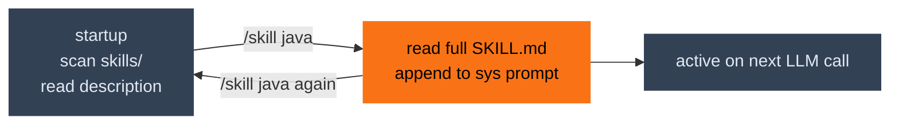
```mermaid {theme: 'dark', scale: 0.82}
flowchart LR
  A["startup\nscan skills/\nread description"] -->|"/skill java"| B["read full SKILL.md\nappend to sys prompt"]
  B -->|"/skill java again"| A
  B --> C["active on next LLM call"]
  style A fill:#334155,color:#e2e8f0,stroke:none
  style B fill:#f97316,color:#000,stroke:none
  style C fill:#334155,color:#e2e8f0,stroke:none
```


</div>

</div>

<!--
**[~48:30]** "Discovery is cheap — just the description. Loading only happens on activation. And because buildSystemPrompt() is called before every LLM turn, activate/deactivate takes effect on the very next message."
-->

---
layout: center
---


<div class="absolute inset-0 bg-black/60 z-0" />

<div class="relative z-10">

# Live Demo: Skills

<div class="text-xl mt-8 text-gray-300">

```bash
java -jar target/tiny-llm-demo.jar SkillCodingAgent --base-url gardener
```

</div>

<div class="mt-6 text-lg text-gray-400">

**Try:** `Tell me about this project like a viking`

</div>

<div class="mt-2 text-sm text-gray-500">

`/skills` lists available · `/skill <name>` toggles · model activates via `skill` tool

</div>

</div>

<!--
**[~49:00]** Live demo. Just ask "Tell me about this project like a viking" — the model should discover the viking skill on its own and activate it. Watch the Norse delivery.
-->

---


# Let's Write a Skill Together

<div class="grid grid-cols-2 gap-8 mt-4">

<div>

What should our skill do?

<div class="mt-4 text-gray-400">

Ideas:
- **viking**: answer in Viking dialect ("Skål, fellow shield-bearer!")
- **haiku**: all responses as haiku
- **grumpy-senior**: "Back in my day, we didn't need dependencies..."

</div>

</div>

<div v-click>

**We need two things:**

```text
.claude/skills/<name>/SKILL.md
```

```markdown
---
description: one-line summary
---

Instructions for the agent.
As specific as you like.
```

Create it live → `/skill <name>` → see it work.

</div>

</div>

<!--
**[~49:30]** "Skills are just Markdown files. Let's write one together right now."
Take one suggestion from the audience. Create the folder + SKILL.md live in the terminal. Then /skill <name> to activate. Ask the agent something — watch the behavior change.
-->

---

# Agents Need Memory Limits Too

<div class="mt-8 text-2xl text-center">

Tool-call transcripts inflate history <OrangeText>fast</OrangeText>.

</div>

<div class="mt-8">

```text
[compact] 9 -> 8 messages  (prompt was 1010 tokens)
You: What codeword did I give you?
Assistant: FJORD
```

</div>

<div class="mt-6 text-xl text-center text-gray-400">

The codeword survived compaction. It's inside the summary.

</div>

<!--
**[~50:00]** "Same Compactor helper from the chatbot section — pin system prompt (index 0) + pinned agent state (index 1), fold the middle into a summary, keep the recent tail verbatim. Three lines in the chat loop. Real token counts from the API at 80% of the context window."
-->

---

# One More Thing: The Agent Edits Itself 🪞

<div class="grid grid-cols-2 gap-6 mt-4 text-base">

<div>

**The prompt:**

```
Add a tool to the coding agent
to count the r's in a string
```

</div>

<div>

**What happens:**

</div>

</div>

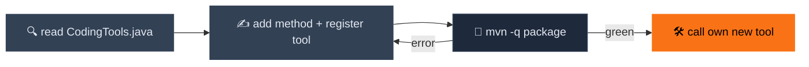
```mermaid {theme: 'dark', scale: 0.8}
flowchart LR
  A["🔍 read CodingTools.java"] --> B["✍️ add method + register tool"]
  B --> C["🔧 mvn -q package"]
  C -->|green| D["🛠️ call own new tool"]
  C -->|error| B
  style A fill:#334155,color:#e2e8f0,stroke:none
  style B fill:#334155,color:#e2e8f0,stroke:none
  style C fill:#1e293b,color:#e2e8f0,stroke:#475569
  style D fill:#f97316,color:#000,stroke:none
```

<div class="mt-2 text-xl">

Plain request → agent reads, writes, builds, verifies. <OrangeText>Boring engineering, reliable outcome.</OrangeText>

</div>

<!--
**[~49:00]** **[FUN/PUNCHLINE]** No skill file needed — just a plain request. The agent reads its own source, writes the right code in the right place, builds, and verifies.
That recovery loop when a tool argument is wrong — the error text teaches it the schema. The library works exactly as designed, even when the agent is the user.
Point out: we sandboxed the agent to its own source tree. It can't escape. It can't delete the git history. It just edits, builds, and proves it works.
-->

---
layout: center
---


<div class="absolute inset-0 bg-black/55 z-0" />

<div class="relative z-10">

<div class="section-header">Wrap-Up</div>

<div class="big-statement">

LLM APIs are boring.

</div>

<div class="text-2xl text-gray-300 mt-8">

And that's a <OrangeText>good thing</OrangeText>.

</div>

<div class="text-xl text-gray-400 mt-4">

Boring means <b>debuggable</b>. Boring means <b>predictable</b>.

</div>

</div>

<!--
**[~48:00]** Third time saying the tagline. "LLM APIs are boring. And that is the *best* news for Java developers."
"Boring means you can debug it. Boring means you can test it. Boring means it works at 3 AM."
Image: Widener Library card catalog, public domain via Wikimedia Commons.
-->

---

# What We Built Together

<div class="grid grid-cols-2 gap-8 mt-4">

<div>

<div class="mb-4">
<div class="text-xl font-bold">✅ REST API</div>
<div class="text-gray-400">Three endpoints, one JSON format</div>
</div>

<div class="mb-4">
<div class="text-xl font-bold">✅ Streaming chatbot</div>
<div class="text-gray-400">SSE parsing, conversation history</div>
</div>

<div class="mb-4">
<div class="text-xl font-bold">✅ Tool calling</div>
<div class="text-gray-400">JSON Schema, sandbox security, while loop</div>
</div>

<div class="mb-4">
<div class="text-xl font-bold">✅ Coding agent</div>
<div class="text-gray-400">File tools, context management, /plan mode</div>
</div>

<div class="mb-4">
<div class="text-xl font-bold">✅ Skills system</div>
<div class="text-gray-400">Reusable instructions, loaded on demand</div>
</div>

</div>

<div>


```mermaid
flowchart TB
  jdk["dependencies<br>(pre-written)"]
  lc["LLMClient"]
  cb["ChatBot"]
  ts["ToolSupport"]
  ft["FileTools"]
  ca["CodingAgent<br>SkillCodingAgent"]

  jdk --> lc
  jdk --> ts
  lc --> cb
  lc --> ts
  ts --> ft
  ts --> ca
  lc --> ca

  style jdk fill:#334155,color:#e2e8f0,stroke:none
  style lc fill:#f97316,color:#000,stroke:none
  style cb fill:#f97316,color:#000,stroke:none
  style ts fill:#f97316,color:#000,stroke:none
  style ft fill:#334155,color:#e2e8f0,stroke:none
  style ca fill:#f97316,color:#000,stroke:none
```

<div class="text-sm text-gray-500 text-center">Orange = what we built</div>

</div>

</div>

<!--
**[~49:00]** Quick recap. Keep it fast — the audience remembers.
-->

---

# Go Build It


<div class="absolute inset-0 bg-black/60 z-0" />

<div class="relative z-10">

<div class="text-2xl font-bold text-center text-gray-200 mb-10">

The whole thing is ~500 lines of Java.<br>
<OrangeText>You already know how to build it.</OrangeText>

</div>

<div class="grid grid-cols-3 gap-8 mt-10 text-center">
  <div>
    <div class="text-lg font-bold mb-3">Blog</div>
    
    <div class="mt-3 text-sm text-gray-300">
      <a href="https://mostlynerdless.de">mostlynerdless.de</a>
    </div>
  </div>
  <div>
    <div class="text-lg font-bold mb-3">Project</div>
    
    <div class="mt-3 text-sm text-gray-300">
      <a href="https://github.com/parttimenerd/tiny-llm-library-demo">tiny-llm-library-demo</a>
    </div>
  </div>
  <div>
    <div class="text-lg font-bold mb-3">SapMachine</div>
    
    <div class="mt-3 text-sm text-gray-300">
      <a href="https://sapmachine.io">sapmachine.io</a>
    </div>
  </div>
</div>
</div>

<!--
**[SHOW OF HANDS]** Final payoff. If most hands go up, the talk succeeded.
**[~50:00]** Q&A time. Have the chatbot running in a terminal in case someone wants to see a live demo during questions.
Expect questions about: model quality, production use, security edge cases, MCP adoption.
-->
